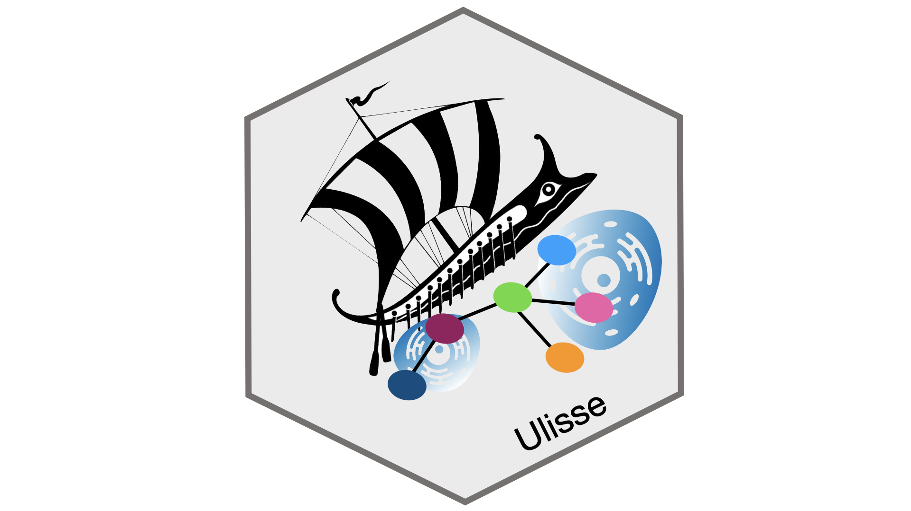

# Ulisse - Analysis of intracellular and intercellular crosstalk from omics data

Disease phenotypes can be described as the consequence of interactions among molecular processes that are altered beyond resilience. Here, we address the challenge of assessing the possible alteration of intra- and inter-cellular molecular interactions among processes or cells. We present an approach, designated as “Ulisse”, which complements the existing methods in the domains of enrichment analysis, pathway crosstalk analysis and cell-cell communication analysis. It applies to gene lists that contain quantitative information about gene-related alterations, typically derived in the context of omics or multi-omics studies. Ulisse highlights the presence of alterations in those components that control the interactions between processes or cells. Considering the complexity of statistical assessment of network-based analyses, crosstalk quantification is supported by two distinct null models, which systematically sample alternative configurations of gene-related changes and gene-gene interactions. Further, the approach provides an additional way of identifying the genes associated with the phenotype. As a proof-of-concept, we applied Ulisse to study the alteration of pathway crosstalks and cell-cell communications in triple negative breast cancer samples, based on single-cell RNA sequencing. In conclusion, our work supports the usefulness of crosstalk analysis as an additional instrument in the “toolkit” of biomedical research for translating complex biological data into actionable insights. 

Ulisse provide the tools to perform:

- Cross-talk analysis: intra-cellular and inter-cellular
- gene classification analysis: to reconstruct the role of the genes in the cross-talk network obtained
- Integrated cross-talk analysis: to integrate the communications between specific cells types/clusters to cellular mechanisms.

Typical application of Ulisse includes:

- Intra-cellular cross-talk analysis of omics data obtained from bulk or single-cell samples
- Inter-cellular analysis between clusters or cell-type in single-cell samples

Source code: https://github.com/emosca-cnr/Ulisse

# Installation

Ulisse requires R >= 4.0.0, and some GitHub and Bioconductor packages.

To successfully install Ulisse firstly run 

```{r, include=TRUE, eval=FALSE}
if (!require("BiocManager", quietly = TRUE)){
  install.packages("BiocManager")
}
BiocManager::install(c("BiocParallel", "ComplexHeatmap", "DOSE", "KEGGREST", "qvalue"))

devtools::install_github("emosca-cnr/NPATools", build_vignettes = TRUE)
```

The other dependencies, if missing, should be automatically installed using the following command:

```{r, include=TRUE, eval=FALSE}
devtools::install_github("emosca-cnr/Ulisse", build_vignettes = TRUE)
```

# Citation and Contact

- Citation: Chiodi A, Pelucchi P, Mosca E (2025) Analysis of intracellular and intercellular crosstalk from omics data. PLOS ONE 20(10): e0334981. https://doi.org/10.1371/journal.pone.0334981

- Contact: [Ettore Mosca](https://www.itb.cnr.it/en/institute/staff/ettore-mosca), Bioinformatics Lab, CNR-ITB

