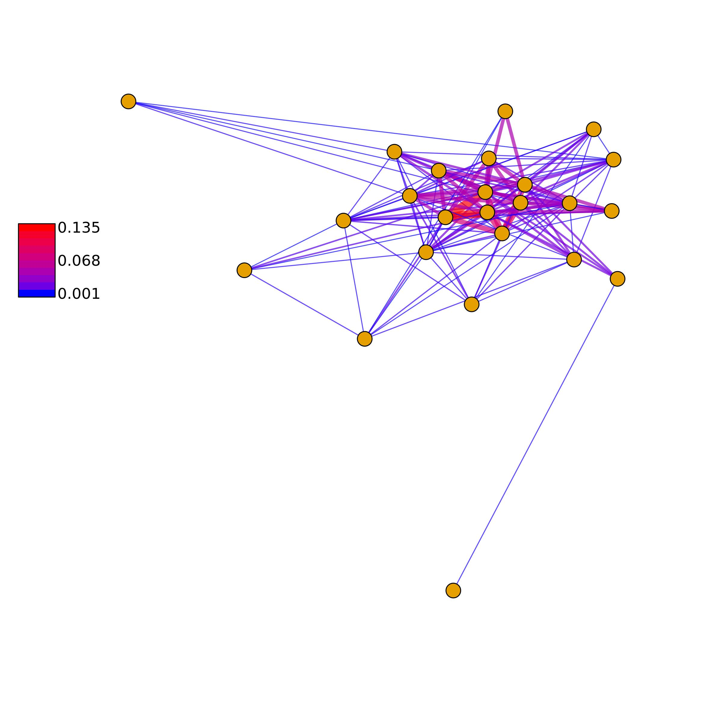
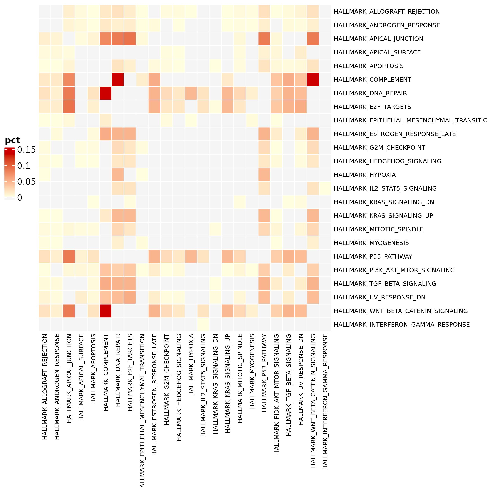
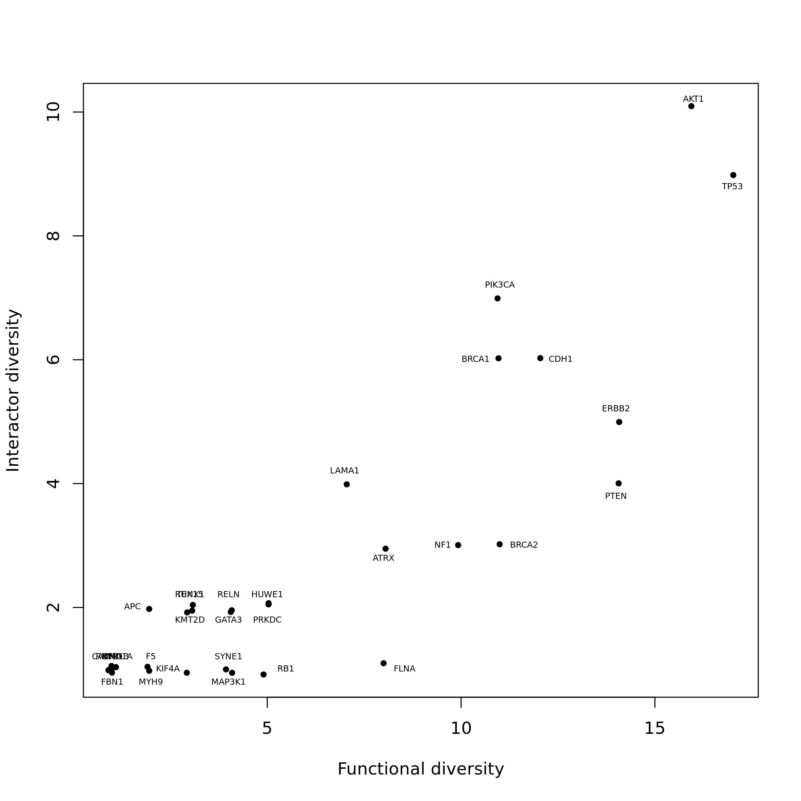
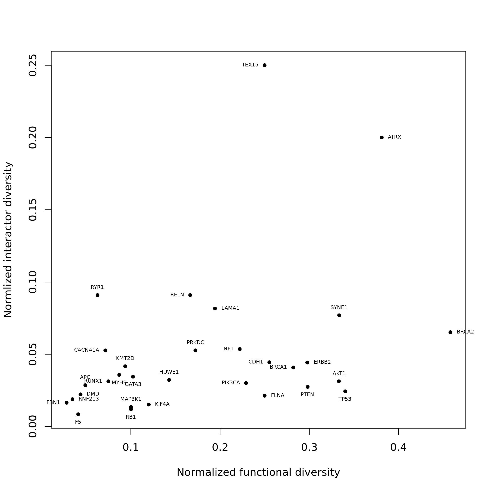
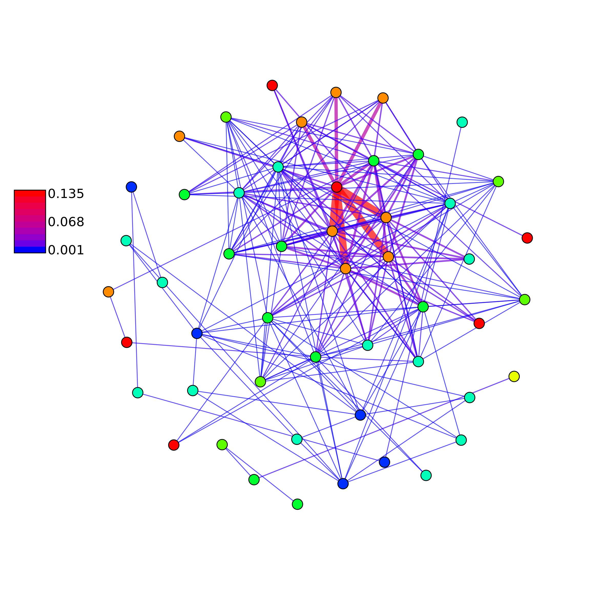
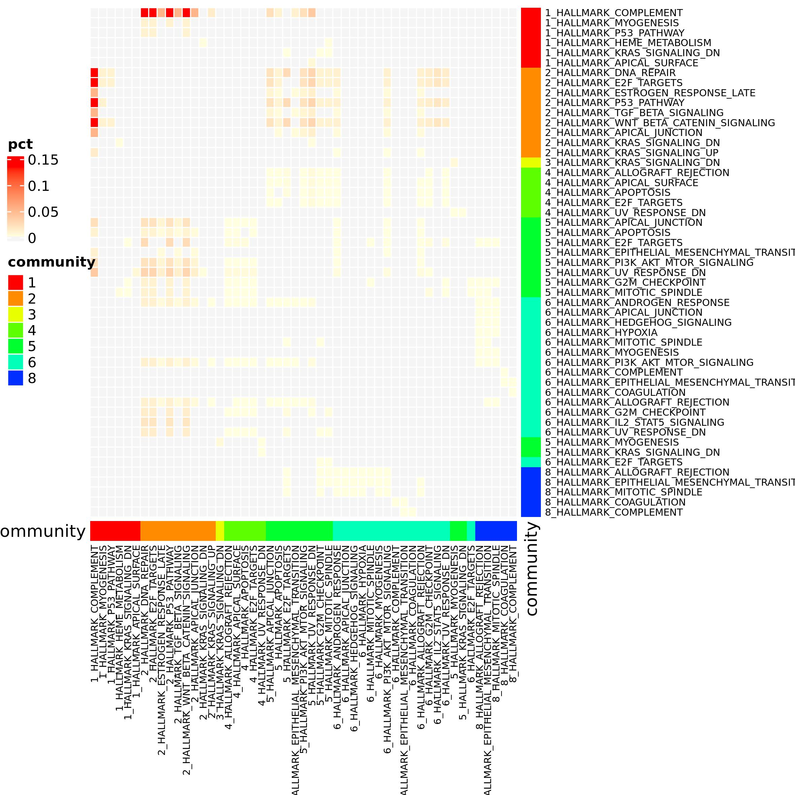

```{r setup, echo = FALSE, message = FALSE, warning=FALSE}
library(pander)
library(knitr)
library(rmarkdown)
library(kableExtra)
library(igraph)
knitr::opts_chunk$set(
  collapse = TRUE,
  comment = "#>",
  error    = FALSE,
  warning  = FALSE,
  #eval     = FALSE,
  message  = FALSE#,
  #fig.width = 7,
  #fig.height = 7
)

#panderOptions("table.split.table", Inf)
#panderOptions('knitr.auto.asis', TRUE)
#options(width = 80)
```

Pathways are groups of genes that occur to a determined biological function. By integrating the pathway data with a gene-gene interaction network it is possible to observe that genes interact within and between pathways. We developed Ulisse to be able to integrate pathway and gene network data and analyse them by different point of view. Ulisse has two workflows, one for bulk data and the other or single cell data, even though the analyses of the bulk workflow can be easily applied to cell clusters of single cell studies. In this workflow we will demonstrate the usage of Ulisse on bulk data. Ulisse needs mainly two inputs: a gene list, that can be or not ranked, and a biological network.

## Downloading and preparing the data
```{r libraries, include=TRUE, message=FALSE, warning=FALSE, eval=FALSE}
library(Ulisse)
library(TCGAbiolinks)
library(STRINGdb)
library(igraph)
library(reshape2)
library(org.Hs.eg.db)
```

As an example, dataset we will use breast cancer mutational data obtained from TCGA, that we will use to obtain the ranked gene list. The biological network will be obtained from STRING database.

### Ranked gene list
To obtain the needed ranked gene list we will split the TCGA data to obtain a matrix with the genes in the rows, the samples in the columns and filled with the number of mutation observed for each gene. By making the mean we will obtain the frequency of mutation identified for each gene in the samples, and we will use this value as a rank. In detail, we will study the cross-talks of the top 200 genes.
```{r not_to_run_downloadTCGAdata, eval=FALSE}
query <- GDCquery(project = "TCGA-BRCA", 
                  data.category = "Simple Nucleotide Variation",
                  data.type = "Masked Somatic Mutation")
                  #)
GDCdownload(query = query) #have to be done only the first time
data <- TCGAbiolinks::GDCprepare(query, summarizedExperiment = F, save = T)
```

```{r preparing_ranked_glNOT, eval=FALSE}
data <- data[!data$Entrez_Gene_Id == 0,]
data <- data.frame(table(data$SYMBOL, data$Tumor_Sample_Barcode), stringsAsFactors = F)
data <- data.frame(reshape2::acast(data, Var1 ~ Var2), stringsAsFactors = F)
data$mean <- rowMeans(data)
data <- data[order(data$mean, decreasing = T),]

rank_gl <- data.frame(gene = rownames(data),
                      rank = data$mean,
                      stringsAsFactors = F)
target_rank_gl <- rank_gl[1:200,]

```

### Biological network
We obtain STRING data from STRINGdb and build the network from all the proteins present in the database. The gene names are formatted with STRING identifiers, so we need to convert it to gene symbol.

```{r preparing_networkNot, eval=FALSE}
string_db <- STRINGdb$new( version="11.0", 
                           species=9606, 
                           score_threshold=700, 
                           input_directory="." )
string_proteins <- string_db$get_proteins()
PPI <- unique(string_db$get_interactions(string_proteins$protein_external_id))
PPI.g <- graph_from_edgelist(as.matrix(PPI[,1:2]), directed = F)
V(PPI.g)$name <- string_proteins$preferred_name[match(V(PPI.g)$name, string_proteins$protein_external_id)]
PPI.g
```

```{r PPI, echo=FALSE, eval=TRUE}
PPI.g <- readRDS("bulk_data/PPI_g.Rds")
PPI.g
rm(PPI.g)

```

### Pathway Data
Now we have the two inputs prepared. We need to download the pathway database and group our gene of interest into pathways.
To do so we will use the `pathway_data` function that download the data of a defined database from MSigDB, group the genes into pathway and returns only the pathways that are composed by at least `min_size` and maximum `max_size` genes. In this case we will use Hallmark database and use the default for the other parameters. The function will return the result of the MSigDBR function to download the pathway and the pathway list

```{r obtaining_pathway_dataNOT, eval=FALSE}
ptw <- pathway_data(species = "Homo sapiens", 
                    category = "H", 
                    type = "gene_symbol", min_size = 1, max_size = 500, 
                    gene = target_rank_gl$gene_symbol)

ptw$msigdb_output[1:10,]
```

```{r obtaining_pathway_data, echo=FALSE, warning=FALSE, message=F, results='show', eval=TRUE}
ptw <- readRDS("bulk_data/ptw.Rds")

ptw$msigdb_output[1:10,] %>%
  kable(format = "html", col.names = colnames(ptw$msigdb_output[1:10,])) %>%
  kable_minimal() %>%
  kable_styling(bootstrap_options = c("striped", "condensed")) %>%
  kableExtra::scroll_box(width = "100%")

```

```{r obtaining_pathway_data3, eval=TRUE}
ptw$path_list[1:3]
```

## Pathway Cross-talk
Now we have all the needed input for calculating PCT. The biological network will be provided to `pathway_cross_talk` function as an adjacency matrix. The rank (or weights) of the target genes should be provided to the function as a named vector of values associated to the genes. PCT calculation can be parallelized by increasing the `mc_cores_pct` and `mc_cores_perm` values: the first parallelize the calculation of the PCT on the pathways, the second all the permutations used for p-value calculation, thus multiply the `mc_cores_pct` in some part of the function. The number of permutations `k` corresponds to the number of permutation needed that, together with the original matrix, are used for the calculation of p-value and FDR. Here we set the number to 49, which means that the p-value and FDR are calculated on 49 permuted matrices + the original one, so 50 matrix in total (and thus the minimal p-vale will be 0.02).
But, how is calculated the p-value? We implemented a permutation-based approach so that for each pathway-pair p1, p2 composed by n and m genes respectively, we pick randomly from the biological network k lists of n and m genes. We then calculate the PCT score without considering the gene weights between p1 and p2 and the k permuted version of them, to then compare the scores to calculate p-value and FDR by using the equations listed in the paper.
As a short example we will use no parallelization and 49 permutations. 

```{r pctNot, results="asis", eval=FALSE}
adj.m <- as_adjacency_matrix(PPI.g, sparse = F)
wgt <- target_rank_gl$rank
names(wgt) <- target_rank_gl$gene
pct <- pathway_cross_talk(pathway_list = ptw$path_list, gene_network_adj = adj.m, 
                          genes = target_rank_gl$gene,
                          weight = wgt, mc_cores_pct = 1, 
                          mc_cores_perm = 1, k = 49)
pct[1:10,]
```

```{r pct, results="asis", echo=FALSE, warning=FALSE, message=F, results='show', eval=TRUE}
pct <- readRDS("bulk_data/pct.Rds")
rownames(pct) <- c()
pct[1:10,] %>%
  kable(format = "html", col.names = colnames(pct[1:10,])) %>%
  kable_minimal() %>%
  kable_styling(bootstrap_options = c("striped", "condensed")) %>%
  kableExtra::scroll_box(width = "100%")
rm(pct, ptw)
```

### PCT visualization

PCT results can be filtered to maintain only the significant ones. The results can be visualized as a network or as an heatmap by using Ulisse package functions.
Considering the network, the `all` argument is used to control which CT have to be visualized in the network. If set to `TRUE`, then `p_val, FDR and ct_val` are used to identify the singnifican CT and plot these with a solid line, whereas all the others will be plotted with a dashed line. Otherwise, the PCT result table will be filtered and only the CT passing the threshold will be plotted. `plot_network_CT()` function returns the igraph object plotted, the layout and the communities (if calcualted)

```{r PCT_visualizationNOT, eval=FALSE}
pct_net <- plot_network_CT(ct = pct, 
                           all = F, 
                           p_val = 0.05, FDR = NULL, ct_val = NULL, 
                           community = NULL,
                           edge_width = T, edge_adj_col =0.7,
                           vertex.label=NA, 
                           vertex.size=6, 
                           vertex.label.color = "black", 
                           vertex.label.family = "sans")
pct_net
```

```{r, eval=TRUE, echo=FALSE, out.width=600, fig.align = 'center'}
pct_net <- readRDS("bulk_data/pct_net_out.Rds")
pct_net
rm(pct_net)

```

Here you can see the significant CT as an heatmap. You can choose the variable that have to be used to color the heatmap, here we decide to use PCT score. The color parameters are used to set the color of the extremes of the color scale, so if you want to correct for outliers you can choose not to use minimum and maximum (default) ad provide your own values. `no_ct_color` is used to color the cells in the heatmap corresponding to the pathways pairs that do not shows CT but that are necessarily present in an heatmap with a 0 score. Having different colors for minimum and zero help the heatmap readability 

```{r PCT_visualization2NOT, eval=FALSE}

pct_f <- pct[which(pct$p_value_link <=0.05),]

ct_heatmap(ct = pct_f, 
           color_by = "pct", 
           color = c("lightyellow", "red3"), 
           no_ct_color = "whitesmoke", 
           rect_gp = gpar(col = "white"), 
           cluster_rows = FALSE, 
           cluster_columns = FALSE,
           row_names_gp = gpar(fontsize = 7), column_names_gp = gpar(fontsize = 7))


```

```{r, eval=TRUE, echo=FALSE, out.width=600, fig.align = 'center'}

```

### Gene functional relevance
The significant results of PCT can be used for gene functional relevance analysis via `gene_funct_rel()` function. In this analysis the PCT data are used to study the roles of the genes in the PCTs. It returns two values: the functional diversity, which is the number of different pathways with which a gene participates in the formation of a cross-talk; and the interactors diversity, or the number of interactors, or the gene with which a gene interacts that participate in a significant PCT. There are two ways to identify the interactors: if `only_diff` value is set to `TRUE` then the functions searches only for the interactors with which the genes do not share any pathway; otherwise if it is set to `FALSE` it uses all interactors.
By turning the argument `to_plot` to `TRUE`, the function saves a plot named as default `gene_functional_relevance.jpeg` in the working directory. 

```{r Funct_relNot, results="asis", eval=FALSE}
funct_rel <-gene_funct_relevance(pct = pct_f, adj = adj.m, method = "count", to_plot = T)
funct_rel[1:10,]
```

```{r Funct_rel, results="asis", echo=FALSE, warning=FALSE, message=F, results='show', eval=TRUE}
funct_rel <- readRDS("bulk_data/funct_rel.Rds")
rownames(funct_rel) <- c()
funct_rel[1:10,] %>%
  kable(format = "html", col.names = colnames(funct_rel[1:10,])) %>%
  kable_minimal() %>%
  kable_styling(bootstrap_options = c("striped", "condensed")) %>%
  column_spec(4, width = "5cm") %>%
  kableExtra::scroll_box(width = "100%")
rm(funct_rel)
```

```{r Funct_rel2, echo=FALSE, eval=TRUE, out.width=600, fig.align = 'center'}

```
We implemented two ways to calculate functional and interactor diversity: `method = "count"` is used to obtain the results shown above, that list the numbers of pathways and interactors; `method = "normalized"` is used to calculate normalized functional relevance by using a null model. In this case, we have to provide to the function a null model built by using all pathway data

```{r Funct_relNormNot, results="asis", eval=FALSE}
h.data <- msigdbr(species = "Homo sapiens", category = "H")
h.data <- h.data[h.data$gene_symbol %in% V(PPI.g)$name,]
h.genes <- unique(h.data$gene_symbol)
h.pathway <- split(h.data$gene_symbol, h.data$gs_name)

null.pct <- pathway_cross_talk(pathway_list = h.pathway, gene_network_adj = adj.m, weight = NULL, 
                               genes = V(PPI.g)$name, mc_cores_pct = 2, mc_cores_perm = 1, k = 9)
```

With the code above we have run a PCT analysis on the whole Hallmark database. We set `weight` argument to `NULL` to avoid using any weights, as we have none. In this case the PCT is equal to the number of links. Now we can calculate the normalized functional relevance

```{r Funct_relNormNot2, results="asis", eval=FALSE}
funct_rel_norm <-gene_funct_relevance(pct = pct_f, 
                                      adj = adj.m, 
                                      method = "normalized", 
                                      pct_null = null.pct, 
                                      to_plot = T)
funct_rel_norm[1:10, ]

```

```{r Funct_relNorm, results="asis", echo=FALSE, warning=FALSE, message=F, results='show', eval=TRUE}
funct_rel <- readRDS("bulk_data/funct_rel_norm.Rds")
funct_rel[1:10,] %>%
  kable(format = "html", col.names = colnames(funct_rel[1:10,])) %>%
  kable_minimal() %>%
  kable_styling(bootstrap_options = c("striped", "condensed")) %>%
  column_spec(4, width = "5cm") %>%
  kableExtra::scroll_box(width = "100%")
rm(funct_rel_norm)
```

```{r Funct_relNorm2, echo=FALSE, eval=TRUE, out.width=600, fig.align = 'center'}

```


## Sub-pathway CT
Gene interacts inside the pathways and groups into connected components (CC), or group of genes more interconnected between them than to the other genes in the network. In this case, each connected components correspond to genes with a similar biological function. It may be important to study the CC of pathways of interest, that may be the pathways that contains the target genes of the study or the ones involved in significant PCTs. `pathway_cc()` assigns a score to each CC in the pathways. Similarly to `pathway_cross_talk`, `mc_cores_cc` control the parallelization of the calculation of the CC score.
The function returns a list of two elements: the first are the details of the CC present in each pathway and the second a table with the result of the sub-pathway analysis

```{r CC_Not, results="asis", eval=FALSE}
pct_CC <- pathway_cc(pathway_list = ptw$path_list, 
                     gene_network_adj = adj.m, 
                     genes = target_rank_gl$gene,
                     weight = wgt,
                     mc_cores_cc = 2)
pct_CC$membership[1:3]
```

```{r CC, results="asis", echo=FALSE, warning=FALSE, message=F, results='show', eval=TRUE}
pct_CC <- readRDS("bulk_data/pct_cc.Rds")
pct_CC$membership[1:3]
```

```{r CC_Not2, results="asis", eval=FALSE}

pct_CC$pathway_cc[1:10,]
```


```{r CC2, results="asis", echo=FALSE, warning=FALSE, message=F, results='show', eval=TRUE}
rownames(pct_CC$pathway_cc) <- c()
pct_CC$pathway_cc[1:10,] %>%
  kable(format = "html", col.names = colnames(pct_CC$pathway_cc[1:3,])) %>%
  kable_minimal() %>%
  kable_styling(bootstrap_options = c("striped", "condensed")) %>%
  kableExtra::scroll_box(width = "100%")
rm(pct_CC)
```

## TM-PCT

Network can be studied to identify communities, that are groups of vertices that are more connected between them than to the rest of the network. It is said that these communities correspond to genes that have similar biological function. By aligning the biological network to the target genes we can obtain the gene network, tha tcan be studied to identify communities. The genes of the different communities can be grouped in pathways, which should represent the part of pathways that have a similar biological function. We decided to develop `TM_PCT()` as to be able to study how the pathways build on these gene communities interact between communities. First, we need to subset the biological network to then identify the gene communities. We can use `find_communites()` function to compare different algorithms

```{r gene_commNot, eval=FALSE}
sub.PPI <- induced.subgraph(PPI.g, vids = target_rank_gl$gene[target_rank_gl$gene %in% V(PPI.g)$name])
sub.PPI <- induced.subgraph(sub.PPI, V(sub.PPI)$name[-which(igraph::degree(sub.PPI) ==0)])

comm_det <- find_communities(sub.PPI)
comm_det$info

```

```{r gene_comm, echo=FALSE, eval=TRUE}
comm_det <- readRDS("bulk_data/comm_det.Rds")
comm_det$info
rm(comm_det)
```

Considering the output of `find_communities`, the best algorithm to choose is the one with highest modularity and the lowest number of communities. Here we choose to use multi-level modularity optimization algorithm.

```{r comm_detect, eval=FALSE}
comm <- comm_det$comm$multilev
comm_m <- membership(comm)
sub.PPI <- set_vertex_attr(sub.PPI, "comm_id", value =  comm_m[match(names(V(sub.PPI)), names(comm_m))])

pal = rainbow(max(comm_m))

plot(sub.PPI, 
     vertex.color=pal[as.numeric(comm_m)], 
     vertex.label=NA, 
     vertex.size=6)
legend("bottomleft", fill = pal, legend = min(comm_m):max(comm_m), cex = 0.75)

```

```{r eval=TRUE, echo=FALSE, out.width=600, fig.align = 'center'}
include_graphics("bulk_data/BRCA_TCGA_gene_net_communities.jpeg")
```

Now we have all the inputs needed for TM-PCT. As before, `mc_cores_pct` and `mc_cores_tm` controls the parallelization of the calculation of TM-PCT score in pathway pairs and combinations of communities, respectively. `TM_PCT()` function returns a list of two object, the first is a pathway list for each community, the second a table with the results of TM-PCT calculation

```{r TM_PCTNOT, results="asis", eval=FALSE}
att.vertex <- vertex_attr(sub.PPI)
sub.adj.m <- as.matrix(adj.m[names(V(sub.PPI)), names(V(sub.PPI))])
sub_wgt <- wgt[names(V(sub.PPI))]
tm_pct <- TM_PCT(pathway_list = ptw$path_list, 
                 gene_network_adj = as.matrix(sub.adj.m),
                 membership = as.vector(att.vertex$comm_id),
                 weight = sub_wgt, 
                 mc_cores_pct = 1, 
                 mc_cores_tm = 1)

tm_pct[["comm_pathway_list"]][["1"]][1:3]
```

```{r TM_PCT, echo=FALSE, eval=TRUE}
tm_pct <- readRDS("bulk_data/tm_pct.Rds")
tm_pct[["comm_pathway_list"]][["1"]][1:3]
```

```{r TM_PCTNOT2, results="asis", eval=FALSE}
tm_pct$TM_PCT_res[1:10,]
```

```{r TM_PCT2, echo=FALSE, eval=TRUE}
tm_pct$TM_PCT_res$p_value <- as.vector(tm_pct$TM_PCT_res$p_value)
tm_pct$TM_PCT_res[1:10,] %>%
  kable(format = "html", col.names = colnames(tm_pct$TM_PCT_res[1:10,])) %>%
  kable_minimal() %>%
  kable_styling(bootstrap_options = c("striped", "condensed")) %>%
  kableExtra::scroll_box(width = "100%")
rm(tm_pct)
```

TM-PCT results can be visualized as a network or as an heatmap again by using Ulisse functions.

```{r TMPCT_visualizationNOT, eval=FALSE}

tm_pct_mod <- tm_pct$TM_PCT_res
tm_pct_mod$pathway_1 <- paste(tm_pct_mod$commID_1, tm_pct_mod$pathway_1, sep = "_")
tm_pct_mod$pathway_2 <- paste(tm_pct_mod$commID_2, tm_pct_mod$pathway_2, sep = "_")
tm_pct_mod <- tm_pct_mod[, -c(1,3)]

tm_pct_net <- graph_from_data_frame(tm_pct_mod, directed = F)
V(tm_pct_net)$comm <- unlist(lapply(strsplit(V(tm_pct_net)$name, "_", fixed = T), "[[", 1))
V(tm_pct_net)$comm_pal <- pal[V(tm_pct_net)$comm]

tm_pct_lt <- plot_network_CT(tm_pct_mod, 
                             all = NULL, p_val = NULL, FDR = NULL, ct_val = NULL, edge_width = T, edge_adj_col =0.7,
                             community = NULL, 
                             vertex.label=NA, vertex.size=5, 
                             vertex.color = V(tm_pct_net)$comm_pal)

```

```{r, eval=TRUE, echo=FALSE, out.width=600, fig.align = 'center'}


```

```{r TMPCT_visualization2NOT, eval=FALSE}
tm_pct.comm <- unlist(lapply(strsplit(V(tm_pct_net)$name, "_", fixed = T), "[[", 1))
names(tm_pct.comm) <- V(tm_pct_net)$name

ct_heatmap(ct = tm_pct_mod, 
           color_by = "pct", 
           community = NULL, 
           row_annotation = tm_pct.comm, row_annotation_name = "community", pal_row_annotation = pal[unique(tm_pct.comm)], 
           column_annotation = tm_pct.comm, column_annotation_name = "community", pal_column_annotation = pal[unique(tm_pct.comm)], 
           color = c("lightyellow", "red"), no_ct_color = "whitesmoke",
           cluster_rows = F,  cluster_columns = F,
           rect_gp = gpar(col = "white"),
           row_names_gp = gpar(fontsize = 7), column_names_gp = gpar(fontsize = 7))


```

```{r, eval=TRUE, echo=FALSE, out.width=600, fig.align = 'center'}

```


# Session Info {- .smaller}
```{r sessioninfo}
sessionInfo()
```
