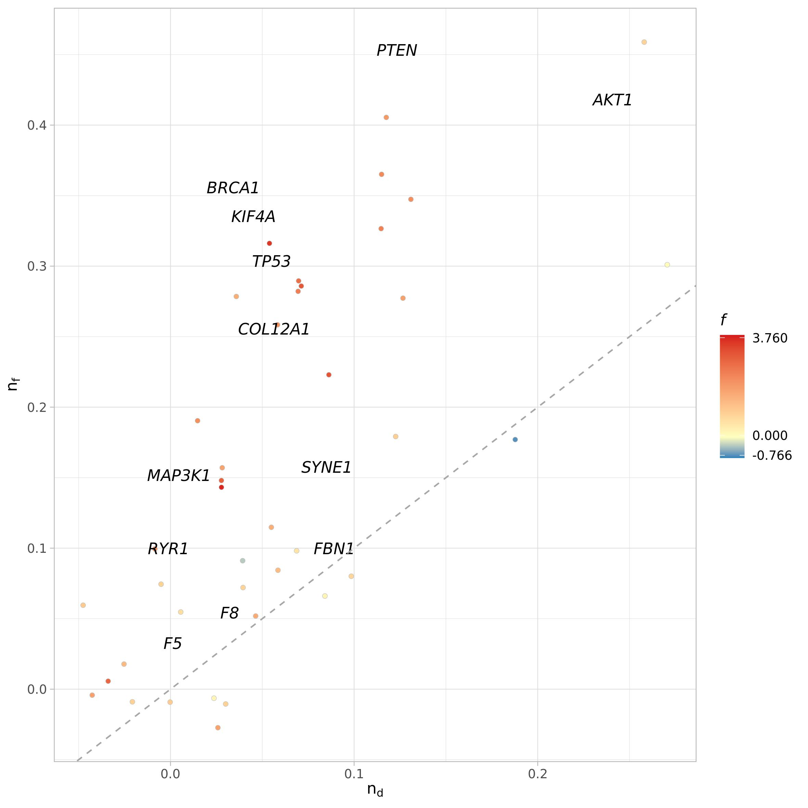
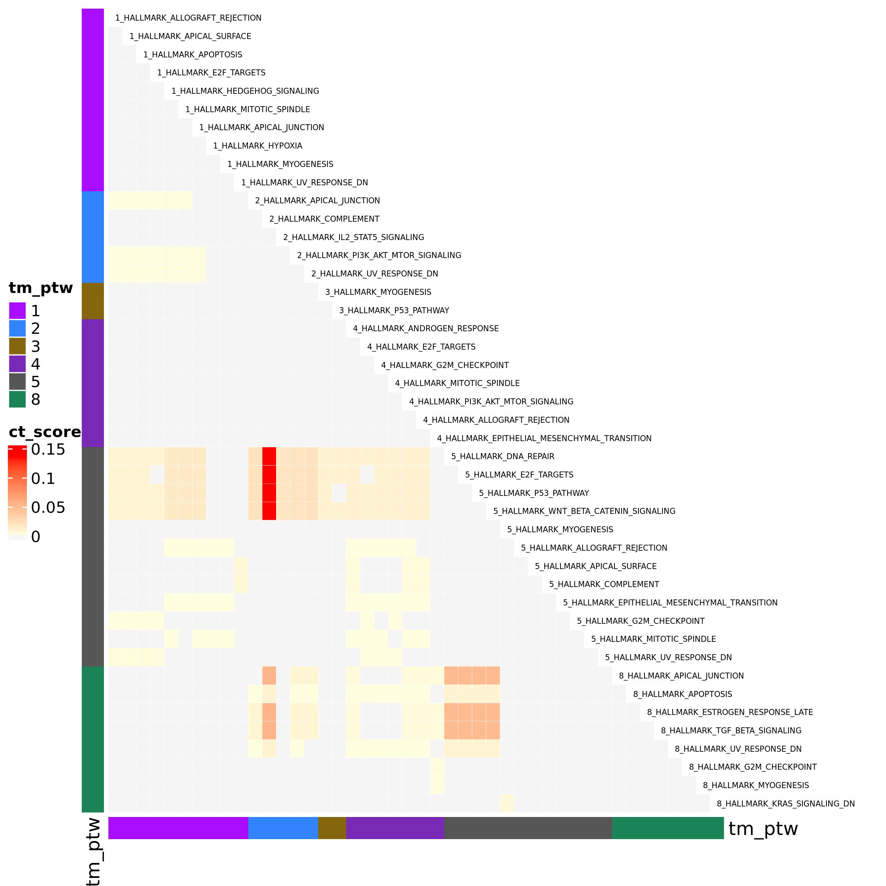

```{r setup, echo = FALSE, message = FALSE, warning=FALSE}
library(pander)
library(knitr)
library(rmarkdown)
library(kableExtra)
library(igraph)
knitr::opts_chunk$set(
  collapse = TRUE,
  comment = "#>",
  error    = FALSE,
  warning  = FALSE,
  #eval     = FALSE,
  message  = FALSE#,
  #fig.width = 7,
  #fig.height = 7
)

#panderOptions("table.split.table", Inf)
#panderOptions('knitr.auto.asis', TRUE)
#options(width = 80)
```

In this vignette we will show the usage of Ulisse on gene-sets or pathway data. We will apply pathway cross-talk analysis on mutational bulk data of breast cancer obtained from TCGA, but the very same pipeline can be used to analyse other bulk-derived gene data, as well as gene signatures of cell cluster in single cell data. The only difference is that this pipeline can be applied to only a cluster at time. 

# Downloading and preparing the data

```{r libraries, include=TRUE, message=FALSE, warning=FALSE, eval=FALSE}
library(Ulisse)
library(TCGAbiolinks)
library(STRINGdb)
library(igraph)
library(reshape2)
library(org.Hs.eg.db)
```
Ulisse needs mainly two inputs: a gene list, that can be or not ranked, and a biological network.

As an example dataset we will use breast cancer mutational data obtained from TCGA, that we will use to obtain the ranked gene list. The biological network will be obtained from STRING database.

## Biological network

We obtain STRING data from STRINGdb [@szklarczyk2021] and build the network from all the proteins present in the database. The gene names are formatted with STRING identifiers, so we need to convert it to gene symbol.

```{r preparing_networkNot, eval=FALSE}
string_db <- STRINGdb$new( version="11.0", 
                           species=9606, 
                           score_threshold=700, 
                           input_directory="." )
string_proteins <- string_db$get_proteins()
PPI <- unique(string_db$get_interactions(string_proteins$protein_external_id))
PPI.g <- graph_from_edgelist(as.matrix(PPI[,1:2]), directed = F)
V(PPI.g)$name <- string_proteins$preferred_name[match(V(PPI.g)$name, string_proteins$protein_external_id)]
PPI.g
```

```{r PPI, echo=FALSE, eval=TRUE}
PPI.g <- readRDS("bulk_data/PPI_g.Rds")
PPI.g

```


## Ranked gene list

To obtain the needed ranked gene list we will download the data from TGCA by using TCGAbiolinks package [@colaprico2016, @mounir2019], to then split the  dataset to obtain a gene by sample matrix, with the number of mutation observed for each gene. By making the row mean we will obtain the frequency of mutation for each gene in the samples, and we will use this value as a rank. In detail, we will study the cross-talks of the top 200 genes.

```{r not_to_run_downloadTCGAdata, eval=FALSE}
query <- GDCquery(project = "TCGA-BRCA", 
                  data.category = "Simple Nucleotide Variation",
                  data.type = "Masked Somatic Mutation")
                  #)
GDCdownload(query = query) #have to be done only the first time
data <- TCGAbiolinks::GDCprepare(query, summarizedExperiment = F, save = T)
```

```{r preparing_ranked_glNOT, eval=FALSE}
data <- data[!data$Entrez_Gene_Id == 0,]
data <- data.frame(table(data$SYMBOL, data$Tumor_Sample_Barcode), stringsAsFactors = F)
data <- data.frame(reshape2::acast(data, Var1 ~ Var2), stringsAsFactors = F)
data$mean <- rowMeans(data)
data <- data[order(data$mean, decreasing = T),]

gene_weights <- data.frame(gene = rownames(data),
                      weights = data$mean,
                      stringsAsFactors = F)
target_gene_weights <- gene_weights[1:200,]

```


## Pathway Data

Now that we have the two needed input, we can proceed in the pipeline. The subsequent step will be:

* group genes into a (ranked) gene-sets (or pathways) to obtain a gene-set list

* use the gene-set list and the adjacency matrix of the biological network to calculate cross-talk.

As an example we will use MSigDB Hallmark pathways [@liberzon2015] to obtain the gene-set list by using `preparing_msigdb_list()`. This function downloads a defined gene-set database and uses it to group the gene in the gene list. The function will return a list composed by a named vector for each pathway. The vectors are composed by the ranks named after the genes in the gene-set. It returns only the pathways that are composed by at least `min_size` and maximum `max_size` genes. 

```{r obtaining_pathway_dataNOT, eval=FALSE}

ptw <- preparing_msigdb_list(species = "Homo sapiens", 
                             category = "H", 
                             type = "gene_symbol", min_size = 1, max_size = 500, 
                             gene = target_gene_weights$gene,
                             weights = target_gene_weights$weights)
ptw[1:3]
```

```{r obtaining_pathway_data, echo=FALSE, warning=FALSE, message=F, results='show', eval=TRUE}
ptw <- readRDS("bulk_data/ptw.Rds")

ptw
```

Ulisse contains also a function, `preparing_gs_list()` to build gene-set list from custom resources. To exemplify the usage of this function, here we download Hallmark db from MSigDB by using msigdbr package [@msigdbr2021] to then build the very same gene-set list

```{r obtaining_pathway_data2NOT, eval=FALSE}
msig_out <- msigdbr::msigdbr(species = "Homo sapiens", category = "H")
ptw <- preparing_gs_list(gs_names =  msig_out$gs_name,
                         gs_genes = msig_out$gene_symbol, 
                         weights = setNames(target_gene_weights$weights, target_gene_weights$gene), 
                         min_size = 1, max_size = 500)
```

# Cross-talk

Now we have all the needed input for calculating cross-talk. The biological network will be provided to `gs_cross_talk()` function as an adjacency matrix. Cross-talk calculation can be parallelized by increasing the `mc_cores_pct` and `mc_cores_perm` values: the first parallelize the calculation of the cross-talk on the gene-sets, the second all the permutations used for p-value calculation, thus multiply the `mc_cores_pct` in some part of the function. The number of permutations `k` corresponds to the number of permutation needed that, together with the original matrix, are used for the calculation of p-value and FDR. Here we set the number to 49, which means that the p-value and FDR are calculated on 49 permuted matrices + the original one, so 50 matrix in total (and thus the minimal p-value will be 1/50 = 0.02).
Other inputs parameter are:

* `shared` which should be set to `FALSE` in gene-set cross-talk to avoid considering shared genes. Pathways are defined to group genes that occur to a particular molecular function. However, they are not mutually exclusive, as a gene may be involved in multiple functions. Considering shared genes will lead to consider in cross-talk calculations even the links between a shared gene and a not-shared, which are nevertheless internal to the pathway. Thus, when calculating cross-talk on gene-sets or pathways this parameter should be set to `FALSE`;

* `hash`: logical, used to speed-up calculation when lots of gene-sets are used. For pathway cross-talk we suggest to set it to `TRUE`;

* `ct_info`: logical, if detail of gene-gene interaction in the gene-set should be returned. This might be highly important in cell-cell cross-talk. Here we set it to `FALSE`.


```{r pctNot, results="asis", eval=FALSE}
adj.m <- as_adjacency_matrix(PPI.g, sparse = F)
pct <- gs_cross_talk(gs_list = ptw, 
                     gene_network_adj = adj.m, 
                     k = 49, shared = F, 
                     hash = T, 
                     ct_info = F, 
                     mc_cores_perm = 1, 
                     mc_cores_ct = 1)
pct[1:10,]
```

```{r pct, results="asis", echo=FALSE, warning=FALSE, message=F, results='show', eval=TRUE}
pct <- readRDS("bulk_data/pct.Rds")
#rownames(pct) <- c()
pct %>%
  kable(format = "html", col.names = colnames(pct)) %>%
  kable_minimal() %>%
  kable_styling(bootstrap_options = c("striped", "condensed")) %>%
  kableExtra::scroll_box(width = "100%")

```

## Cross-talk visualization

Cross-talk results can be filtered to maintain only the significant ones. The results can be visualized as a network (`plot_network_CT()`) or as an heatmap (`ct_heatmap()`) by using Ulisse package functions.
Considering the network, the `filtering` argument is used to control which CT have to be visualized in the network. If set to `TRUE`, then `p_val`, `FDR` and `ct_val` are used to identify the significant CT and plot these with a solid line, whereas all the others will be plotted with a dashed line. Otherwise, the whole cross-talk result table will be used. `community` can be logical (if the community should be calculated by using `igraph::fastgreedy.community()`), or a community object as calculated with igraph package. `vertex_label` can be either a logical (if the label of the vertices should be plotted), or a vector with the label that should be assigned to each vertex (explained more later in the vignette). `edge_col_by` and `edge_width` parameters control the value used to color the edges and if their width should be proportional to that value. `edge_adj_col` is used to control the transparency of the edges: as in pathway cross-talk there can be lots of links it can e useful to control the transparency. 
`plot_network_CT()` function returns the igraph cross-talk network with the communities under "comm_id" vertex attribute (if calculated). `plot_network_CT()` function uses `ggraph` package functions [@ggraph2022], which are ggplot2-based [@ggplot22016]. If `file_out` is set to `NULL` the function returns also the ggplot2 network object.

```{r PCT_visualizationNOT, eval=FALSE}
pct_f <- pct[which(pct$p_value_link <=0.05),]

pct_net <- plot_network_CT(ct = pct_f, 
                           filtering = F,
                           community = T, 
                           vertex_label = FALSE,
                           edge_col_by = "ct_score", edge_width = T, edge_adj_col = 0.7,
                           file_out =NULL, width = 200, height = 200, res = 300, units = "mm") 
pct_net
```

```{r, eval=TRUE, echo=FALSE, out.width=600, fig.align = 'center'}
pct_net <- readRDS("bulk_data/pct_net_out.Rds")
pct_net

include_graphics("bulk_data/pct_net.jpeg")
```

Here you can see the significant CT as an heatmap. You can choose the variable to color the heatmap, here we decide to use cross-talk score. The color parameters are used to set the color of the extremes of the color scale, so if you want to correct for outliers you can choose not to use minimum and maximum (default) ad provide your own values. `no_ct_color` is used to color the cells in the heatmap corresponding to the pathways pairs that do not shows CT but that are necessarily present in an heatmap with a 0 score. Having different colors for minimum and zero help the heatmap readability. Other parameters can be passed through `...` argument. See complexHeatmap package for more parameters [@gu2016].

```{r PCT_visualization2NOT, eval=FALSE}

ct_heatmap(ct = pct_f, 
           color_by = "ct_score", 
           color = c("lightyellow", "red3"), 
           no_ct_color = "whitesmoke", 
           rect_gp = gpar(col = "white"), 
           cluster_rows = FALSE, 
           cluster_columns = FALSE,
           row_names_gp = gpar(fontsize = 7), column_names_gp = gpar(fontsize = 7))


```

```{r, eval=TRUE, echo=FALSE, out.width=600, fig.align = 'center'}
include_graphics("bulk_data/pct_f_heatmap.jpeg")
```

# Gene functional relevance

The significant cross-talk results can be used for gene functional relevance analysis via `gene_functional_relevance()` function. In this analysis the cross-talk data are used to study the roles of the genes in the cross-talks. It returns: 

* the functional diversity, which is the number of different pathways with which a gene is involved in a cross-talk; 

* the interactors diversity, or the number of interactors, which are the genes with which a gene interacts in a significant cross-talk;

* the functional relevance, which is the log2(functional diversity/interactor diversity). 

```{r Funct_relNot, results="asis", eval=FALSE}
funct_rel <- gene_functional_relevance(ct = pct_f, adj = adj.m, method = "count")
funct_rel[1:10,]
```

```{r Funct_rel, results="asis", echo=FALSE, warning=FALSE, message=F, results='show', eval=TRUE}
funct_rel <- readRDS("bulk_data/funct_rel.Rds")
rownames(funct_rel) <- c()
funct_rel %>%
  kable(format = "html", col.names = colnames(funct_rel)) %>%
  kable_minimal() %>%
  kable_styling(bootstrap_options = c("striped", "condensed")) %>%
  column_spec(4, width = "5cm") %>%
  kableExtra::scroll_box(width = "100%")

```

Functional relevance analysis results can be visualized through `plot_functional_relevance()` function, which takes as input the result table from `gene_functional_relevance()`. As before, if `file_name` argument is set to `NULL` the function will return the ggplot2 object instead of saving it. `plot_names` can be used to turn on/off the plotting of gene names (logical) or to provide a vector with the new labels of the vertices, insted of their name. It should be a named vector to assure correspondence between vertices names and new labels It can be used to change the vertices names or, as demonstrated here, to plot only some vertices of interest, like the one that have top/least functional and interactor values and functional relevance scores.

```{r Funct_relNot2, results="asis", eval=FALSE}

names <- c(funct_rel$gene[order(funct_rel$functional_diversity)][c(1:3, 38:40)],
           funct_rel$gene[order(funct_rel$interactor_diversity)][c(1:3, 38:40)],
           funct_rel$gene[order(funct_rel$functional_relevance)][c(1:3, 38:40)])

names <- unique(names)
funct_rel_names <- funct_rel$gene
funct_rel_names[!funct_rel_names %in% names] <- ""

plot_functional_relevance(fr = funct_rel, 
                          method = "count", 
                          plot_names = funct_rel_names,
                          pal = NULL)
```

```{r Funct_rel2, echo=FALSE, eval=TRUE, out.width=600, fig.align = 'center'}
include_graphics("bulk_data/funct_rel.jpeg")
```

We implemented two ways to perform functional relevance analysis: `method = "count"` is used to obtain the results shown above, that list the numbers of pathways and interactors; `method = "relative"` is used to calculate normalized functional relevance by using a general model. In this case, we have to provide to the function cross-talk results obtained from a general model built by using all pathway data.

```{r Funct_relNormNot, results="asis", eval=FALSE}
h.ptw <- preparing_msigdb_list(species = "Homo sapiens", 
                               category = "H",
                               type = "gene_symbol", min_size = 1, max_size = 500, 
                               gene = V(PPI.g)$name,
                               weights = NULL)


null.pct <- gs_cross_talk(gs_list = h.ptw, 
                          gene_network_adj = adj.m, 
                          shared = F, hash = T, 
                          ct_info = F, 
                          mc_cores_ct = 1, mc_cores_perm = 1, k = 9)

```

With the code above we have run a cross-talk analysis on the whole Hallmark database. We set `weight` argument to `NULL` to avoid using any weights, as we have none. In this case the cross-talk is equal to the number of links. Now we can calculate the normalized functional relevance

```{r Funct_relNormNot2, results="asis", eval=FALSE}
funct_rel_norm <- gene_functional_relevance(ct = pct_f, 
                                            adj = adj.m, 
                                            method = "relative", 
                                            ct_null = null.pct)

funct_rel_norm[1:10, ]

```

```{r Funct_relNorm, results="asis", echo=FALSE, warning=FALSE, message=F, results='show', eval=TRUE}
funct_rel <- readRDS("bulk_data/funct_rel_norm.Rds")
funct_rel %>%
  kable(format = "html", col.names = colnames(funct_rel)) %>%
  kable_minimal() %>%
  kable_styling(bootstrap_options = c("striped", "condensed")) %>%
  column_spec(4, width = "5cm") %>%
  kableExtra::scroll_box(width = "100%")

```

As you can see, relative functional relevance returns also the "count" values, as well as the functional and interactor diversity calculated on the general model and used for normalization.
Now we can use the same `plot_functional_relevance()` function to plot relative functional relevance results.

```{r Funct_relNot3, results="asis", eval=FALSE}

names <- c(funct_rel_norm$gene[order(funct_rel_norm$functional_diversity)][c(1:3, 38:40)],
           funct_rel_norm$gene[order(funct_rel_norm$interactor_diversity)][c(1:3, 38:40)],
           funct_rel_norm$gene[order(funct_rel_norm$functional_relevance)][c(1:3, 38:40)])
names <- unique(names)
funct_rel_names <- funct_rel_norm$gene
funct_rel_names[!funct_rel_names %in% names] <- ""

plot_functional_relevance(fr = funct_rel_norm, 
                          method = "relative", 
                          plot_names = funct_rel_names, pal = NULL)
```

```{r Funct_relNorm3, echo=FALSE, eval=TRUE, out.width=600, fig.align = 'center'}

```

As you can see from the plotting function call, the `method` argument is used to define which data you want to plot ("count" or "relative", as in functional relevance calculation). This implies that by using the functional relevance results obtained with method "relative", that thus returns both relative and count results, it is possible to plot both results without re-running the calculation.

# Sub-gene-set cross-talk

Gene interacts inside the gene-sets and groups into connected components (CC). Each connected components correspond to genes with a similar biological function. It may be important to study the CC of gene-sets of interest. `gene_set_cc()` assigns a score to each CC in the gene-sets. Similarly to `gs_cross_talk`, `mc_cores_cc` control the parallelization of the calculation of the CC score.
The function returns a list of two elements: the first are the details of the CC present in each pathway and the second a table with the result of the sub-pathway analysis

```{r CC_Not, results="asis", eval=FALSE}
pct_CC <- gene_set_cc(gs_list = ptw, 
                      gene_network_adj = adj.m, 
                      mc_cores_cc = 2)
pct_CC$membership[1:3]
```

```{r CC, results="asis", echo=FALSE, warning=FALSE, message=F, results='show', eval=TRUE}
pct_CC <- readRDS("bulk_data/pct_cc.Rds")
pct_CC$membership[1:3]
```

```{r CC_Not2, results="asis", eval=FALSE}

pct_CC$pathway_cc[1:10,]
```


```{r CC2, results="asis", echo=FALSE, warning=FALSE, message=F, results='show', eval=TRUE}
rownames(pct_CC$pathway_cc) <- c()
pct_CC$pathway_cc %>%
  kable(format = "html", col.names = colnames(pct_CC$pathway_cc)) %>%
  kable_minimal() %>%
  kable_styling(bootstrap_options = c("striped", "condensed")) %>%
  kableExtra::scroll_box(width = "100%")

```

# TM-CT

Network can be studied to identify communities, that are groups of vertices that are more connected between them than to the rest of the network. It is said that these communities correspond to genes that have similar biological function. By aligning the biological network to the target genes we can obtain the gene network, that can be studied to identify communities. The genes of the different communities can be grouped in gene-sets, which should represent the part of pathways that have a similar biological function. We decided to develop `TM_CT()` as to be able to study how the gene-sets build on these gene communities interact between communities. First, we need to subset the biological network to then identify the gene communities. We can use `find_communites()` function to compare different algorithms

```{r gene_commNot, eval=FALSE}
sub.PPI <- induced.subgraph(PPI.g, vids = target_gene_weights$gene[target_gene_weights$gene %in% V(PPI.g)$name])
sub.PPI <- induced.subgraph(sub.PPI, V(sub.PPI)$name[-which(igraph::degree(sub.PPI) ==0)])
comm_det <- find_communities(sub.PPI)

comm_det$info

```

```{r gene_comm, echo=FALSE, eval=TRUE}
comm_det <- readRDS("bulk_data/comm_det.Rds")
comm_det

```

Considering the output of `find_communities`, the best algorithm to choose is the one with highest modularity and the lowest number of communities. Here we choose to use multi-level modularity optimization algorithm.

```{r comm_detect, eval=FALSE}
comm <- comm_det$comm$multilev
comm_m <- membership(comm)
sub.PPI <- set_vertex_attr(sub.PPI, "comm_id", value =  as.character(comm_m[match(names(V(sub.PPI)), names(comm_m))]))

pal = pals::alphabet2(max(comm_m))
names(pal) <- 1:max(comm_m)

ggraph(sub.PPI) +
        theme_graph()  +
        geom_edge_link(color = "grey45") +
        geom_node_point(aes(color = comm_id), size = 3) +
        scale_color_manual(limits = names(pal), values = pal)

```

```{r eval=TRUE, echo=FALSE, out.width=600, fig.align = 'center'}
include_graphics("bulk_data/BRCA_TCGA_gene_net_communities.jpeg")
```

Now we have all the inputs needed for TM-CT. As before, `mc_cores_ct` and `mc_cores_tm` controls the parallelization of the calculation of TM-PCT score in pathway pairs and combinations of communities, respectively. `TM_CT()` function returns a list of two object, the first is a pathway list for each community, the second a table with the results of TM-CT calculation

```{r TM_PCTNOT, results="asis", eval=FALSE}

tm_pct <- TM_CT(gs_list = ptw, 
                 gene_network_adj = adj.m,
                 membership = comm_m,
                 mc_cores_ct = 1, 
                 mc_cores_tm = 1) 

tm_pct[["comm_pathway_list"]][["1"]][1:3]
```

```{r TM_PCT, echo=FALSE, eval=TRUE}
tm_pct <- readRDS("bulk_data/tm_pct_comm.Rds")
tm_pct
```

```{r TM_PCTNOT2, results="asis", eval=FALSE}
tm_pct$TM_CT_res[1:10,]
```

```{r TM_PCT2, echo=FALSE, eval=TRUE}
tm_pct <- readRDS("bulk_data/tm_pct_res.Rds")
tm_pct %>%
  kable(format = "html", col.names = colnames(tm_pct)) %>%
  kable_minimal() %>%
  kable_styling(bootstrap_options = c("striped", "condensed")) %>%
  kableExtra::scroll_box(width = "100%")

```

TM-PCT results can be visualized as a network or as an heatmap again by using Ulisse functions. We need to slightly adapt the TM-PCT output to use it with graphical CT functions. In the code below we will modify the gs names to be compatible with both `plot_network_CT()` and `ct_heatmap()`.
In the code below we will also create a `vertex` object to plot only the vertex names involved in the highest score TM-CT

```{r TMPCT_visualizationNOT, eval=FALSE}

tm_pct_mod <- tm_pct$TM_CT_res
tm_pct_mod$gs1 <- paste(tm_pct_mod$commID_1, tm_pct_mod$gs1, sep = "_")
tm_pct_mod$gs2 <- paste(tm_pct_mod$commID_2, tm_pct_mod$gs2, sep = "_")
tm_pct_mod <- tm_pct_mod[, -c(1,3)]
tm_ptw <- unique(data.frame(Map(c, tm_pct_mod[, 1:2], tm_pct_mod[, 3:4])))
tm_ptw <- setNames(as.character(tm_ptw$commID_1), tm_ptw$gs1)

tm_n <- setNames(names(tm_ptw), names(tm_ptw))
target_tm_pct <- tm_pct_mod[order(tm_pct_mod$ct_score, decreasing = T),]
target_tm_pct <- as.vector(unlist(tm_pct_mod[1:5, 1:2]))
tm_n[!tm_n %in% target_tm_pct] <- ""

plot_network_CT(ct = tm_pct_mod, filtering = FALSE, 
                vertex = list("gene_comm", tm_ptw), 
                community = NULL, edge_col_by = "ct_score", 
                vertex_label = tm_n,
                file_out = "tm_pct_net.jpeg")

```

```{r, eval=TRUE, echo=FALSE, out.width=600, fig.align = 'center'}

include_graphics("bulk_data/tm_pct_net2.jpeg")
```

Here, we will use TM-CT results to create heatmap annotations to highlight the communities to which the pathways belongs to.

```{r TMPCT_visualization2NOT, eval=FALSE}

tm_pct.adj <- as_adjacency_matrix(tm_pct_net, attr = "pct", sparse = F)
tm_pct.adj <- tm_pct.adj[order(rownames(tm_pct.adj)), order(rownames(tm_pct.adj))]

tm_pct.comm <- unlist(lapply(strsplit(rownames(tm_pct.adj), "_", fixed = T), "[[", 1))
names(tm_pct.comm) <- rownames(tm_pct.adj)
tm_ptw_df <- data.frame(tm_ptw = tm_ptw, stringsAsFactors = F)
rownames(tm_ptw_df) <- names(tm_ptw)
ct_heatmap(ct = tm_pct_mod, 
           color_by = "ct_score", 
           community = NULL, row_annotation = tm_ptw_df, 
           column_annotation = tm_ptw_df, 
           color = c("lightyellow", "red"), no_ct_color = "whitesmoke", 
           filtering = F, label_size = 5, col_name_side = "right",
           width = unit(12, "cm"), height = unit(12, "cm"))

```

```{r, eval=TRUE, echo=FALSE, out.width=600, fig.align = 'center'}

```

# References