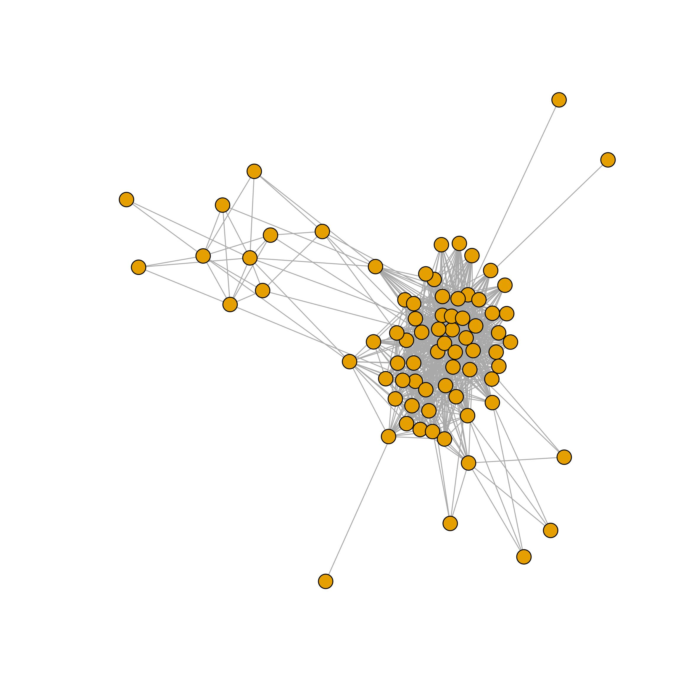
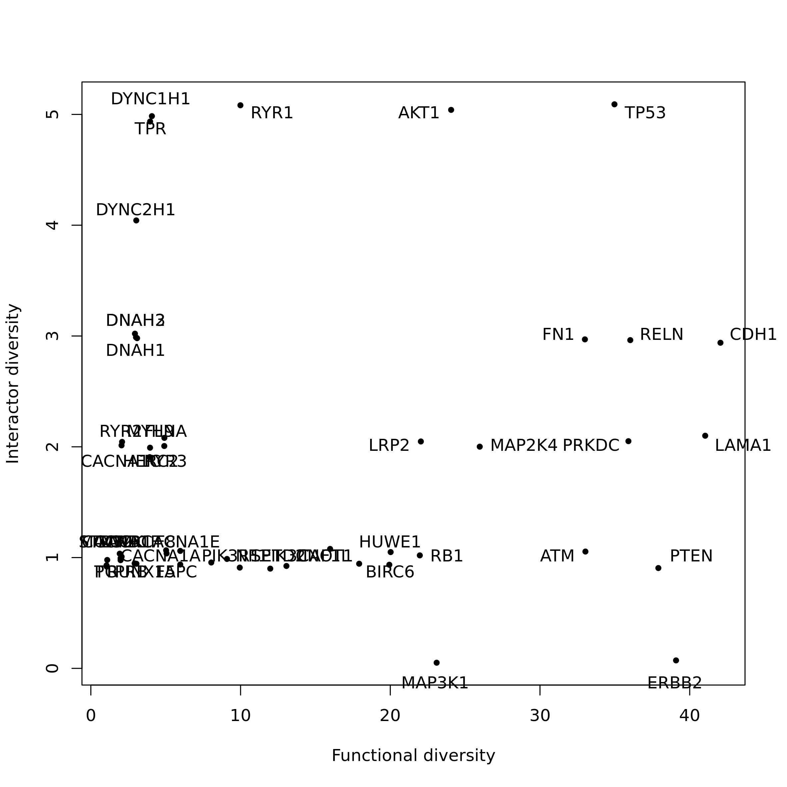
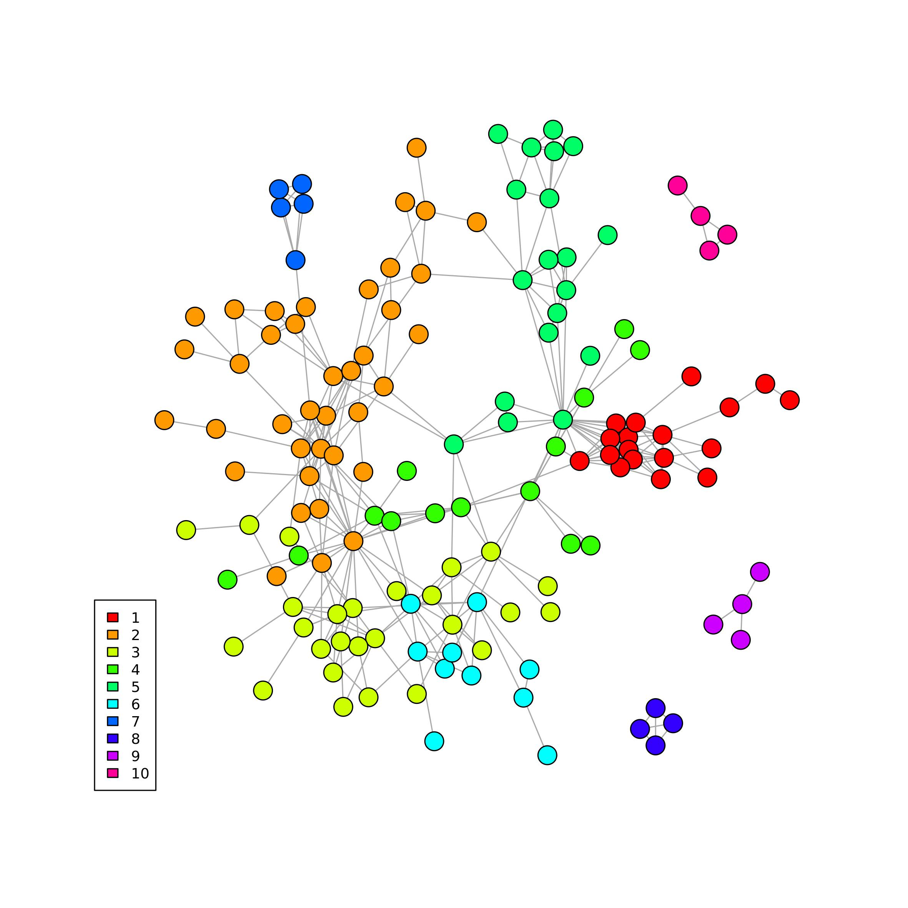

```{r setup, echo = FALSE, message = FALSE, warning=FALSE}
library(pander)
library(knitr)
library(rmarkdown)
library(kableExtra)
library(igraph)
knitr::opts_chunk$set(
  collapse = TRUE,
  comment = "#>",
  error    = FALSE,
  warning  = FALSE,
  #eval     = FALSE,
  message  = FALSE#,
  #fig.width = 7,
  #fig.height = 7
)

#panderOptions("table.split.table", Inf)
#panderOptions('knitr.auto.asis', TRUE)
#options(width = 80)
```

Pathways are groups of genes that occur to a determined biological function. By integrating the pathway data with a gene-gene interaction network it is possible to observe that genes interact within and between pathways. We developed Ulisse to be able to integrate pathway and gene network data and analyse them by different point of view. Ulisse has two workflows, one for bulk data and the other or single cell data, even though the analyses of the bulk workflow can be easily applied to cell clusters of single cell studies. In this workflow we will demonstrate the usage of Ulisse on bulk data. Ulisse needs mainly two inputs: a gene list, that can be or not ranked, and a biological network.

## Downloading and preparing the data
```{r libraries, include=TRUE, message=FALSE, warning=FALSE, eval=FALSE}
library(Ulisse)
library(TCGAbiolinks)
library(STRINGdb)
library(igraph)
library(reshape2)
```
As an example, dataset we will use breast cancer mutational data obtained from TCGA, that we will use to obtain the ranked gene list. The biological network will be obtained from STRING database.

### Ranked gene list
To obtain the needed ranked gene list we will split the TCGA data as to have a matrix with the genes in the rows and the samples in the columns. This matrix will have a 1 if the gene is mutated in that sample and a 0 otherwise. By making the mean we will obtain the frequency of mutation identified for each gene in the samples, and we will use this value as a rank.
```{r not_to_run_downloadTCGAdata, eval=FALSE}
query <- GDCquery(project = "TCGA-BRCA", 
                  data.category = "Simple Nucleotide Variation",
                  data.type = "Masked Somatic Mutation", 
                  sample.type = "Primary Tumor",
                  workflow.type = "MuTect2 Variant Aggregation and Masking"
                  )
GDCdownload(query = query) #have to be done only the first time
data <- TCGAbiolinks::GDCprepare(query, 
                                 summarizedExperiment = F, 
                                 save = T, 
                                 mut.pipeline = "MuTect2")
```

```{r preparing_ranked_glNOT, eval=FALSE}
data <- data.frame(table(data$Entrez_Gene_Id, data$Tumor_Sample_Barcode), stringsAsFactors = F)
data <- data.frame(acast(data, Var1 ~ Var2), stringsAsFactors = F)
data$mean <- rowMeans(data)
data <- data[order(data$mean, decreasing = T),]
data <- data[1:200,]
rank_gl <- data.frame(gene = rownames(data),
                      rank = data$mean,
                      stringsAsFactors = F)
```

### Biological network
We obtain the biological network from STRINGdb and the filter it to maintain only the 200 genes of interest

```{r preparing_networkNot, eval=FALSE}
string_db <- STRINGdb$new( version="11.0", 
                           species=9606, 
                           score_threshold=700, 
                           input_directory="." )
rank_gl <- string_db$map(rank_gl, "gene", removeUnmappedRows = T)
PPI <- unique(string_db$get_interactions(rank_gl$STRING_id))
PPI.g <- graph_from_edgelist(as.matrix(PPI[,1:2]), directed = F)
```

Now we have the biological network of the 200 genes of interest. However, it is formatted with STRING identifiers, so we need to convert it in something compatible with the names of the gene in the ranked gene list. We will convert both to gene symbol. As is possible to see, there are more genes in the ranked gene list than in the network. The missing genes are singletons that does not have inks with the other and are thus not represented in the edge list. Moreover, these genes do not give any information that can be used in CT calculations, so it is correct to ignore them

```{r convert_entrezid_symbol, message=FALSE, eval=FALSE}
library(org.Hs.eg.db)
hs <- org.Hs.eg.db

rank_gl <- rank_gl[which(rank_gl$STRING_id %in% V(PPI.g)$name),]
to_convert <- select(hs, keys=rank_gl$gene, columns = "SYMBOL", keytype = "ENTREZID")
rank_gl$gene_symbol <- to_convert$SYMBOL[match(rank_gl$gene, to_convert$ENTREZID)]

V(PPI.g)$name <- rank_gl$gene_symbol[match(V(PPI.g)$name, rank_gl$STRING_id)]
PPI.g
```

```{r PPI, echo=FALSE, eval=TRUE}
PPI.g <- readRDS("bulk_data/PPI_g.Rds")
PPI.g

```

### Pathway Data
Now we have the two inputs prepared. We need to download the pathway database and group our gene of interest into pathways.
To do so we will use the `pathway_data` function that download the data of a defined database from MSigDB, group the genes into pathway and returns only the ones that are composed by at least `min_size` and maximum `max_size` genes. In this case we will download KEGG database and use the default for the other parameters. The function will return the result of the MSigDBR function to download the pathway and the pathway list

```{r obtaining_pathway_dataNOT, eval=FALSE}
ptw <- pathway_data(species = "Homo sapiens", 
                    subcategory = "CP:KEGG", 
                    type = "gene_symbol", 
                    gene = rank_gl$gene_symbol )

ptw$msigdb_output[1:10,]
```

```{r obtaining_pathway_data, echo=FALSE, warning=FALSE, message=F, results='show', eval=TRUE}
ptw <- readRDS("bulk_data/ptw.Rds")

ptw$msigdb_output[1:10,] %>%
  kable(format = "html", col.names = colnames(ptw$msigdb_output[1:10,])) %>%
  kable_minimal() %>%
  kable_styling(bootstrap_options = c("striped", "condensed")) %>%
  kableExtra::scroll_box(width = "100%")
```

```{r obtaining_pathway_data3, eval=TRUE}
ptw$path_list[1:3]
```

## Pathway Cross-talk
Now we have all the needed input for calculating PCT. The network will be provided to `pathway_cross_talk` function as an adjacency matrix. The rank (or weights) of the genes should be provided to the function as a vector of values associated to the genes ordered with the same order of the adjacency matrix. PCT calculation can be parallelized by increasing the `mc_cores_pct` and `mc_cores_perm` values: the first parallelize the calculation of the PCT on the pathways, the second parallelize all the calculation over the permutated version of the adjacency matrix, thus multiply the `mc_cores_pct` in some part of the function. The number of permutations `k` corresponds to the number of permutated versions of the matrix that are needed, together with the original matrix, for the calculation of p-value and FDR. Here we set the number to 9, which means that the p-value and FDR are calculated on 9 permutated matrices + the original one, so 10 matrix in total (and thus the minimal p-vale will be 0.10)
As a short example we will use no parallelization and only 9 permutations. 

```{r pctNot, results="asis", eval=FALSE}
adj.m <- as_adjacency_matrix(PPI.g, sparse = F)
rank_gl <- rank_gl[match(rownames(adj.m), rank_gl$gene_symbol),]

pct <- pathway_cross_talk(pathway_list = ptw$path_list, 
                          gene_network_adj = adj.m, 
                          weight = rank_gl$rank, 
                          mc_cores_pct = 1, 
                          mc_cores_perm = 1, k = 9)
pct[1:10,]
```

```{r pct, results="asis", echo=FALSE, warning=FALSE, message=F, results='show', eval=TRUE}
pct <- readRDS("bulk_data/pct.Rds")
pct$p_value <- as.vector(pct$p_value)
rownames(pct) <- c()
pct[1:10,] %>%
  kable(format = "html", col.names = colnames(pct[1:10,])) %>%
  kable_minimal() %>%
  kable_styling(bootstrap_options = c("striped", "condensed")) %>%
  kableExtra::scroll_box(width = "100%")

#paged_table(data.frame(pct[1:3,], stringsAsFactors = F)) 

```

### PCT visualization

PCT results can be filtered to maintain only the significative. Then, the results can be visualized as a network or as an heatmap

```{r, include=TRUE, message=FALSE, warning=FALSE}
library(ComplexHeatmap)
library(circlize)
```


```{r PCT_visualizationNOT, eval=FALSE}
pct <- pct[which(pct$p_value <= 0.1),]

pct.n <- graph_from_edgelist(as.matrix(pct[,1:2]), directed = F)
E(pct.n)$pct <- pct$pct

plot(pct.n,  
     vertex.label=NA,  
     vertex.size=6)
```

```{r, eval=TRUE, echo=FALSE, out.width=600, fig.align = 'center'}

```

```{r PCT_visualization2NOT, eval=FALSE}

adj.pct <- as_adjacency_matrix(pct.n, sparse = F, attr = "pct")

col_fun <- colorRamp2(c(0, max(adj.pct)), c("lightyellow", "red"))
h <- Heatmap(adj.pct, cluster_rows = F,  
             cluster_columns = F, 
             col = col_fun, 
             show_row_names = F, 
             show_column_names = F,
             heatmap_legend_param = list(title="Crosstalk"),
             )
draw(h, heatmap_legend_side = "left")

```

```{r, eval=TRUE, echo=FALSE, out.width=600, fig.align = 'center'}
include_graphics("bulk_data/REACTOME_pct_heatmap.jpeg")
```

### Gene functional relevance
The significative results of PCT can be used for gene functional relevance analysis via `gene_funct_rel` function. In this analysis the PCT data are used to study the roles of the genes in the PCTs. It returns two values: the functional diversity, which is the number of different pathways with which a gene participates in the formation of a cross-talk; and the interactors diversity, or the number of genes with which a gene interacts that participate in a significative PCT.
By turning the argument `to_plot` to `TRUE`, the function saves a plot named as default `gene_functional_relevance.jpeg` in the working directory

```{r Funct_relNot, results="asis", eval=FALSE}
funct_rel <-gene_funct_relevance(pct = pct, adj = adj.m, to_plot = F)
funct_rel[1:10,]
```

```{r Funct_rel, results="asis", echo=FALSE, warning=FALSE, message=F, results='show', eval=TRUE}
funct_rel <- readRDS("bulk_data/funct_rel.Rds")
funct_rel[1:10,] %>%
  kable(format = "html", col.names = colnames(funct_rel[1:10,])) %>%
  kable_minimal() %>%
  kable_styling(bootstrap_options = c("striped", "condensed")) %>%
  column_spec(4, width = "5cm") %>%
  kableExtra::scroll_box(width = "100%")

```

```{r Funct_relNot2, results="asis", eval=FALSE}
plot(jitter(funct_rel$nPTW, factor = 0.5), jitter(funct_rel$nInteractors, factor = 0.5),
     pch=20, xlab = "Functional diversity", ylab ="Interactor diversity" )
plotrix::thigmophobe.labels(funct_rel$nPTW,
                            funct_rel$nInteractors,
                            funct_rel$gene, cex=0.5)

```

```{r Funct_rel2, echo=FALSE, eval=TRUE, out.width=600, fig.align = 'center'}

```

## Sub-pathway CT
Gene interacts inside the pathways and groups into connected components (CC), or group of genes more interconnected between them than to the other genes in the network. In this case, each connected components correspond to genes with a similar biological function. In som studies may be important to identify if there are some connected components that are enriched of gene of interest. `pathway_cc` assign a score to each CC and uses a permutation approach to identify the significative ones. As for `pathway_cross_talk`, `mc_cores_cc` and `mc_cores_perm` are the parameter to control the parallelization of the calculation of the CC score and the permutations for the statistical evaluation, respectively.
The function returns a list of two elements: the first are the details of the CC present in each pathway and the second a table with the result of the sub-pathway analysis
```{r CC_Not, results="asis", eval=FALSE}
pct_CC <- pathway_cc(pathway_list = ptw$path_list, 
                     gene_network_adj = adj.m,
                     weight = rank_gl$rank, 
                     k = 9,
                     mc_cores_cc = 1, 
                     mc_cores_perm = 1)
pct_CC$membership[1:3]
```

```{r CC, results="asis", echo=FALSE, warning=FALSE, message=F, results='show', eval=TRUE}
pct_CC <- readRDS("bulk_data/pct_cc.Rds")
pct_CC$membership[1:3]
```

```{r CC_Not2, results="asis", eval=FALSE}

pct_CC$pathway_cc[1:10,]
```


```{r CC2, results="asis", echo=FALSE, warning=FALSE, message=F, results='show', eval=TRUE}
pct_CC$pathway_cc$p_value <- as.vector(pct_CC$pathway_cc$p_value)
rownames(pct_CC$pathway_cc) <- c()
pct_CC$pathway_cc[1:10,] %>%
  kable(format = "html", col.names = colnames(pct_CC$pathway_cc[1:3,])) %>%
  kable_minimal() %>%
  kable_styling(bootstrap_options = c("striped", "condensed")) %>%
  kableExtra::scroll_box(width = "100%")

```

## TM-PCT

It is possible to study in a network if there are some communities of vertices where the vertices are more connected between them than to the rest of the network. In biological network it is said that these communities correspond to genes that have similar biological function. We decided to develop `TM_PCT` as to be able to study how the pathways build on the gene communities interact. Community pathways should represent the part of pathways that have a similar biological function, and with `TM_PCT` we can study how these interact. First, we need to identify the gene communities. We can use `find_communites` function to compare different algorithms

```{r gene_commNot, eval=FALSE}
comm_det <- find_communities(PPI.g)
comm_det$info

```

```{r gene_comm, echo=FALSE, eval=TRUE}
comm_det <- readRDS("bulk_data/comm_det.Rds")
comm_det$info

```

Considering the output of `find_communities`, the best algorithm to choose is the one with highest modularity and the lowest number of communities. Here we choose to use fastgreedy

```{r comm_detect, eval=FALSE}
comm <- comm_det$comm$fastgreedy
comm_m <- membership(comm)
PPI.g <- set_vertex_attr(PPI.g, "comm_id", value =  comm_m[match(names(V(PPI.g)), names(comm_m))])

comm_mF <- factor(comm_m, levels = min(comm_m):max(comm_m)) #to control graphical parameters
pal = rainbow(max(comm_m))
plot(PPI.g, 
     vertex.color=pal[as.numeric(comm_m)], 
     vertex.label=NA, 
     vertex.size=6)
legend("bottomleft", fill = pal, legend = levels(comm_mF), cex = 0.75)

```

```{r eval=TRUE, echo=FALSE, out.width=600, fig.align = 'center'}

```

Now we have all the inputs needed for TM-PCT. As before, `mc_cores_pct`, `mc_cores_perm` and `mc_cores_tm` controls the parallelization of the calculation of TM-PCT score in pathway pairs, in the permutations and combinations of communities, respectively. `tm_pct` function returns a list of two object, the first is a pathway list for each community, the secondo a table with the results of TM-PCT calculation
```{r TM_PCTNOT, results="asis", eval=FALSE}
att.vertex <- vertex_attr(PPI.g)
tm_pct <- TM_PCT(pathway_list = ptw$path_list, 
                 gene_network_adj = adj.m,
                 membership = as.vector(att.vertex$comm_id),
                 weight = rank_gl$rank, 
                 mc_cores_pct = 1, 
                 mc_cores_perm = 1, 
                 mc_cores_tm = 1, 
                 k = 9)
tm_pct[["comm_pathway_list"]][["1"]][1:3]
```

```{r TM_PCT, echo=FALSE, eval=TRUE}
tm_pct <- readRDS("bulk_data/tm_pct.Rds")
tm_pct[["comm_pathway_list"]][["1"]][1:3]
```

```{r TM_PCTNOT2, results="asis", eval=FALSE}
tm_pct$TM_PCT_res[1:10,]
```

```{r TM_PCT2, echo=FALSE, eval=TRUE}
tm_pct$TM_PCT_res$p_value <- as.vector(tm_pct$TM_PCT_res$p_value)
tm_pct$TM_PCT_res[1:10,] %>%
  kable(format = "html", col.names = colnames(tm_pct$TM_PCT_res[1:10,])) %>%
  kable_minimal() %>%
  kable_styling(bootstrap_options = c("striped", "condensed")) %>%
  kableExtra::scroll_box(width = "100%")

```

# Session Info {- .smaller}
```{r sessioninfo}
sessionInfo()
```
