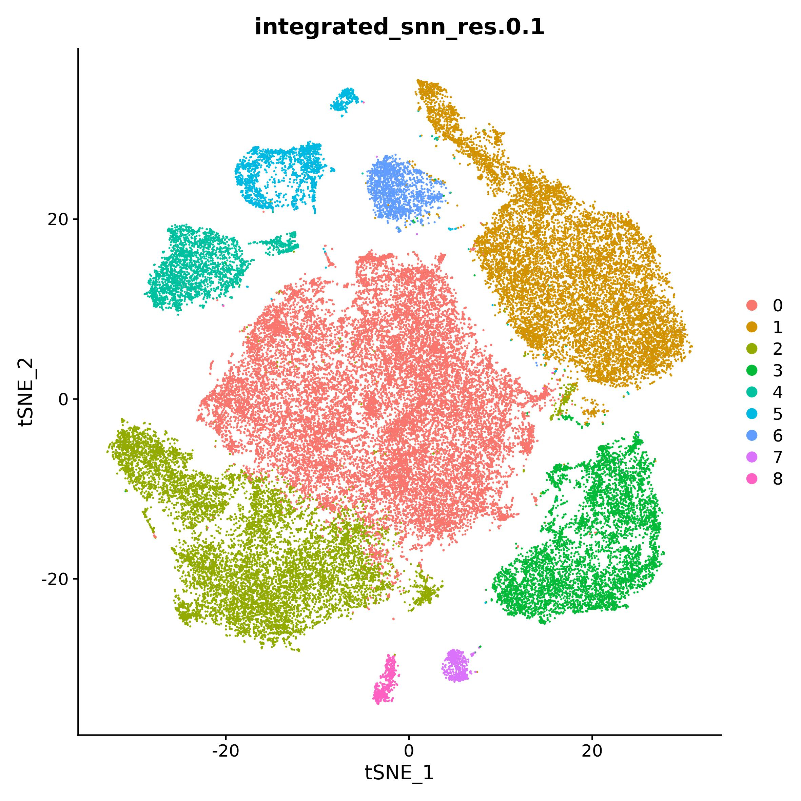
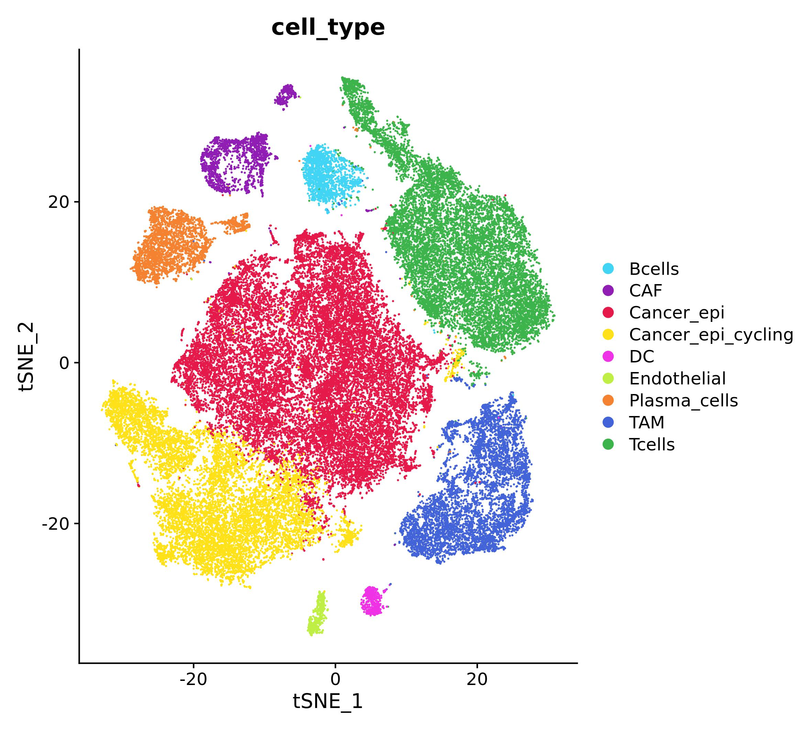
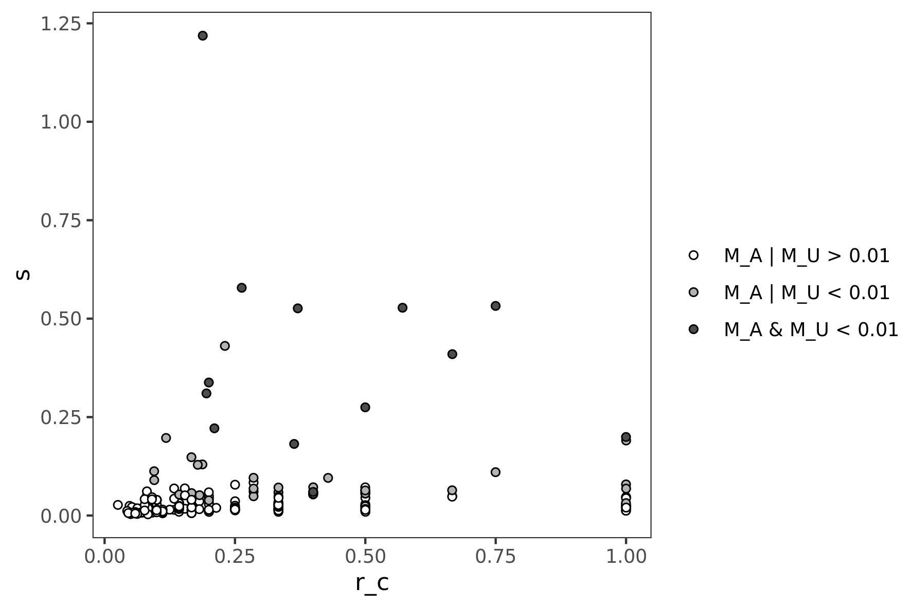
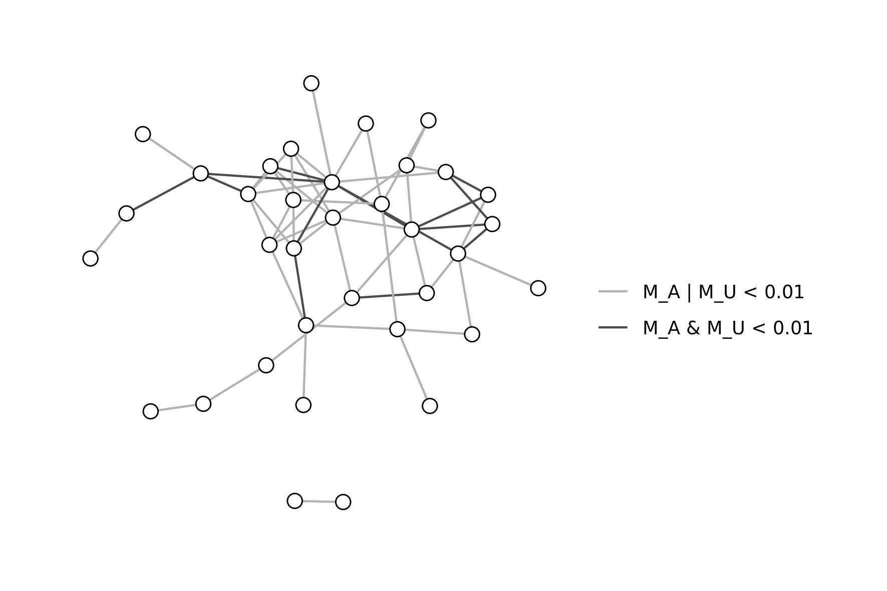
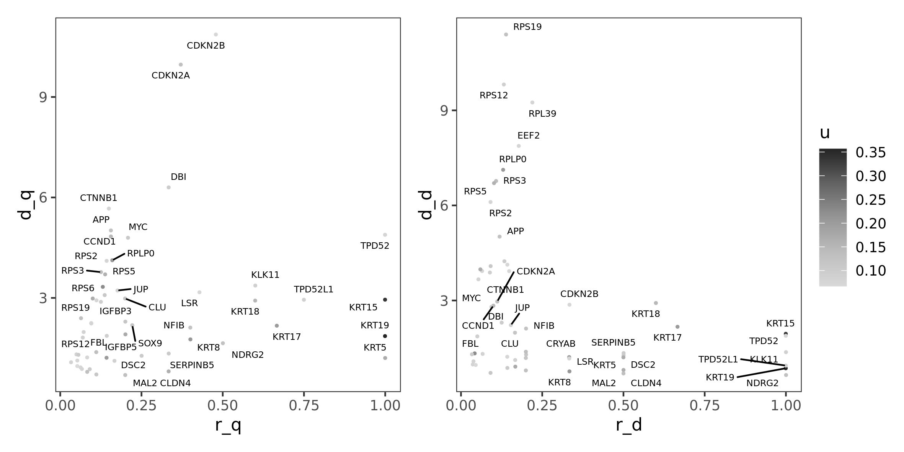
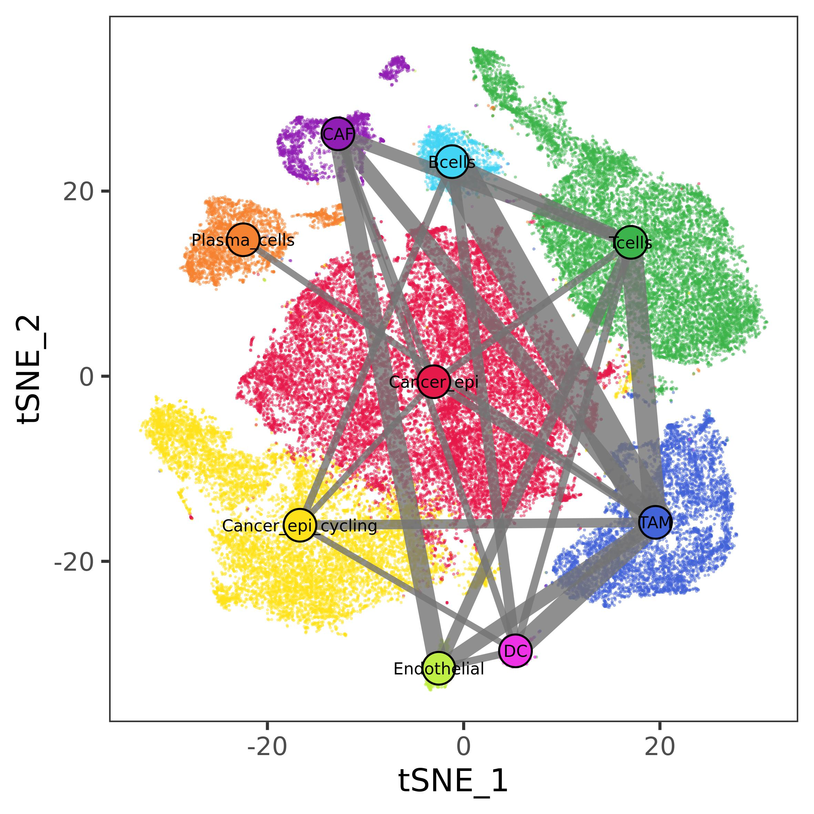
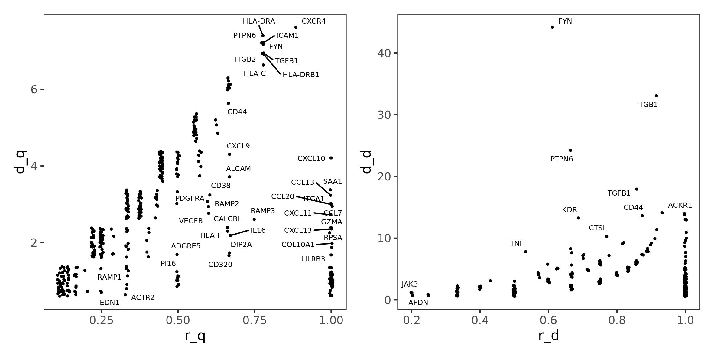

```{r setup, echo = FALSE, message = FALSE, warning=FALSE}
#library(pander)
library(knitr)
library(rmarkdown)
#library(kableExtra)
knitr::opts_chunk$set(
  collapse = TRUE,
  comment = "#>",
  error    = FALSE,
  warning  = FALSE,
  #eval     = FALSE,
  message  = FALSE#,
  #fig.width = 7,
  #fig.height = 7
)
```

In this vignette we will describe the usage of Ulisse. We will use already processed data from [@pal2021single] and some Seurat v4 [@Hao2021] functions to obtain input data. As you will see, the usage of Seurat is not mandatory, as the same data can be obtained with other tools. Moreover, the same workflow can be applied to other data (i.e.: expression, mutation, combination of the two, etc...), or even applied only partially (i.e.: intracellular crosstalk only on bulk data).

This vignette will describe Ulisse usage to analyse communications among cell types, intracellular crosstalk in Cancer-Associated Fibroblasts (CAF), and integrated crosstalk of cancer-CAF clusters.
In general, crosstalk calculation needs: 

* gene sets 
* gene scores
* gene-gene interaction network. 

Gene-sets definition depends on the test used: in cell-cell communication the gene sets are the cell types (or clusters), while in intracellular analysis they represents cellular functions or mechanisms, defined by using public (pathway) databases. In our example, we will use MSigDB Hallmarks database.

The definition of gene scores is up to the user, the data under analysis and the focus of the study. Here we will use a score calculated over Differentially Expressed Genes (DEG) testing, to use a statistic that summarize both the significance and the importance of the gene in a cell type over the entire dataset. It is important to note, that the analysis can be done without providing gene weights, by setting them = 1.

Equal to the gene sets, the definition of interaction network depends on the test: communication analysis needs a communication network, while other gene/protein interaction network can be suitable for intracellular analysis. Here, we will use Omnipath [@turei2021] and String [@szklarczyk2021] networks, respectively.

The code used in this vignette replicates the one used for Ulisse publication.

```{r libraries, include=TRUE, message=FALSE, warning=FALSE, eval=FALSE}
library(Ulisse)
library(Seurat)
library(MAST)
library(OmnipathR)
library(igraph)
library(ggplot2)
library(ggraph)
library(ggrepel)
library(msigdbr)
library(patchwork)
```

# Data uploading, preparation and Differential Expression testing

As an example we will use Triple Negative Breast Cancer(TNBC) data from [@pal2021single]. Already processed data can be obtained at [@Chen2022]. 

```{r uploading, include=TRUE, message=FALSE, warning=FALSE, eval=FALSE}
tnbc <- readRDS("17058077/SeuratObject_TNBC.rds")

DimPlot(tnbc, group.by = "integrated_snn_res.0.1")

```

```{r, eval=TRUE, echo=FALSE, out.width=600, fig.align = 'center'}

```

The dataset is composed by 8 samples integrated with Seurat method. Processing of the data, described in detail in the article, resulted in 9 cluster. In the paper they provide cluster annotation, which is not present in the `tnbc` object. We used `SeuratObject_TNBCSub.rds` and paper plots to reconstruct cluster annotation (not shown).

```{r ct_annotationNOT, include=TRUE, message=FALSE, warning=FALSE, eval=FALSE}
tnbc_ct <- setNames(c("Cancer_epi", "Tcells", "Cancer_epi_cycling", "TAM", "Plasma_cells", "CAF", "Bcells", "DC", "Endothelial"), 0:8)
tnbc$cell_type <- tnbc_ct[as.character(tnbc$integrated_snn_res.0.1)]

ct_pal <- pals::trubetskoy(length(tnbc_ct))
names(ct_pal) <- names(tnbc_ct)

DimPlot(tnbc, group.by = "cell_type", cols = ct_pal)

```


```{r ct_annotation, eval=TRUE, echo=FALSE, out.width=600, fig.align = 'center'}

```

Once obtained cluster annotation, we test for differential expression (DE) by using `MAST` algorithm. DE results will then be used to calculate a cluster-specific gene score, which is defined as $(log_{2}(Fold Change))(-log_{10}(adjusted-p-value))$. To reduce noise, only scores of genes with: $adjusted-p-value < 0.05$ & $log2(Fold Change) > 0.5$ will be considered, all the other are set to 0. We will normalize the score over the maximum value to obtain more intelligible values.

```{r DEG, include=TRUE, message=FALSE, warning=FALSE, eval=FALSE}
#this may take a while
#to reduce change the test, the results will be different
DEG_tnbc <- FindAllMarkers(tnbc, test = "MAST", assay = "RNA")

DEG_tnbc$p_adj_BH <- p.adjust(DEG_tnbc$p_val, method = "BH")
DEG_tnbc$p_adj_BH[DEG_tnbc$p_adj_BH == 0] <- min(DEG_tnbc$p_adj_BH[DEG_tnbc$p_adj_BH != 0])
DEG_tnbc$score <- DEG_tnbc$avg_log2FC * (-log10(DEG_tnbc$p_adj_BH))
DEG_tnbc$score <- DEG_tnbc$score/max(DEG_tnbc$score) #normalize score values
DEG_tnbc$score[!(DEG_tnbc$p_adj_BH < 0.05 & DEG_tnbc$avg_log2FC > 0.5)] <- 0 #denoising

```

# Intracellular crosstalk

In this section we will demonstrate the usage of Ulisse to analyse intracellular crosstalk. To do so, we will focus on Cancer epithelial cell type.

## Inputs

We need:

* biological network: here we will use String v12, which is provided within NPAtools package
* gene scores: we will use "Cancer_epi" DEGs
* gene sets: here we will use MsigDB hallmarks, downloaded from msigdbr package

```{r stringNOT, include=TRUE, message=FALSE, warning=FALSE, eval=FALSE}
#biological network
data(NAPtools)
V(stringv12)$name <- V(stringv12)$symbol #stringv12 names are entry id, but here we need symbols. 
#Without this code, the adjacency matrix rownames and colnames will be the entry ids
g.adj <- as_adjacency_matrix(stringv12, sparse = F, type = "both")

#gene set database, mapped to  string genes
hallmarks <- msigdbr(category = "H")
ptw.H <- data.frame(hallmarks[, c("gs_name", "gene_symbol")])
ptw.H <- ptw.H[ptw.H$gene_symbol %in% V(stringv12)$symbol,]
```

Once obtained gene set and gene scores, these needs to be coupled (via `build_S_list()`) to build a weighted gene set list. At this point, this list can be provided to Ulisse, together with the network, to perform the analysis with `gs_cross_talk()` function.
There are two way to use `build_S_list()`: one is shown here, where the gene sets are provided as a table, together with a named vector for weights; the other is shown in later in the vignette.

```{r gsNOT, include=TRUE, message=FALSE, warning=FALSE, eval=FALSE}
g.w <- DEG_tnbc[DEG_tnbc$cluster == "Cancer_epi",]
g.w <- setNames(g.w$score, g.w$gene)

gs_list <- build_S_list(S_tab = ptw.H, g_u = g.w,  universe = V(stringv12)$symbol, min_size = NULL, max_size = NULL)

```

## crosstalk calculation

Now we have everything ready for intracellular crosstalk calculation. Here, we will set `ct_type = "intracellular"`, so the function will not consider overlapping genes, as they are the same and shouldn't be considered to avoid using gene-set internal links. This return a crosstalk table

```{r ctNOT, include=TRUE, message=FALSE, warning=FALSE, eval=FALSE}
can_ct <- gs_cross_talk(S_list = gs_list,
                        A = g.adj, 
                        k = 99, 
                        ct_type = "intracellular",
                        mc_cores_perm = 2, perm_link = "degree", perm_weights = "degree", cut_par = NULL, mc_cores_ct = 2)
can_ct[1:5, ]
```

```{r ct, results="asis", echo=FALSE, warning=FALSE, message=F, results='show', eval=TRUE}
tnbc_ct <- readRDS("data/tnbc_ct.Rds")
tnbc_ct <- tnbc_ct[1:5,]
tnbc_ct
```

Results can be visualized as scatterplot, by plotting the score (`s`) and the crosstalk saturation (`r_c``) affected over the possible. This visualization allows to prioritize genes on the percentage of affected crosstalks.

```{r ct_plotNOT, include=TRUE, message=FALSE, warning=FALSE, eval=FALSE}
can_ct$sign <- "M_A | M_U > 0.01"
can_ct$sign[can_ct$pA < 0.01 | can_ct$pU < 0.01] <- "M_A | M_U < 0.01"
can_ct$sign[can_ct$pA < 0.01 & can_ct$pU < 0.01] <- "M_A & M_U < 0.01"


ggplot(can_ct, aes(x =  r_c, y = s, shape = sign)) +
  geom_jitter(position = position_jitter(seed = 1), shape = 21) +
  scale_fill_manual("", values = c("white", "gray70", "gray30"), 
                    breaks = c("M_A | M_U > 0.01", "M_A | M_U < 0.01", "M_A & M_U < 0.01")) +
  theme_test() 

```

```{r ct_plot, eval=TRUE, echo=FALSE, out.width=600, fig.align = 'center'}


```

Otherwise, we can visualize results as a network. Here, we will consider only significant interactions and set different color for fully (`r_c = 1`) or partially (`r_c < 1`) affected crosstalks.

```{r ct_plotNOT2, include=TRUE, message=FALSE, warning=FALSE, eval=FALSE}
can_ct <- can_ct[can_ct$pA < 0.01 | can_ct$pU < 0.01, ]
g.ct <- graph_from_data_frame(can_ct, directed = F)
ly <- create_layout(g.ct, "nicely")

ggraph(g.ct, layout = ly) +
  geom_edge_link(aes(color =  sign)) +
  scale_edge_color_manual("", values = c("gray70", "gray30"), 
                          breaks = c("M_A | M_U < 0.01", "M_A & M_U < 0.01")) +
  geom_node_point(shape = 21, fill = "white", size = 3) +
  theme_graph() 


```

```{r ct_plot2, eval=TRUE, echo=FALSE, out.width=600, fig.align = 'center'}


```

## Crosstalk gene classification
Gene classification analysis is performed by extracting crosstalk and interaction data for genes occurring in significant crosstalks, and comparing them to a reference model, to calculate interactor and crosstalk diversity and saturation. 
The general reference model should be built on the same data of the case study, but without considering weight differences among genes (so, all genes should have u = 1).
In this way, we can normalize crosstalk and interactor diversity of each gene affected by the condition, over all possibilities. 
To do so, we need to perform crosstalk analysis and gene classification of the reference model, to then use it in our cancer cell gene classification analysis, as described below.
Note that here, `build_S_list()` is differently, as gene sets are provided as a three column table: gene set names, gene names and weights. This format should be used when genes have different weights in the gene sets (as in intercellular crosstalk).

```{r frNOT, include=TRUE, message=FALSE, warning=FALSE, eval=FALSE}
ptw.H$score <- 1

gs_list_general <- build_S_list(S_tab = ptw.H, universe = V(stringv12)$symbol, min_size = NULL, max_size = NULL)

general <- gs_cross_talk(S_list = gs_list_general, 
                         A = g.adj, k = 0, 
                         ct_type = "intracellular",
                         mc_cores_perm = 2, perm_link = "degree", 
                         perm_weights = "degree", cut_par = NULL,
                         mc_cores_ct = 2)

general_cl <- gene_classification(gs_ct = general, A = g.adj, n_cores = 2)


can_class <- gene_classification(gs_ct = caf_ct,#only significant ones
                                 A = g.adj, 
                                 ct_ref = general_cl, #general model for normalization
                                 n_cores = 2)

can_class[, 1:5]

```


```{r fr, results="asis", echo=FALSE, warning=FALSE, message=F, results='show', eval=TRUE}
tnbc_cl <- readRDS("data/tnbc_cl.rds")
tnbc_cl <- tnbc_cl[1:5,]
tnbc_cl
```

Here we can visualize saturations of crosstalk diversity and interactor diversity (`r_q` and `r_d`, respectively), which are measure normalized on the general model, compared to their absolute values (`d_q` and `d_d`, respectively). This visualization allows to identify genes whose interactors or crosstalks diversity are fully or only partially affected. 
Here we can also color genes by their initial value, to identify interesting genes (in terms of `r_q` and `r_d`) which might not be prioritized by DEG analysis.

```{r fr_plotNOT, include=TRUE, message=FALSE, warning=FALSE, eval=FALSE}
can_class$u <- g.w[can_class$gene]

p1 <- ggplot(can_class, aes(x =  r_q, y = d_q, label = gene, colour = u)) +
  geom_jitter(position = position_jitter(seed = 1), size = 0.5) +
  ggrepel::geom_text_repel(position = position_jitter(seed = 1), size = 2, color = "black") +
  scale_color_gradientn(colours = pals::brewer.greys(6)[2:6]) +
  theme_test()


p2 <- ggplot(can_class, aes(x = r_d, y = d_d, label = gene, colour = u)) +
  geom_jitter(position = position_jitter(seed = 1), size = 0.5) +
  ggrepel::geom_text_repel(position = position_jitter(seed = 1), size = 2, color = "black") +
  scale_color_gradientn(colours = pals::brewer.greys(6)[2:6]) +
  theme_test()

p1 + p2 + plot_layout(guides = 'collect')

```

```{r fr_plot, eval=TRUE, echo=FALSE, out.width=600, fig.align = 'center'}


```

# Intercellular Communication

## input: omnipath communication network

As described before, we need a communication network for communication analysis. Here we will use OmnipathR package to download the intercellular network. The data reported here are the ones used in the publication (downloaded in September, 2024). Later updates of Omnipath database may yield different results.

```{r omnipath, include=TRUE, message=FALSE, warning=FALSE, eval=FALSE}

intercell_net <- import_intercell_network(interactions_param = list("datasets" = "omnipath"),
                                          transmitter_param = list(
                                            categories = c('ligand')),
                                          receiver_param = list(
                                            categories =c('receptor')), entity_types = "protein")

g.intercell <- graph_from_edgelist(as.matrix(unique(intercell_net[,c("source_genesymbol", "target_genesymbol")])),
                                   directed = F)
g.adj_intercell <- as_adjacency_matrix(g.intercell, sparse = F, type = "both")

```

## cell-cell communication analysis

Once obtained the input, we can build the weighted gene-set list. As described before, here we should use `build_S_list()` by providing the gene sets as a three column table. In this way, we can build a gene set for each cell type, with different weights for the same genes.

```{r CCC, include=TRUE, message=FALSE, warning=FALSE, eval=FALSE}

tnbc_list <- build_S_list(S_tab = DEG_tnbc[, c("cluster", "gene", "score")], 
                          universe = V(g.intercell)$name, 
                          min_size = NULL, max_size = NULL)

tnbcCCC <- gs_cross_talk(S_list = tnbc_list, 
                         A = g.adj_intercell, 
                         k = 99, 
                         ct_type = "communication",
                         mc_cores_perm = 2, perm_link = "degree", perm_weights = "degree", 
                         cut_par = NULL,
                         mc_cores_ct = 2)

```

By specifying `ct_type = "communication"`, the `gs_cross_talk()` function will consider genes shared among gene sets in the calculation, as they are genes in different cell types with different score, and return also a list of interacting genes tables, one for each cell type pair. The output will then be a list with two object:
* the results of crosstalk calculation

```{r CCC_resNOT, results="asis", eval=FALSE}
tnbcCCC$ct_res[1:5,]
```

```{r CCC_res, results="asis", echo=FALSE, warning=FALSE, message=F, results='show', eval=TRUE}
ct_res <- readRDS("data/ccc_res.Rds")
ct_res <- ct_res[1:5,]
ct_res
```

* a list, with a table for each cell type pair with the detail of the interactions.

```{r CCC_resNOT2, results="asis", eval=FALSE}
tnbcCCC$ct_info$`CAF|Cancer_epi_cycling`[1:5,]
```

```{r CCC_res2, results="asis", echo=FALSE, warning=FALSE, message=F, results='show', eval=TRUE}
ct_res <- readRDS("data/ccc_caf_ccy.Rds")
ct_res <- ct_res[1:5,]
ct_res
```

The communication network can be visualized overlapped to the map of the cells by using `plot_communication_network()`. Here we will use only significant communication ($\alpha$ < 0.01).

```{r CCC_plotNOT, include=TRUE, message=FALSE, warning=FALSE, eval=FALSE}
ccc_res <- tnbcCCC$ct_res
ccc_res <- ccc_res[ccc_res$pA < 0.01 | ccc_res$pU < 0.01, ]

cl_cell <- data.frame(cell = rownames(tnbc@meta.data),
                      cluster = tnbc$cell_type, stringsAsFactors = F)

plot_communication_network(cell_emb = tnbc@reductions$tsne@cell.embeddings, 
                           cl_res = ccc_res, 
                           cl_cell = cl_cell, 
                           palette = ct_pal, #palette built at the beginning of the vignette 
                           e_scale = 9, label = T,
                           save_file = NULL)
```


```{r CCC_plot, eval=TRUE, echo=FALSE, out.width=600, fig.align = 'center'}

```

## CT gene classification

Here, in communication analysis, reference model should be built by using all cell type, and all tested genes but without weights (u = 1). In this way, we can normalize the number of crosstalk and interactor of each gene affected by the condition, over all possibilities. 
To do so, we need to perform crosstalk analysis and gene classification of the reference model, to then use it in our TNBC communication gene classification analysis, as described below.

```{r CCC_frNOT, results="asis", eval=FALSE}
DEG_tnbc_mod <- DEG_tnbc
DEG_tnbc_mod$score <- 1 #to consider all genes with same weigths

tnbc_general <- build_S_list(S_tab = DEG_tnbc_mod[, c("cluster", "gene", "score")], 
                             universe = V(g.intercell)$name, min_size = NULL, max_size = NULL)

general_tnbcCCC <- gs_cross_talk(S_list = tnbc_general, 
                                 A = g.adj_intercell, 
                                 k = 0, 
                                 ct_type = "communication",
                                 mc_cores_perm = 2, mc_cores_ct = 2,
                                 perm_link = "degree", perm_weights = "degree", cut_par = NULL) #geneal CCC model

general_cl <- gene_classification(gs_ct = general_tnbcCCC$ct_res, 
                                  A = g.adj_intercell, n_cores = 2) #general gene classification of CCC genes

fr.tnbc <- gene_classification(gs_ct = ccc_res, #only significant communications
                               A = g.adj_intercell, 
                               ct_ref = general_cl, #general gene classification to calculate degree ratio and crosstalk activity
                               n_cores = 2)
fr.tnbc[, 1:5]

```

```{r CCC_fr, results="asis", echo=FALSE, warning=FALSE, message=F, results='show', eval=TRUE}
fr.tnbc <- readRDS("data/fr.tnbc_CCC.rds")
fr.tnbc <- fr.tnbc[1:5,]
fr.tnbc
```

Now we can plot saturation of interactor diversity and crosstalk diversity compared to their absolute values, to prioritize genes, as done before in Intracellular crosstalk section 

```{r frCCCplotNot, results="asis", eval=FALSE}
p1 <- ggplot(fr.tnbc, aes(x = r_q, y = d_q, label = gene)) +
  geom_jitter(position = position_jitter(seed = 1), size = 0.5) +
  ggrepel::geom_text_repel(position = position_jitter(seed = 1), size = 2) +
  theme_test() 

p2 <- ggplot(fr.tnbc, aes(x = r_d, y = d_d, label = gene)) +
  geom_jitter(position = position_jitter(seed = 1), size = 0.5) +
  ggrepel::geom_text_repel(position = position_jitter(seed = 1), size = 2) +
  theme_test() 

p1 + p2 
```


```{r frCCCplot, eval=TRUE, echo=FALSE, out.width=600, fig.align = 'center'}

```

# Integrated crosstalk

Lastly, we can perform integrated crosstalk analysis, which study the interaction between genes involved in a communication with a cell type and the intracellular mechanisms (pathways). Here, we will study cancer - CAF communication and the crosstalk with Hallmarks pathways.
We can perform this analysis in two ways:

* Single integrated analysis: focused only on cancer genes involved in the communication with CAFs, and their crosstalks with Hallmarks pathways involving altered genes
* Integrated analysis: focused on multiple inter-intracellular crosstalks. Here we will apply this analysis on cancer-CAF communication, to obtain results in both directions

In both analysis, we can again filter the results to maintain only the significant ones, as done for intercellular and intracellular.

## Single integrated analysis

To perform this analysis we simply need the data already used for intracellular and intercellular crosstalks. In detail, we need the cancer communication gene set, but considering as altered (with u > 0) only the genes involved in the communication with CAFs, and the pathway gene set list created for intracellular communication.
`single_integrated_cross_talk()` takes as input a gene set list, composed by both these inputs, the name of the communicating gene set (`ref`), and a biological network (here we will use String, as done in intrecellular section). The function returns a table with the same structure of the ones obtained with `gs_cross_talk()`. Here, S1 is always the communication gene set (`"Cancer_epi"` in this case), as this function do not calculate the the crosstalk between each possible pair, to not rerun intracellular analysis and do not complicate null models building.

```{r singlIntNot, results="asis", eval=FALSE}
ccc_info <- tnbcCCC$ct_info[["CAF|Cancer_epi"]]
can_ccc <- tnbc_list$Cancer_epi
can_ccc[!names(can_ccc) %in% unique(ccc_info$S2_gene[ccc_info$u12 > 0])] <- 0
gs_list_int <- gs_list
gs_list_int[["Cancer_epi"]] <- can_ccc

integr_can <- single_integrated_cross_talk(S_list = gs_list_int, #Hallmark gene set list built for intracellular analysis
                                           ref = "Cancer_epi", #name of the communication gene set
                                           A = g.adj, #String used for intracellular analysis
                                           k = 99, 
                                           perm_link = "degree", perm_weights = "degree", 
                                           cut_par = NULL, mc_cores_perm = 2, mc_cores_ct = 2)
integr_can[1:5, ]
```

```{r singlInt, results="asis", echo=FALSE, warning=FALSE, message=F, results='show', eval=TRUE}
integr_can <- readRDS("data/meta_canc.Rds")
integr_can <- integr_can[1:5,]
integr_can
```

## Integrated analysis

To perform this analysis we need:

* the results of cell-cell communication, in a form of a list with the detail of all the communication we want to study (here only CAF - Cancer cycling)
* weighted gene set lists: we need the gene set built for cell-cell communication, as also intracellular gene sets. Here so far we have analyzed only cancer intracellular crosstalk, so we need to obtain CAF list.
* a biological network: here we will again use string network, as before.
`integrated_cross_talk()` function is a wrapper of `single_integrated_cross_talk()`, that run this analysis on each communication present in `ccc_list`, in both directions, and returns a table with all integrated analysis performed. To discriminate different communicating gene sets, the first column contains the name fo the `ccc_list` object used

```{r metaNOT, include=TRUE, message=FALSE, warning=FALSE, eval=FALSE}
# 1) communication results: a list with details of all communications we want to investigate
ccc_info <- tnbcCCC$ct_info["CAF|Cancer_epi"] 

# 2) gene set list: we are missing Cancer cycling ones, so we built it as done for CAF
g.wCaf <- DEG_tnbc[DEG_tnbc$cluster == "CAF",]
g.wCaf <- setNames(g.wCaf$score, g.wCaf$gene)

gs_listCaf <- build_S_list(S_tab = ptw.H[, 1:2], g_u = g.wCaf,  universe = V(stringv12)$symbol, min_size = NULL, max_size = NULL)

#here is the list both intracellular gene set lists
gs_list_tot <- list(CAF = gs_listCaf,
                    Cancer_epi = gs_list)


integrated_tnbc <- integrated_cross_talk(cl_list = tnbc_list, #CCC gene sets list
                                         ccc_list = ccc_info, #CCC detailed results of the communications of interest
                                         gs_list = gs_list_tot, #intracellular gene set lists
                                         A = g.adj, #biological network
                                         k = 99, mc_cores_perm = 2, mc_cores_ct = 2,
                                         perm_link = "degree", perm_weights = "degree", cut_par = NULL)
                                   

integrated_tnbc[1:5, ]
```

```{r meta, results="asis", echo=FALSE, warning=FALSE, message=F, results='show', eval=TRUE}
meta_tnbc <- readRDS("data/meta_tnbc.Rds")
meta_tnbc <- meta_tnbc[1:5,]
meta_tnbc
```


# References
