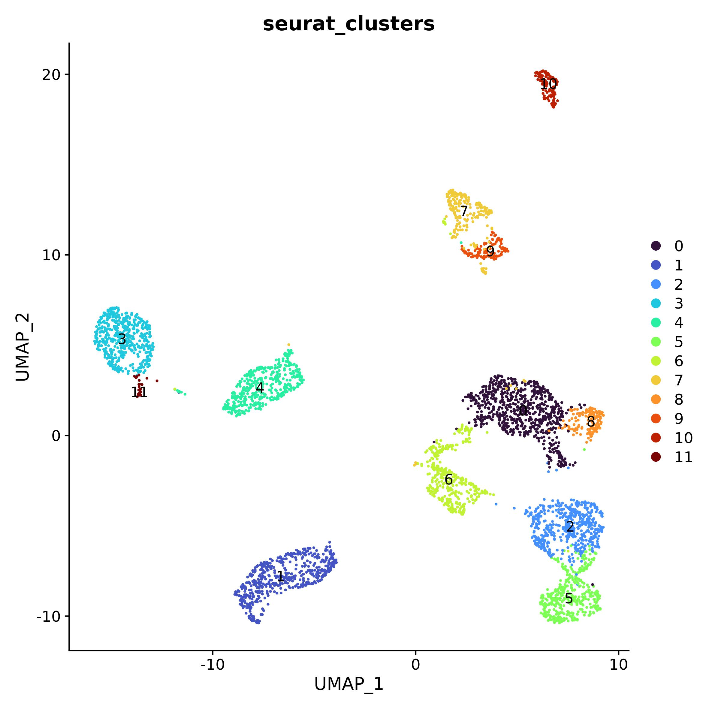
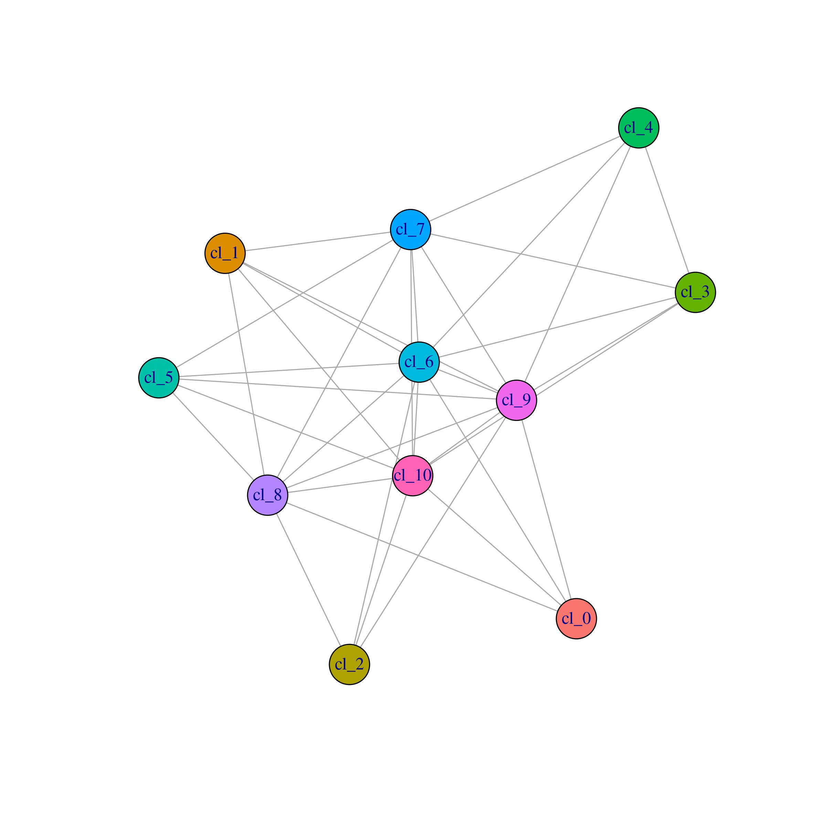
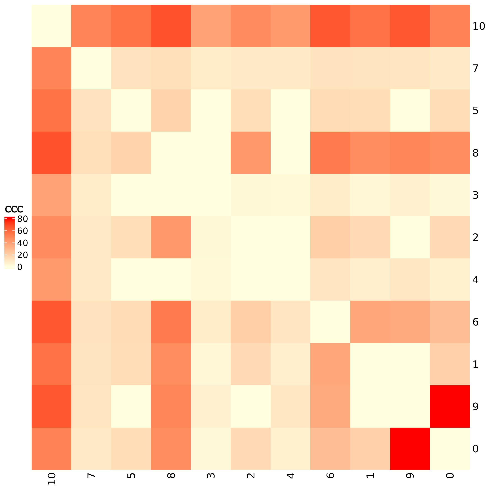
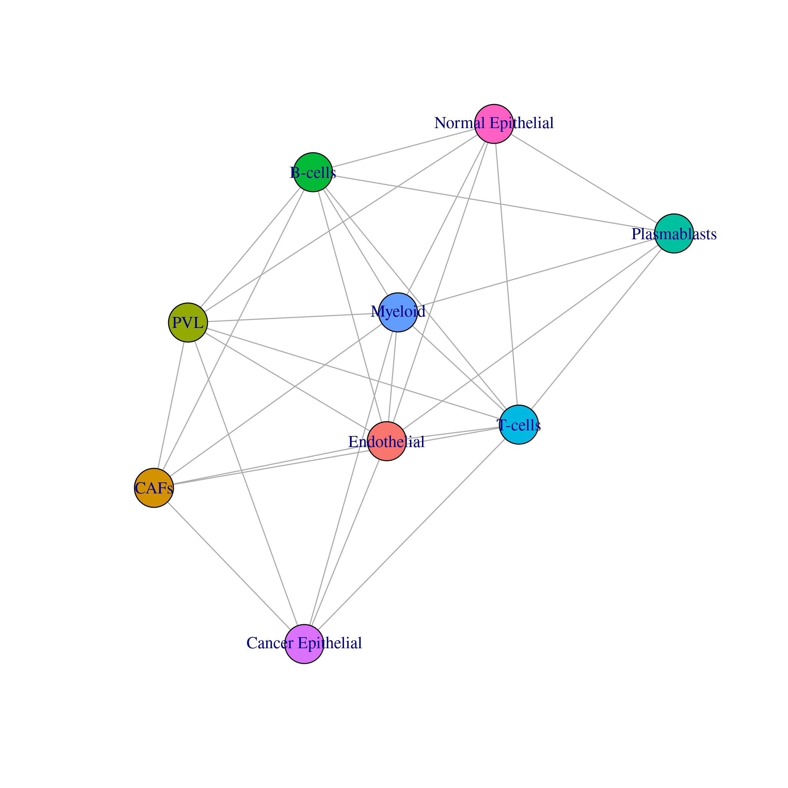
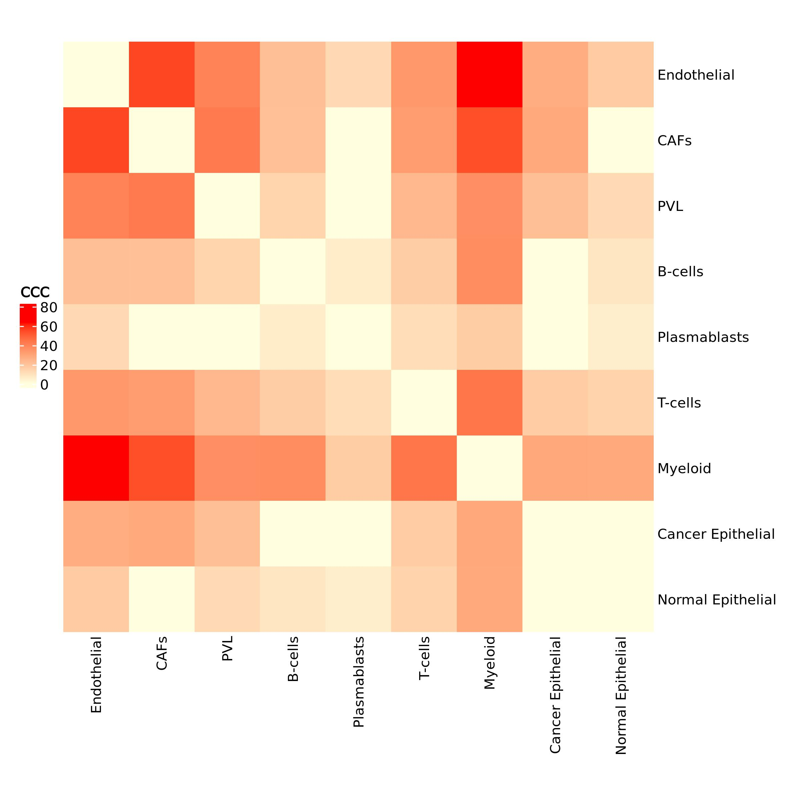

```{r setup, echo = FALSE, message = FALSE, warning=FALSE}
knitr::opts_chunk$set(
  collapse = TRUE,
  comment = "#>",
  error    = FALSE,
  warning  = FALSE,
  #eval     = FALSE,
  message  = FALSE,
  fig.width = 7,
  fig.height = 7
)
library(pander)
library(knitr)
library(rmarkdown)
library(kableExtra)
#panderOptions("table.split.table", Inf)
#panderOptions('knitr.auto.asis', TRUE)
#options(width = 80)
```

In this tutorial we will see how to use Ulisse to analyse cell-cell communication (CCC) data. For CCC analysis we need two inputs: a ranked gene list for each cell cluster and a biological network. 

```{r libraries, message=FALSE, warning=FALSE, eval=FALSE}
library(Seurat)
library(OmnipathR)
library(igraph)
library(Ulisse)
library(circlize)
library(ComplexHeatmap)
library(scales)
```

## Ligand-receptor network
We will use Omnipath to obtain the biological network. Omnipath is a database composed by various resources. The R package provide functions to handle the data. We will download Ligand-Receptor (LR) interactions and use these as a network. To this purpose we will download the intercellular network from Omnipath using ligand as `transmitter` param and receptor as `receiver`. In this case we will use only the Omnipath database, without considering `ligrecextra`.

```{r OmnipathLR, eval=FALSE}
intercell_net <- import_intercell_network(interactions_param = list("datasets" = "omnipath"),
                                          transmitter_param = list(
                                            categories = c('ligand')),
                                          receiver_param = list(
                                            categories =c('receptor')), 
                                          entity_types = "protein")
g.intercell <- unique(intercell_net[,c("source_genesymbol", "target_genesymbol")])
g.intercell <- graph_from_edgelist(as.matrix(g.intercell), 
                                   directed = F)
```

## Pre-processing with Seurat pipeline
To explain the functioning of the CCC calculation implemented in Ulisse we will use one of the samples sequenced by Wu et al. (2021, DOI: 10.1038/s41588-021-00911-1). In this study, the authors analyse 21 single cell samples obtained from tumors. The samples contain tumoral as well as normal cells surrounding the tumor.
The data can be downloaded at https://singlecell.broadinstitute.org/single_cell/study/SCP1039 or at GEO website under accession GSE176078. In particular, we will study CCC in sample CID44991, but the pipeline can be applied to any sample of the study. We will use the matrix, barcodes and genes data of the sample, together with the metadata, that provides cell annotation. With this data we will be able to study the communication not only between clusters, but also between cell types.
After downloading the data, we must upload the 10X data into R and analyse them. We will use Seurat pipeline to import the 10X file, create the Seurat object to then normalize and scale the data, reduce the dimensionality by using the PCA and UMAP for graphical representation; clustering is done via graph-based approach. Prior to create the Seurat object, we filter the count matrix as to remove the low expressed genes (present in less than 5 cells).
```{r preprocessingNot1, eval=FALSE}
data <- ReadMtx(mtx = "CID44991/count_matrix_sparse.mtx", 
                cells = "CID44991/count_matrix_barcodes.tsv",
                features = "CID44991/count_matrix_genes.tsv" )
data <- data[which(rowSums(sign(data)) >= 5),]
data <- CreateSeuratObject(counts = data, min.cells = 0, min.features = 0)
data <- NormalizeData(data)
data <- ScaleData(data)
data <- RunPCA(data)

data <- FindNeighbors(data, dims = 1:10)
data <- FindClusters(data, resolution = 0.5)
data <- RunUMAP(data, dims = 1:10)
DimPlot(data, reduction = "umap", group.by = "seurat_clusters", label = T)

```

```{r prepocessing1, echo=FALSE, eval=TRUE, out.width=600}

```

```{r preprocessingNot2, eval=FALSE}
meta <- read.csv("CID44991/metadata.csv", sep = ",", stringsAsFactors = F)
meta[1:5,]

```

```{r prepocessing2, eval=T, echo=FALSE}
meta <- read.csv("sc_data/metadata.csv", sep = ",", stringsAsFactors = F)
meta[1:5,] %>%
  kable(format = "html", col.names = colnames(meta[1:5,])) %>%
  kable_minimal() %>%
  kable_styling(bootstrap_options = c("striped", "condensed")) %>%
  kableExtra::scroll_box(width = "100%")
```

After uploading the metadata, we can plot the UMAP by cell type. 

```{r preprocessingNot3, eval=FALSE}
data@meta.data <- cbind(data@meta.data, meta[match(rownames(data@meta.data), meta$X),])
data$celltype_major <- factor(data$celltype_major, levels = unique(data$celltype_major))
DimPlot(data, reduction = "umap", group.by = "celltype_major", label = T)

```

```{r prepocessing3, eval=T, echo=FALSE, out.width=600}
include_graphics("sc_data/umap_cell_type.jpeg")
```

As is possible to see, there is not an exact match between cell type islands and clusters, as in the original papers the authors used another package to pre-process the data. However, by watching the distribution of the cell types, we can annotate our clusters. As multiple clsuters can belong to the same cell type, it will be thus interesting to observe the differences between CCC in clusters and cell types.

```{r preprocessingNot4, eval=F}

cluster_cell <- data.frame(table(data$seurat_clusters, data$celltype_major), stringsAsFactors = F)
cluster_cell <- reshape2::acast(cluster_cell, Var1 ~ Var2)
cluster_cell <- cluster_cell/rowSums(cluster_cell)

cluster_cell

```

```{r preprocessing4, eval=T, echo=F}
tab <- read.delim("sc_data/cluster_cellTy.txt", stringsAsFactors = F, header = T, row.names = 1)
tab %>%
  kable(format = "html", col.names = colnames(tab)) %>%
  kable_minimal() %>%
  kable_styling(bootstrap_options = c("striped", "condensed")) %>%
  kableExtra::scroll_box(width = "100%")
```

However, we can annotate the clusters by assigning to each one the most frequent cell type present. As multiple clusters have the same cell type, it will be thus interesting to observe the differences between CCC in clusters and cell types.

```{r preprocessingNot5, eval=F}
top_cl_cell <- which(cluster_cell>=0.7, arr.ind = T)

top_cl_cell[,1] <- rownames(cluster_cell)[top_cl_cell[,1]]
top_cl_cell[,2] <- colnames(cluster_cell)[as.numeric(top_cl_cell[, 2])]
top_cl_cell
```

```{r preprocessing5, eval=T, echo=FALSE}
idx <- which(tab>=0.7, arr.ind = T)

idx[,1] <- rownames(tab)[idx[,1]]
idx[,2] <- colnames(tab)[as.numeric(idx[, 2])]
rownames(idx) <- NULL

idx %>%
  kable(format = "html", col.names = colnames(idx)) %>%
  kable_minimal() %>%
  kable_styling(bootstrap_options = c("striped", "condensed")) %>%
  kableExtra::scroll_box(width = "100%")
```
## CLUSTER CCC
We will fist study CCC between clusters, to then use the same approach to study CCC between cell types.

### Ranked gene list
For CCC analysis we will need a ranked gene list for each cluster. These will be obtained from the normalized count matrix. `preparing_cl_list()` takes as an inputs: the normalized gene counts matrix (`mtx`), the cluster affiliation of each cell in the count matrix (`clusters`), and a vector with the gene of interest (`universe`), together with two threshold (`mean_t` and `cell_t`) to filter the data and remove noise and false negatives. The function uses `mean_t` identify highly expresssed genes in the normalized expression matrix: if the gene in a cell has a value equal or higher of that threshold is set to 1, 0 otherwise. Subsequently the function uses the binarized expression matrix to calculate for each gene in each cluster the frequency of being highly expressed in at least `cell_t` cells. The function returns a gene list for each cluster composed by the frequency for each gene, filtered to maintain only the ones in `universe`, that in this case are the one present in the LR network.
We suggest identifying `mean_t` considering the mean expression of each gene calculated on non-zero values. Instead, `cell_t` can be set considering the filtering used to remove low expressed genes at the beginning of the Seurat pipeline.
We will then first identify `mean_t`, to then use `preparing_cl_list()` to obtain the gene lists needed for CCC calculation.

```{r mean_gNOT, eval=FALSE}
mean_norm <- data@assays$RNA@data
mean_norm[which(mean_norm == 0)] <- NA
mean_g <- rowMeans(mean_norm, na.rm = T)

summary(mean_g)
```
```{r mean_g, eval=TRUE, echo=FALSE}
mean_g <- readRDS("sc_data/mean_g.Rds")
summary(mean_g)

```
```{r hist_not, eval=FALSE}
hist(mean_g, breaks = 100)
abline(v=0.95, col = "red")
```

```{r hist, eval=T, echo=FALSE, out.width=600}
include_graphics("sc_data/hist_mean_expr.jpeg")
```

Considering the summary of `mean_g` and the histogram above, we decide to use 1 as `mean_t` (the red line in the histogram). We decided this value as it lays past the high frequency values in the distribution and thus allows to filter out the most common values and the genes with low expression value, to maintain only the genes with high expression values. As cell threshold we will use the same threshold used for the pre-processing.

```{r prep_listCLNot, eval=F, echo=TRUE}
universe <- V(g.intercell)$name
cl_list <- preparing_cl_list(mtx = data@assays$RNA@data,
                             clusters = data$seurat_clusters,
                             mean_t =  1, 
                             cell_t = 5, 
                             universe = universe)
head(cl_list[[1]])
```

```{r prep_listCL, echo=FALSE, warning=FALSE, message=F, results='show', eval=TRUE}
cl_list <- readRDS("sc_data/cl_list_CL.Rds")
head(cl_list[[1]])
```

### Cluster-Cluster Communication
Now we have all the data to calculate communication between clusters. We firstly need to filter the LR network to maintain only the genes of interest, to then use the corresponding adjacency matrix for CCC calculation.
In `cluster_communication()` the number of communication between two clusters is statistically evaluated by calculating an empirical p-value by using a permutation-based approach. This approach creates `k` permutated version of gene lists of the two clusters by random sampling the same number of gene present in the two lists and calculating the number of interaction present. The number of permutatio that have to be done for p-value calculation of the p-value is controlled by the parameter `k` in the function. In this case we use 49 permutation that, together with the real one, correspond to a total of 50 matrix, and thus the minimal p-value that can be observed is 1/50. The other values of the function, which are `mc_cores_perm` and `mc_cores_ccc` controls the parallelization of the function in CCC calculation and permutation, respectively. Be aware that `mc_cores_perm` multiplies `mc_cores_ccc`. Parallelization is useful to reduce the computational time needed for the calculation but improves the amount of memory needed. 
The function returns two outputs, the first (`communication_info`) is a table with the detailed description of the gene communication between the two clusters: the name of the clusters communicating, the respective genes occurring and the score of their communication. The second output (`cc_communications`) is a table with the names of the clusters, the cumulative CCC score between the two clusters, the number and the names of the genes involved and the number of the links occurring, the empirical p-value, the empirical FDR and the Benjamini-Hochberg FDR.

```{r CCC_CLnot1, eval=FALSE}
cl_gene <- unique(unlist(lapply(cl_list, names)))
g.intercell_filt <- induced.subgraph(g.intercell, vids = cl_gene)
LR.adj <- as_adjacency_matrix(g.intercell_filt, sparse = F)

cl_ct <- cluster_communication(cl_list = cl_list, 
                               gene_network_adj = LR.adj, 
                               k = 49, 
                               mc_cores_perm = 1, 
                               mc_cores_ccc = 1)
cl_ct$communications_info[1:5,]

```

```{r CCC_CL1, eval=TRUE, echo=FALSE}
cl_ct <- readRDS("sc_data/clCC_clusters.Rds")
cl_ct$communications_info[1:5,] %>%
  kable(format = "html", col.names = colnames(cl_ct$communications_info[1:5,])) %>%
  kable_minimal() %>%
  kable_styling(bootstrap_options = c("striped", "condensed")) %>%
  kableExtra::scroll_box(width = "100%")
```

```{r CCC_CLnot2, eval=FALSE}
cl_ct$cc_communications[1:5,]
```

```{r CCC_CL2, eval=TRUE, echo=FALSE}

cl_ct$cc_communications[1:5,] %>%
  kable(format = "html", col.names = colnames(cl_ct$cc_communications[1:5,])) %>%
  kable_minimal() %>%
  kable_styling(bootstrap_options = c("striped", "condensed")) %>%
  kableExtra::scroll_box(width = "100%")
```

### CCC network
The CCC score obtained as output of `cluster_communication()` can be used to build a Cluster-Cluster Communication network by considering only the significative ones. The resulting network can be visualized as a graph or as an heatmap.

```{r CCC_CLnetNOT, eval=FALSE}

CCC_net <- clCC[[2]]
CCC_net <- CCC_net[which(CCC_net$p_value_link <= 0.05),]
CCC.g <- graph_from_edgelist(as.matrix(CCC_net[,1:2]), directed = FALSE)
CCC.g <- set.edge.attribute(CCC.g, name = "ccc_score", value = CCC_net$ccc_score)
CCC.adj <- as_adjacency_matrix(CCC.g, sparse = F, attr = "ccc_score")
pal <- hue_pal()(length(levels(data$seurat_clusters)))
names(pal) <- levels(data$seurat_clusters)

plot(CCC.g, vertex.color = pal[V(CCC.g)$name])
```

```{r CCC_CLnet, eval=TRUE, echo=FALSE, out.width=600}

```

```{r CCC_CL_H_not, eval=FALSE}
col_fun <- colorRamp2(c(0, max(CCC.adj)), c("lightyellow", "red"))
h <- Heatmap(CCC.adj, cluster_rows = F,  
             cluster_columns = F, 
             col = col_fun, 
             heatmap_legend_param = list(title="CCC"))
draw(h, heatmap_legend_side = "left")

```

```{r CCC_CL_H, eval=TRUE, echo=F, out.width=600}

```

## CELL TYPE CCC
We will apply the same workflow used for CCC analysis in clusters. As a network we will use the same LR network obtained before.

### Ranked gene list
We will use the same thresholds used for clusters to obtain the ranked gene lists for cell types.

```{r prep_list_TYNot, eval=F, echo=TRUE}
universe <- V(g.intercell)$name
cl_list <- preparing_cl_list(mtx = data@assays$RNA@data,
                             clusters = data$celltype_major,
                             mean_t =  1, 
                             cell_t = 5, 
                             universe = universe)
head(cl_list[[1]])
```

```{r prep_list_TY, echo=FALSE, warning=FALSE, message=F, results='show', eval=TRUE}
cl_list <- readRDS("sc_data/cl_list_TY.Rds")
head(cl_list[[1]])
```

### Cluster-Cluster Communication
We have to filter the network on the genes present in the ranked genes list, as done before. Then, we have all the inputs needed to calculate CCC between cell types.

```{r CCC_TYnot1, eval=FALSE}
cl_gene <- unique(unlist(lapply(cl_list, names)))
g.intercell_filt <- induced.subgraph(g.intercell, vids = cl_gene)
LR.adj <- as_adjacency_matrix(g.intercell_filt, sparse = F)

cl_ct <- cluster_communication(cl_list = cl_list, 
                               gene_network_adj = LR.adj, 
                               k = 49, 
                               mc_cores_perm = 1, 
                               mc_cores_ccc = 1)
cl_ct$communications_info[1:5,]

```

```{r CCC_TY1, eval=TRUE, echo=FALSE}
cl_ct <- readRDS("sc_data/cl_CCC_TY.Rds")
cl_ct$communications_info[1:5,] %>%
  kable(format = "html", col.names = colnames(cl_ct$communications_info[1:5,])) %>%
  kable_minimal() %>%
  kable_styling(bootstrap_options = c("striped", "condensed")) %>%
  kableExtra::scroll_box(width = "100%")
```

```{r CCC_TYnot2, eval=FALSE}
cl_ct$cc_communications[1:5,]
```

```{r CCC_TY2, eval=TRUE, echo=FALSE}
cl_ct$cc_communications[1:5,] %>%
  kable(format = "html", col.names = colnames(cl_ct$cc_communications[1:5,])) %>%
  kable_minimal() %>%
  kable_styling(bootstrap_options = c("striped", "condensed")) %>%
  kableExtra::scroll_box(width = "100%")
```

### CCC network
The significative CCC score obtained can again be used to build a Cell-Cell Communication network. The resulting network can be visualized as a graph or as an heatmap.

```{r CCC_TYnetNOT, eval=FALSE}

CCC_net <- clCC[[2]]
CCC_net <- CCC_net[which(CCC_net$p_value_link <= 0.05),]
CCC.g <- graph_from_edgelist(as.matrix(CCC_net[,1:2]), directed = FALSE)
CCC.g <- set.edge.attribute(CCC.g, name = "ccc_score", value = CCC_net$ccc_score)
CCC.adj <- as_adjacency_matrix(CCC.g, sparse = F, attr = "ccc_score")
pal <- hue_pal()(length(levels(data$celltype_major)))
names(pal) <- levels(data$celltype_major)

plot(CCC.g, vertex.color = pal[V(CCC.g)$name])
```

```{r CCC_TYnet, eval=TRUE, echo=FALSE, out.width=600}

```

```{r CCC_TY_Hnot, eval=FALSE}
col_fun <- colorRamp2(c(0, max(CCC.adj)), c("lightyellow", "red"))
h <- Heatmap(CCC.adj, cluster_rows = F,  row_names_gp = grid::gpar(fontsize = 10),
             column_names_gp = grid::gpar(fontsize = 10),
             width = unit(15, "cm"), height = unit(15, "cm"),
             cluster_columns = F, 
             col = col_fun, 
             heatmap_legend_param = list(title="CCC"))
draw(h, heatmap_legend_side = "left")

```

```{r CCC_TY_H, eval=TRUE, echo=F, out.width=600}

```

# Session Info {- .smaller}
```{r sessioninfo}
sessionInfo()
```
