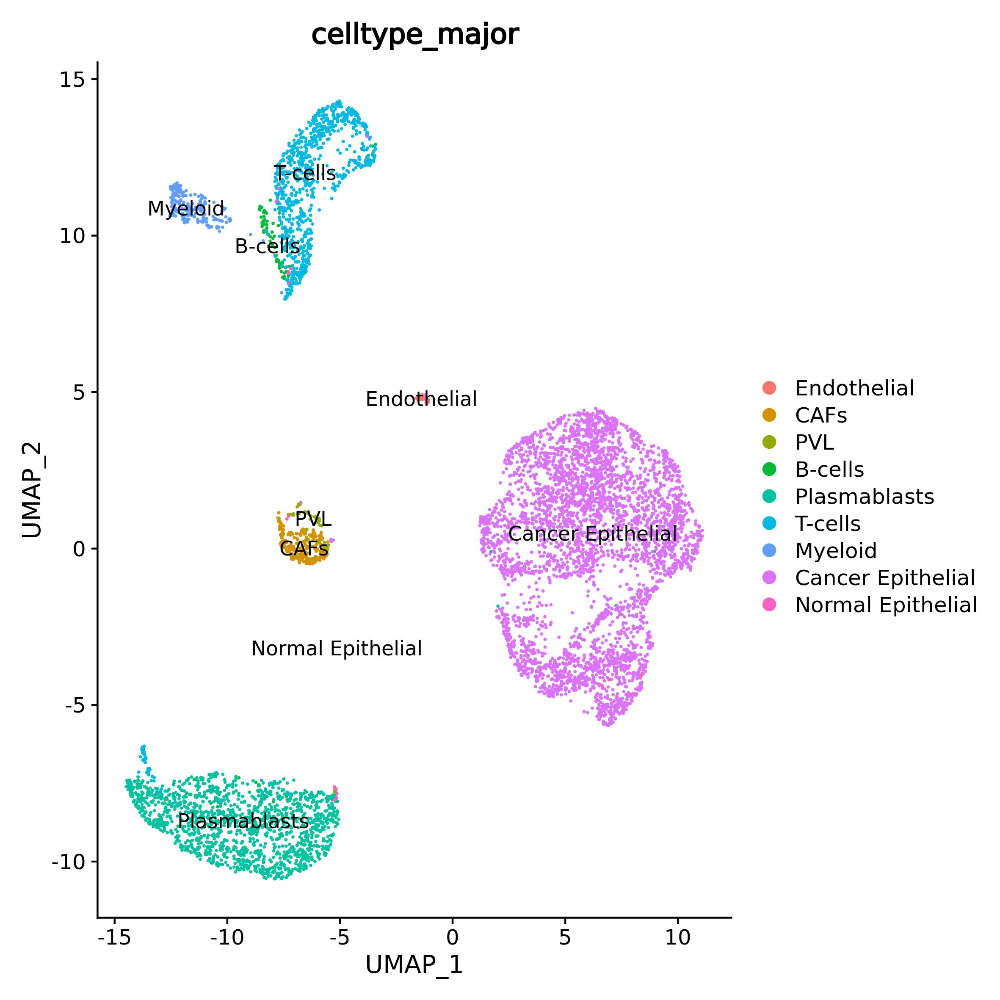
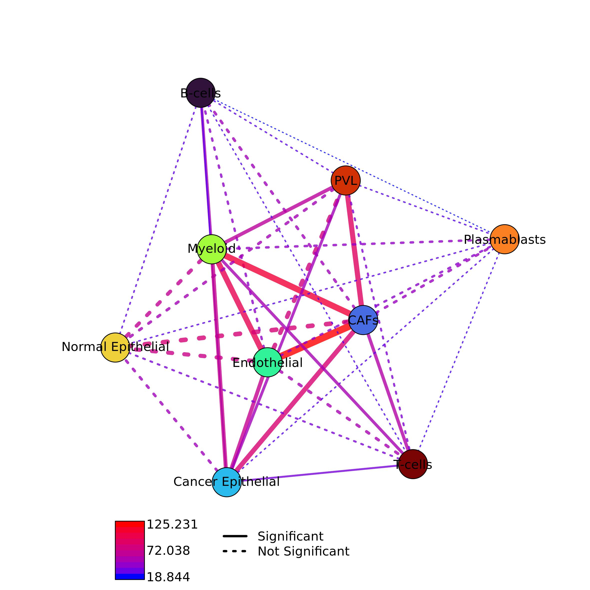
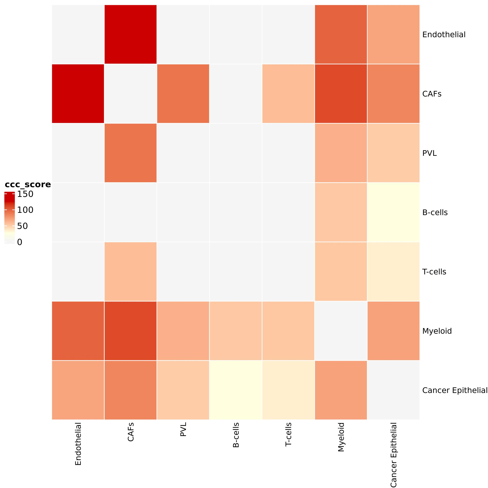
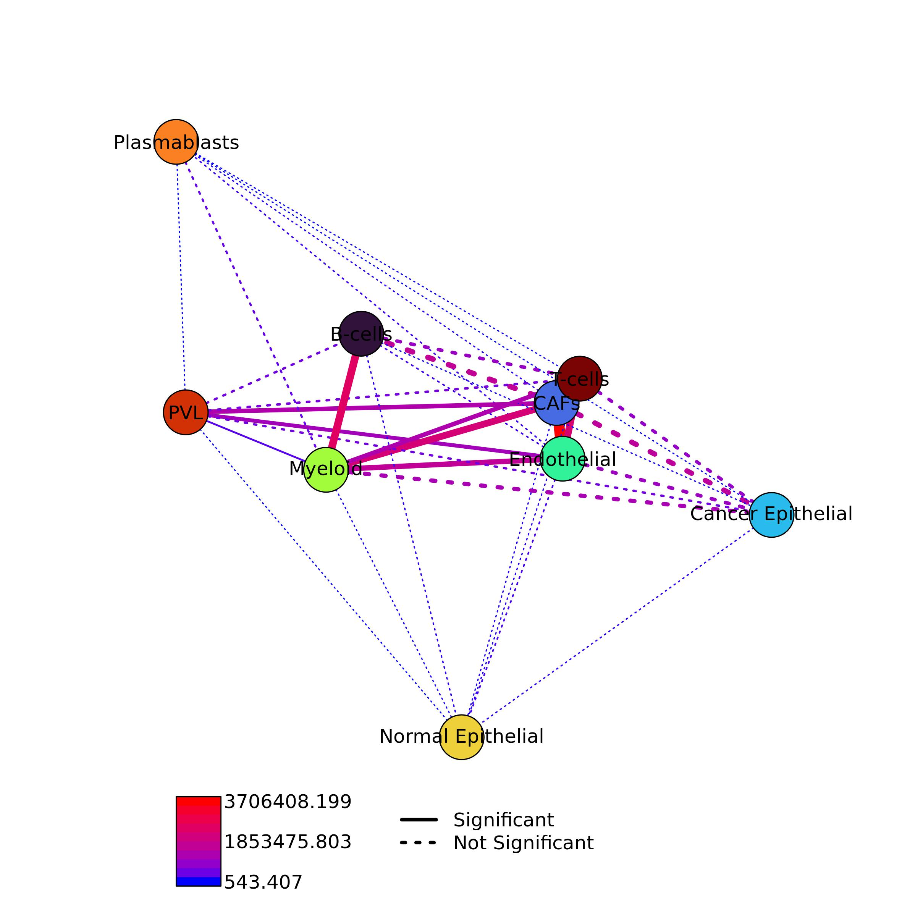
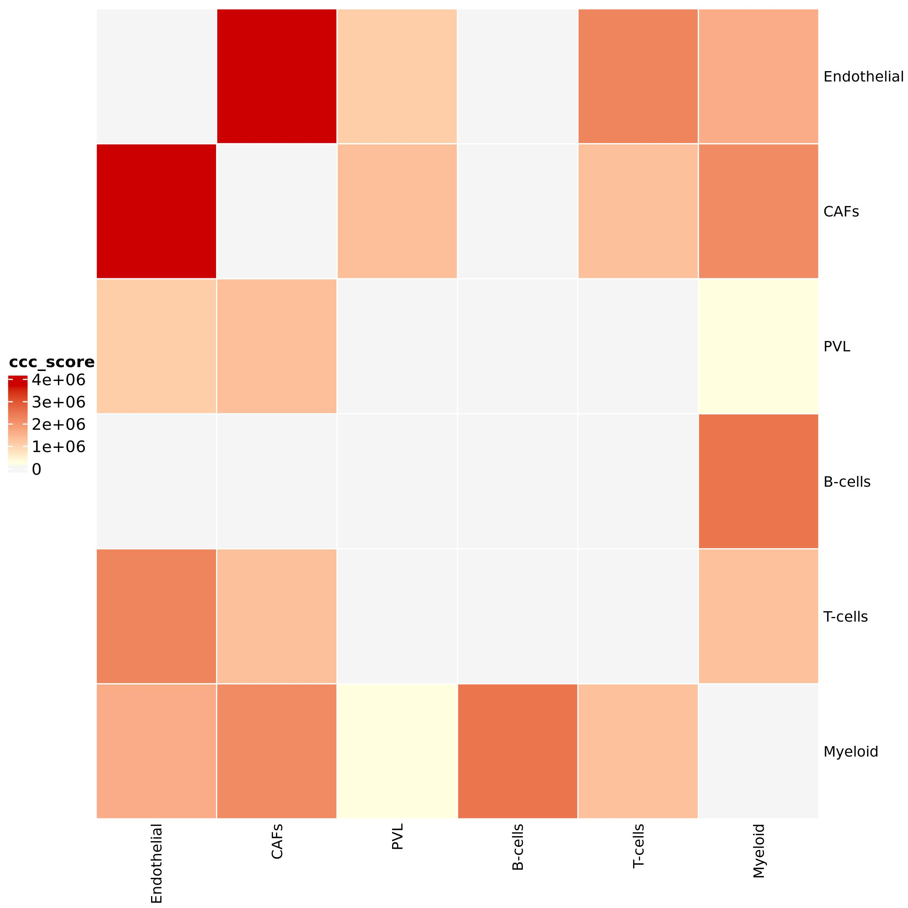
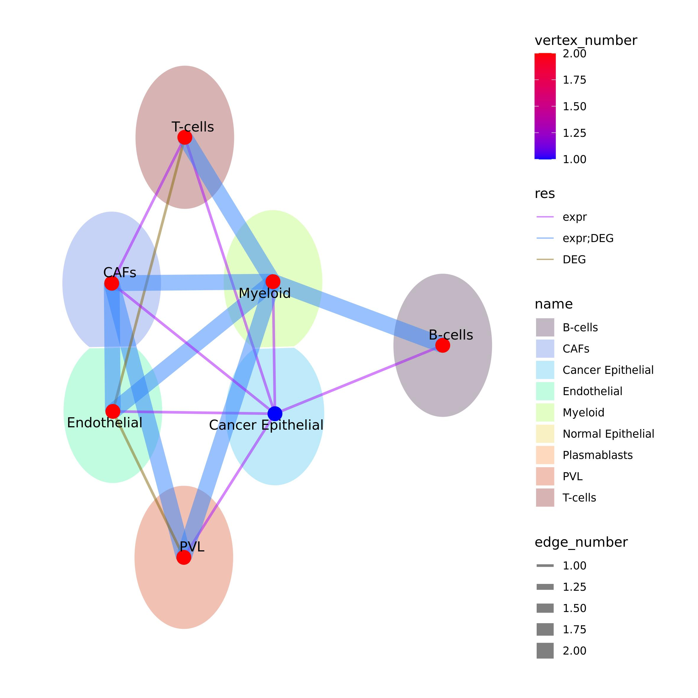

```{r setup, echo = FALSE, message = FALSE, warning=FALSE}
knitr::opts_chunk$set(
  collapse = TRUE,
  comment = "#>",
  error    = FALSE,
  warning  = FALSE,
  #eval     = FALSE,
  message  = FALSE,
  fig.width = 7,
  fig.height = 7
)
library(pander)
library(knitr)
library(rmarkdown)
library(kableExtra)
library(igraph)
#panderOptions("table.split.table", Inf)
#panderOptions('knitr.auto.asis', TRUE)
#options(width = 80)
```

In this tutorial we will see how to use Ulisse to analyse cell-cell communication (CCC) data. For CCC analysis we need two inputs: a ranked gene list for each cell cluster and a biological network, which in this case is a communication network. 

```{r libraries, message=FALSE, warning=FALSE, eval=FALSE}
library(Seurat)
library(OmnipathR)
library(igraph)
library(Ulisse)
library(circlize)
library(ComplexHeatmap)
library(scales)
```

## Ligand-receptor network
We will use Omnipath to obtain the biological network, a database composed by various resources. We will download Ligand-Receptor (LR) interactions and use these as a network. To this purpose we will download the intercellular network from Omnipath using ligand as `transmitter` param and receptor as `receiver`. In this case we will use only the Omnipath database, without considering `ligrecextra`.

```{r OmnipathLR, eval=FALSE}
intercell_net <- import_intercell_network(interactions_param = list("datasets" = "omnipath"),
                                          transmitter_param = list(
                                            categories = c('ligand')),
                                          receiver_param = list(
                                            categories =c('receptor')), 
                                          entity_types = "protein")
g.intercell <- unique(intercell_net[,c("source_genesymbol", "target_genesymbol")])
g.intercell <- graph_from_edgelist(as.matrix(g.intercell), 
                                   directed = F)
```

## Pre-processing with Seurat pipeline
To explain the functioning of the CCC calculation implemented in Ulisse we will use one of the samples sequenced by Wu et al. (2021, DOI: 10.1038/s41588-021-00911-1). In this study, the authors analyse 26 single cell of breast cancer samples. The samples contain tumoral as well as normal cells surrounding the tumor and composing its microenvironment.
The data can be downloaded at https://singlecell.broadinstitute.org/single_cell/study/SCP1039 or at GEO website under accession GSE176078. In particular, we will study CCC in sample CID4515, but the pipeline can be applied to any sample of the study. We will use the matrix, barcodes and genes data of the sample, together with the metadata, that provides cell annotation. With this data we will be able to study the communication not only between clusters, but also between cell types.
After downloading the data, we must upload the 10X data into R and analyse them. We will use Seurat pipeline to import the 10X file, create the Seurat object to then normalize and scale the data, reduce the dimensionality by using the PCA and UMAP for graphical representation; clustering is done via graph-based approach. Prior to create the Seurat object, we filter the count matrix as to remove the low expressed genes (present in less than 5 cells).
```{r preprocessingNot1, eval=FALSE}
data <- ReadMtx(mtx = "CID4515/count_matrix_sparse.mtx", 
                cells = "CID4515/count_matrix_barcodes.tsv",
                features = "CID4515/count_matrix_genes.tsv" )
data <- data[which(rowSums(sign(data)) >= 5),]
data <- CreateSeuratObject(counts = data, min.cells = 0, min.features = 0)
data <- NormalizeData(data)
data <- ScaleData(data)
data <- RunPCA(data)

data <- FindNeighbors(data, dims = 1:10)
data <- FindClusters(data, resolution = 0.5)
data <- RunUMAP(data, dims = 1:10)

```

```{r preprocessingNot2, eval=FALSE}
meta <- read.csv("CID44991/metadata.csv", sep = ",", stringsAsFactors = F)
meta[1:5,]

```

```{r prepocessing2, eval=T, echo=FALSE}
meta <- read.csv("sc_data/metadata.csv", sep = ",", stringsAsFactors = F)
rownames(meta) <- c()
meta[1:5,] %>%
  kable(format = "html", col.names = colnames(meta[1:5,])) %>%
  kable_minimal() %>%
  kable_styling(bootstrap_options = c("striped", "condensed")) %>%
  kableExtra::scroll_box(width = "100%")
rm(meta)
```

After uploading the metadata, we can plot the UMAP by cell type. 

```{r preprocessingNot3, eval=FALSE}
data@meta.data <- cbind(data@meta.data, meta[match(rownames(data@meta.data), meta$X),])
data$celltype_major <- factor(data$celltype_major, levels = unique(data$celltype_major))
DimPlot(data, reduction = "umap", group.by = "celltype_major", label = T)

```

```{r prepocessing3, eval=T, echo=FALSE, out.width=600}

```

Ulisse provides two methods to study CCC, one that uses expression data and the other that uses Differentially Expressed Genes (DEG) data. We will study CCC in this sample on the cell types by using the two approach available in Ulisse, to then compare the obtained results. It is important to note that you can choose to perform the same analyses on clusters or cell types as both of them are groups of cells. Thus, in this vignette we will consider them synonyms.

## Expression CCC

### Ranked gene list
For CCC analysis we will need a ranked gene list for each cell type These will be obtained from the normalized count matrix. `preparing_cl_list()` takes as an inputs: the normalized gene counts matrix (`mtx`), the cluster or cell type affiliation of each cell in the count matrix (`clusters`), and a vector with the gene of interest (`universe`), together with two threshold (`mean_t` and `cell_t`) to filter the data and remove noise. The function uses `mean_t` to identify highly expressed genes in the normalized expression matrix: if the gene in a cell has a value equal or higher of that threshold is set to 1, 0 otherwise. Subsequently the function uses the binarized expression matrix to calculate for each gene in each cell type the frequency of being highly expressed in at least `cell_t` cells. The function returns a gene list for each cell type composed by the frequency for each gene, filtered to maintain only the ones in `universe`, that in this case are the one present in the LR network.
We suggest identifying `mean_t` considering the mean expression of each gene calculated on non-zero values. Instead, `cell_t` can be set considering the filtering used to remove low expressed genes at the beginning of the Seurat pipeline.
We will then first identify `mean_t`, to then use `preparing_cl_list()` to obtain the gene lists needed for CCC calculation.

```{r mean_gNOT, eval=FALSE}
mean_norm <- data@assays$RNA@data
mean_norm[which(mean_norm == 0)] <- NA
mean_g <- rowMeans(mean_norm, na.rm = T)

summary(mean_g)
```
```{r mean_g, eval=TRUE, echo=FALSE}
mean_g <- readRDS("sc_data/mean_g.Rds")
summary(mean_g)
rm(mean_g)
```
```{r hist_not, eval=FALSE}
hist(mean_g, breaks = 100)
abline(v=0.95, col = "red")
```

```{r hist, eval=T, echo=FALSE, out.width=600}
include_graphics("sc_data/hist_mean_expr.jpeg")
```

Considering the summary of `mean_g` and the histogram above, we decide to use 0.65 as `mean_t` (the red line in the histogram). We decided this value as it lays past the high frequency values in the distribution and thus allows to filter out the most common values and the genes with low expression value, to maintain only the genes with high expression values. As cell threshold we will use the same threshold used for the pre-processing.

```{r prep_listCTNot, eval=F, echo=TRUE}
universe <- V(g.intercell)$name
ct_list <- preparing_expr_list(mtx = data@assays$RNA@data,
                             clusters = data$celltype_major,
                             mean_t =  1, 
                             cell_t = 5, 
                             universe = universe)
head(ct_list[[1]])
```

```{r prep_listCT, echo=FALSE, warning=FALSE, message=F, results='show', eval=TRUE}
ct_list <- readRDS("sc_data/cl_list_TY.Rds")
head(ct_list[[1]])
rm(ct_list)
```

### Communication analysis
Now we have all the data to calculate communication between cell types by using expression data. 
In `cluster_communication()` the number of communications between two cell types is statistically evaluated by calculating an empirical p-value by using a permutation-based approach. This approach creates `k` permuted version of gene lists of the two cell types by random sampling the same number of gene present in the two lists and calculating the number of interaction present. The number of permutation that have to be done is controlled by the parameter `k` in the function. In this case we use 49 permutation that, together with the real one, correspond to a total of 50 permuted list for each cell type pair, and thus the minimal p-value that can be observed is 1/50 or 0.02. The other values of the function, which are `mc_cores_perm` and `mc_cores_ccc` control the parallelization of the function in CCC calculation and permutation, respectively. Be aware that `mc_cores_perm` multiplies `mc_cores_ccc`. Parallelization is useful to reduce the computational time for the calculation but improves the amount of memory needed. 
The function returns two outputs, the first (`communication_info`) is a table with the detailed description of the gene communication between the two cell types: the name of the clusters communicating, the genes interacting and the score of their communication. The second output (`cc_communications`) is a table with the names of the cell types, the cumulative CCC score between them, the number and the names of the genes involved and the number of the links occurring, the empirical p-value, the empirical FDR and the Benjamini-Hochberg FDR. Note that the cumulative score of a cell type pair is equal to the sum of all the gene pair scores.

```{r CCC_CTnot1, eval=FALSE}
LR.adj <- as_adjacency_matrix(g.intercell, sparse = F)

expr_ccc <- cluster_communication(cl_list = ct_list, 
                                  gene_network_adj = LR.adj, 
                                  k = 49, 
                                  mc_cores_perm = 1, 
                                  mc_cores_ccc = 1)
expr_ccc$communications_info[1:5,]

```

```{r CCC_CT1, eval=TRUE, echo=FALSE}
expr_ccc <- readRDS("sc_data/cl_CCC_TY.Rds")
expr_ccc$communications_info[1:5,] %>%
  kable(format = "html", col.names = colnames(expr_ccc$communications_info[1:5,])) %>%
  kable_minimal() %>%
  kable_styling(bootstrap_options = c("striped", "condensed")) %>%
  kableExtra::scroll_box(width = "100%")
```

```{r CCC_CTnot2, eval=FALSE}
expr_ccc$cc_communications[1:5,]
```

```{r CCC_CT2, eval=TRUE, echo=FALSE}

expr_ccc$cc_communications[1:5,] %>%
  kable(format = "html", col.names = colnames(expr_ccc$cc_communications[1:5,])) %>%
  kable_minimal() %>%
  kable_styling(bootstrap_options = c("striped", "condensed")) %>%
  kableExtra::scroll_box(width = "100%")
rm(expr_ccc)
```

### CCC network
The communications obtained as output of `cluster_communication()` can be used to build a Cluster-Cluster Communication network. The resulting network can be visualized as a graph or as an heatmap by using Ulisse functions. `plot_network_ct()` will return the igraph object plotted, the layout and the communities (if calcualted)

```{r CCC_CTnetNOT, eval=FALSE}

expr.CCC.g <- graph_from_data_frame(as.matrix(expr_ccc$cc_communications), 
                             directed = F)
expr_ccc_net <- plot_network_CT(ct = expr_ccc$cc_communications, 
                                all = T, p_val =  0.05, FDR = 0.2, ct_val = NULL,
                                community = NULL, 
                                edge_col_by = "ccc_score",  edge_width = T, edge_adj_col = 0.8,
                                x_filt = -0.5, y_filt = -1.2, xl = -1, yb = -1.5, xr = -0.85, yt = -1.2, 
                                vertex.color = pal_cl[V(CCC.g)$name], 
                                vertex.label.color = "black", 
                                vertex.label.family = "sans")
expr_ccc_net
```

```{r CCC_CTnet, eval=TRUE, echo=FALSE, out.width=600}
ccc_net <- readRDS("sc_data/ct_lt_net.Rds")
ccc_net
rm(ccc_net)


```

Here you can see the significant communications as an heatmap. You can choose the variable that have to be used to color the heatmap. In this case we decide to use CCC score. The color parameters are used to set the color of the extremes of the color scale, so if you want to correct for outliers you can choose not to use minimum and maximum (default) ad provide your own values. `no_ct_color` is used to color the cells in the heatmap corresponding to the cell types pairs that do not shows significant communications, but that are necessarily present in an heatmap with a 0 score. Having different colors for minimum and zero help the heatmap readability 

```{r CCC_CT_H_not, eval=FALSE}
expr_ccc_f <- expr_ccc$cc_communications[expr_ccc$cc_communications$p_value_link <= 0.05 & expr_ccc$cc_communications$FDR_link <= 0.2,]

ct_heatmap(ct = expr_ccc_f, 
           color_by = "ccc_score", 
           color = c("lightyellow", "red3"), 
           no_ct_color = "whitesmoke", 
           rect_gp = gpar(col = "white"), 
           cluster_rows = FALSE, cluster_columns = FALSE,
           row_names_gp = gpar(fontsize = 10), column_names_gp = gpar(fontsize = 10))

```

```{r CCC_CT_H, eval=TRUE, echo=F, out.width=600}

```

## DEG CCC
We will now apply the DEG workflow to the same data used for expression CCC. First of all, we need to obtain DEG data. 

### DEG analysis
Here we will use Seurat function for Differential Expression Analysis, but it is not important which package and algorithm you use, as Ulisse is highly flexible.
Here we will use the function with default parameters to calculate DEG for each cell type against the others. Then, we will use Benjamini-Hochberg method to obtain adjusted p-value to be used to filter DEGs to maintain only the significant ones. We will select only the up-regulated genes as the down-regulated ones might be not meaningful in scRNAseq data.

```{r prep_DEGNot, eval=F, echo=TRUE}
Idents(data) <- data$celltype_major

DEGs_data <- FindAllMarkers(data, assay = "RNA") #this may take a while
DEGs_data$p_val_BH <- p.adjust(DEGs_data$p_val, method = "BH")

DEGs_data[1:5,]

```

```{r prep_DEG, eval=TRUE, echo=FALSE}
DEGs_data <- readRDS("sc_data/DEGs_data.Rds")
DEGs_data[1:5,] %>%
  kable(format = "html", col.names = colnames(DEGs_data[1:5,])) %>%
  kable_minimal() %>%
  kable_styling(bootstrap_options = c("striped", "condensed")) %>%
  kableExtra::scroll_box(width = "100%")
rm(DEGs_data)
```

Now we have the data to be used to obtain the cell type lists by using `preparing_DEG_list()` function. As Ulisse is highly flexible and is not bound to be used with a particular scData analysis package, this function does not take as an input the data.frame resulting from `FindAllMarkers()` function. Instead, it takes only the interested columns, which are the genes, their log2 Fold Change, p-value and the cluster in which are tested. `preparing_DEG_list()` uses these inputs to calculate for each `gene` in `clusters` the associated weights, that are the product between `log2FC` and the -log10 of `p_val`. Then, the function builds a vector for each `cluster`, each one composed by the weights, named after the respective genes. Then, these vectors are filtered to maintain only the gene that are present in `universe` and returned as a list

```{r prep_DEG_listNOT, eval=F, echo=TRUE}
DEGs_data <- DEGs_data[DEGs_data$p_val_BH <= 0.05 & DEGs_data$avg_log2FC >= 0.5,]


DEG_list <- preparing_DEG_list(cluster = DEGs_data$cluster, p_val = DEGs_data$p_val_BH, 
                               log2FC = DEGs_data$avg_log2FC, gene = DEGs_data$gene, universe = rownames(adj.m))

head(DEG_list[[1]])
```

```{r prep_DEG_list, echo=FALSE, warning=FALSE, message=F, results='show', eval=TRUE}
DEG_list <- readRDS("sc_data/DEG_list.Rds")
head(DEG_list[[1]])
rm(DEG_list)
```

### Communication Analysis
To calculate DEG CCC we will use the same LR network used in expression CCC. So we have all the needed inputs. By using `cluster_communication()` function we calculate the CCC by using DEG data as done before, with `k = 9` permutations. We obtain again the two output: `communications_info` which is the detail of the gene-gene communications between each cell type pairs, and `cc_communications` the cumulative cluster-cluster communications.

```{r CCC_DEGnot1, eval=FALSE}

DEG_ccc <- cluster_communication(cl_list = DEG_list, 
                                 gene_network_adj = LR.adj, 
                                 k = 49, 
                                 mc_cores_perm = 1, 
                                 mc_cores_ccc = 1)
DEG_ccc$communications_info[1:5,]

```

```{r CCC_DEG1, eval=TRUE, echo=FALSE}
DEG_ccc <- readRDS("sc_data/DEGcl_ct.Rds")
DEG_ccc$communications_info[1:5,] %>%
  kable(format = "html", col.names = colnames(DEG_ccc$communications_info[1:5,])) %>%
  kable_minimal() %>%
  kable_styling(bootstrap_options = c("striped", "condensed")) %>%
  kableExtra::scroll_box(width = "100%")
```

```{r CCC_DEGnot2, eval=FALSE}
DEG_ccc$cc_communications[1:5,]
```

```{r CCC_DEG2, eval=TRUE, echo=FALSE}
DEG_ccc$cc_communications[1:5,] %>%
  kable(format = "html", col.names = colnames(DEG_ccc$cc_communications[1:5,])) %>%
  kable_minimal() %>%
  kable_styling(bootstrap_options = c("striped", "condensed")) %>%
  kableExtra::scroll_box(width = "100%")
rm(DEG_ccc)
```

### CCC network
As done before, we can build CCC network by filtering the results and using Ulisse function and plot it as a network

```{r CCC_DEGnetNOT, eval=FALSE}

DEG_CCC.g <- graph_from_data_frame(as.matrix(DEG_ccc$cc_communications), 
                                   directed = F)
DEG_CCC_net <- plot_network_CT(ct = DEG_ccc$cc_communications, 
                               edge_col_by = "ccc_score", edge_width = T, edge_adj_col =1,
                               ct_val = NULL, 
                               all = T, p_val =  0.05, FDR = 0.2, 
                               community = NULL, 
                               x_filt = -0.5, y_filt = -1.2, xl = -1, yb = -1.5, xr = -0.85, yt = -1.2, 
                               vertex.color = pal_ct[V(CCC.g)$name],
                               vertex.label.color = "black", vertex.label.family = "sans")
DEG_CCC_net
```

```{r CCC_DEGnet, eval=TRUE, echo=FALSE, out.width=600}
DEG_ccc_net <- readRDS("sc_data/ct_lt_net_DEG.Rds")
DEG_ccc_net
rm(DEG_ccc_net)

```

or as an heatmap

```{r CCC_DEG_Hnot, eval=FALSE}
DEG_ccc_f <- DEG_ccc$cc_communications[DEG_ccc$cc_communications$p_value_link <= 0.05 & DEG_ccc$cc_communications$FDR_link <= 0.2,]

ct_heatmap(ct = DEG_ccc_f, 
           color_by = "ccc_score", 
           color = c("lightyellow", "red3"), no_ct_color = "whitesmoke", 
           rect_gp = gpar(col = "white"), 
           cluster_rows = FALSE, cluster_columns = FALSE,
           row_names_gp = gpar(fontsize = 9), column_names_gp = gpar(fontsize = 9))


```

```{r CCC_DEG_H, eval=TRUE, echo=F, out.width=600}

```

##Comparison between expression and DEG CCC results
Ulisse provides a function to visually compare results obtained from multiple analyses or samples. `comparing_results_network()` function takes as an input a list composed by the results that have to be compared that contains CT analyses results between comparable gene sets. These can be  PCT analyses from different input dataset but run by using the same pathway database, multiple CCC analysis run on the same samples or on different samples that shows some overlap on the cell types. Note that in order to use `comparing_results_network()` to compare the CCC results from different samples obtained by running the analyses on the clusters there needs to be correspondence between these groups (aka: cluster 1 of one sample should contain the same cells of cluster 1 of another sample or the visualization is meaningless).
Here we will compare the significant results obtained with expression and DEG CCC analyses. To do so we will build the needed input list, to then filter both elements to maintain only the significant CCC. `comparing_results_network()` will create a union network where the vertices are all the cell types present in the results in `res_list`, the links are the communication present between them in the results and are colored according to the number of results that contains them. the function create a gradient color that goes from the minimum value (colored in blue by default, can be changed) to the maximum (colored in red, by default, can be again changed). In this case we are comparing only two results, so the links can be only blue or red. The vertices can be colored by again the number of results that share that vertices (`vertex_col_by = "number"`) or by proving to `vertex_col_by` an vector with an informative value for each vertices present in the results. 
`comparing_results_network()` will return the union network and the layout used for the plot, and save the union network as `"union_ct_network.jpeg"` by default (or can be changed by using `file_out` argument).

```{r comparingNot, eval=FALSE}
res_list <- list(expr = expr_ccc$cc_communications,
                 DEG = DEG_ccc$cc_communications)
res_list <- lapply(res_list, function(x) x <- x[x$p_value_link <= 0.05 & x$FDR_link <= 0.2,])

comp.out <- comparing_results_network(res_list = res_list, 
                                      vertex_col_by = "number",
                                      edge.width = T, edge_adj_col = 0.7,
                                      vertex.label.color = "black", 
                                      vertex.label.family = "sans", 
                                      edge.width = 2, vertex.label.dist = 2)

comp.out
```

```{r comparing, eval=TRUE, echo=F, out.width=600}
comp.out <- readRDS("sc_data/comp_out.Rds")
comp.out

rm(comp.out)

```

# Session Info {- .smaller}
```{r sessioninfo}
sessionInfo()
```
