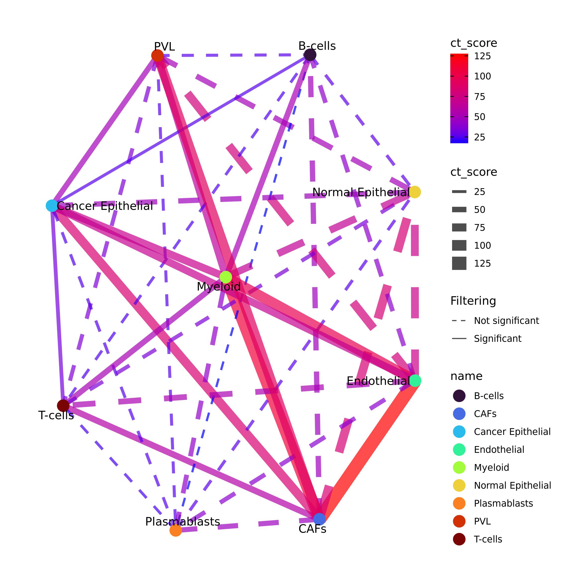
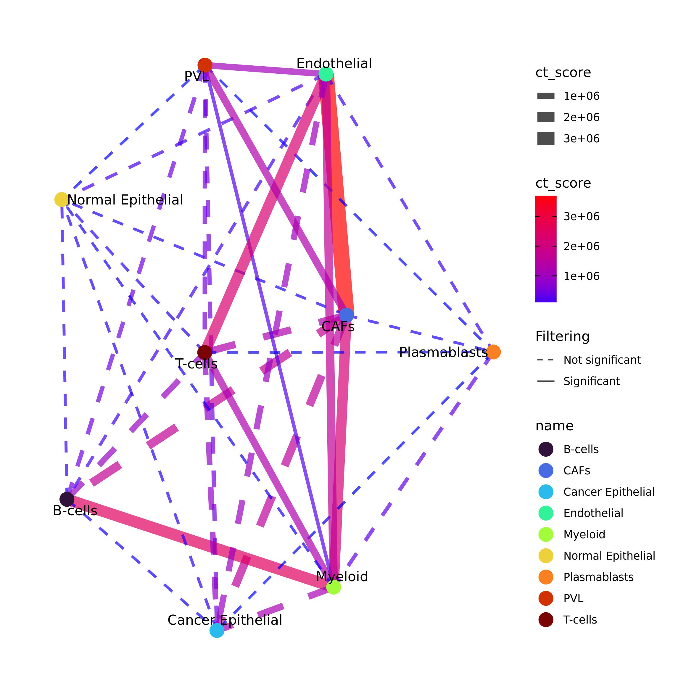

```{r setup, echo = FALSE, message = FALSE, warning=FALSE}
knitr::opts_chunk$set(
  collapse = TRUE,
  comment = "#>",
  error    = FALSE,
  warning  = FALSE,
  #eval     = FALSE,
  message  = FALSE,
  fig.width = 7,
  fig.height = 7
)
library(pander)
library(knitr)
library(rmarkdown)
library(kableExtra)
library(igraph)
#panderOptions("table.split.table", Inf)
#panderOptions('knitr.auto.asis', TRUE)
#options(width = 80)
```

In this tutorial we will see how to use Ulisse to analyse cell-cell cross-talk (CCC) data. For CCC analysis we need two inputs: a ranked gene list for each cell cluster and a biological network, which in this case is a communication network. 

```{r libraries, message=FALSE, warning=FALSE, eval=FALSE}
library(Seurat)
library(OmnipathR)
library(igraph)
library(Ulisse)
library(circlize)
library(ComplexHeatmap)
library(scales)
```

# Preparation of the inputs

As an example, we will use a breast cancer single cell sample and Omnipath communication network. We will apply this workflow on cell-type data, but it can be also applied on clusters. As a communication network, other resources are available and cam be used. Only take care that Ulisse need an undirected biological network and does not considers sub-units.

## Ligand-receptor network

To obtain the biological network we will use Omnipath [@turei2021], a database composed by various resources.
Ligand-Receptor (LR) interactions will download the intercellular network from Omnipath using ligand as `transmitter` param and receptor as `receiver`, and used to build the needed biological network. 

```{r OmnipathLR, eval=FALSE}
intercell_net <- import_intercell_network(interactions_param = list("datasets" = "omnipath"),
                                          transmitter_param = list(
                                            categories = c('ligand')),
                                          receiver_param = list(
                                            categories =c('receptor')), 
                                          entity_types = "protein")
g.intercell <- unique(intercell_net[,c("source_genesymbol", "target_genesymbol")])
g.intercell <- graph_from_edgelist(as.matrix(g.intercell), 
                                   directed = F)
```

## Pre-processing with Seurat pipeline

To explain the functioning of the CCC calculation implemented in Ulisse we will use one of the samples sequenced by Wu et al. [@wu2021]. In this study, the authors analyse 26 single cell of breast cancer samples. The samples contain tumoral as well as normal cells surrounding the tumor and composing its microenvironment.
The data can be downloaded at https://singlecell.broadinstitute.org/single_cell/study/SCP1039 or at GEO website under accession GSE176078. 
In particular, we will study CCC in sample CID4515, but the pipeline can be applied to any sample of the study. 
The code below can be used to read the 10x data and pre-process them to obtain dimensionality reduction through Seurat package [@Hao2021]. 
We will study the cell-cell communication among the cell-types provided by the authors, but the pipeline can be applied also to the clusters.
We will use the matrix, barcodes, genes data together with the metadata, that provides cell annotation. 

```{r preprocessingNot1, eval=FALSE}
data <- ReadMtx(mtx = "CID4515/count_matrix_sparse.mtx", 
                cells = "CID4515/count_matrix_barcodes.tsv",
                features = "CID4515/count_matrix_genes.tsv" )
data <- data[which(rowSums(sign(data)) >= 5),]
data <- CreateSeuratObject(counts = data, min.cells = 0, min.features = 0)
data <- NormalizeData(data)
data <- ScaleData(data)
data <- RunPCA(data)
data <- RunUMAP(data, dims = 1:10)

```

`metadata.csv` is the table obtained by the link with the cell-types. After uploading it, we can use this information to plot the UMAP by cell type. 

```{r preprocessingNot2, eval=FALSE}
meta <- read.csv("CID44991/metadata.csv", sep = ",", stringsAsFactors = F)
meta[1:5,]

```

```{r prepocessing2, eval=T, echo=FALSE}
meta <- read.csv("sc_data/metadata.csv", sep = ",", stringsAsFactors = F)
rownames(meta) <- c()
meta[1:5,] %>%
  kable(format = "html", col.names = colnames(meta[1:5,])) %>%
  kable_minimal() %>%
  kable_styling(bootstrap_options = c("striped", "condensed")) %>%
  kableExtra::scroll_box(width = "100%")
rm(meta)
```


```{r preprocessingNot3, eval=FALSE}
data@meta.data <- cbind(data@meta.data, meta[match(rownames(data@meta.data), meta$X),])
data$celltype_major <- factor(data$celltype_major, levels = unique(data$celltype_major))

pal_ct <- viridis::turbo(9)
names(pal_ct) <- sort(unique(data$celltype_major))

DimPlot(data, reduction = "umap", group.by = "celltype_major", label = T,  cols = pal_ct)

```

```{r prepocessing3, eval=T, echo=FALSE, out.width=600}
include_graphics("sc_data/umap_cell_type.jpeg")
```

Ulisse provides two methods to study CCC, one that uses expression data and the other that uses Differentially Expressed Genes (DEG) data. We exemplify the usage of both approaches, to then compare the obtained results. It is important to note that you can choose to perform the same analyses on clusters or cell types as both of them are groups of cells. Thus, in this vignette we will consider them synonyms.

# Expression CCC

## Ranked gene list

For CCC analysis we will need a ranked gene list for each cell type These will be obtained from the normalized count matrix. 
`preparing_cl_list()` takes as an inputs: 

* the normalized gene counts matrix (`mtx`);

* the cell type affiliation of each cell in the count matrix (`clusters`);

* the gene of interest (`universe`);

* two threshold (`mean_t` and `cell_t`) to filter the data and remove noise. 

The function uses `mean_t` to identify expressed genes in the normalized expression matrix: if the gene in a cell has a value equal or higher of that threshold is set to 1, 0 otherwise. Subsequently the function uses the binarized expression matrix to calculate for each gene in each cell type the frequency of being expressed in at least `cell_t` cells. Only the genes in `universe` are considered, which are the genes present in the LR network.

We suggest identifying `mean_t` considering the mean expression of each gene calculated on non-zero values. Instead, `cell_t` can be set considering the filtering used to remove low expressed genes at the beginning of the Seurat pipeline.
The code below can be used to assess the expression threshold.

```{r mean_gNOT, eval=FALSE}
mean_norm <- data@assays$RNA@data
mean_norm[which(mean_norm == 0)] <- NA
mean_g <- rowMeans(mean_norm, na.rm = T)

summary(mean_g)
```
```{r mean_g, eval=TRUE, echo=FALSE}
mean_g <- readRDS("sc_data/mean_g.Rds")
mean_g
```
```{r hist_not, eval=FALSE}
hist(mean_g, breaks = 100)
abline(v=0.65, col = "red")
```

```{r hist, eval=T, echo=FALSE, out.width=600}
include_graphics("sc_data/hist_mean_expr.jpeg")
```

Considering the summary of `mean_g` and the histogram above, we decide to use 0.65 as `mean_t` (the red line in the histogram). 
We decided this value as it lays past the high frequency values in the distribution and thus allows to filter out the low and the most common values, maintaining only the high ones. As cell threshold we will use the same threshold used for the pre-processing.

```{r prep_listCTNot, eval=F, echo=TRUE}
universe <- V(g.intercell)$name
ct_list <- preparing_expr_list(mtx = data@assays$RNA@data, 
                               clusters = data$celltype_major, 
                               mean_t = 0.65, 
                               cell_t = 5,
                               universe = universe)
head(ct_list[[1]])
```

```{r prep_listCT, echo=FALSE, warning=FALSE, message=F, results='show', eval=TRUE}
ct_list <- readRDS("sc_data/cl_list_TY.Rds")
head(ct_list[[1]])
rm(ct_list)
```

## Communication analysis

The required inputs are now ready to analyse CCC with `gs_cross_talk()` function. This function requires also additional parameter:

* `k` corresponds to the number of permutation needed that, together with the original matrix, are used for the calculation of p-value and FDR. In this case we use 49 permutation that, together with the real one, correspond to a total of 50 permuted list for each cell type pair, and thus the minimal p-value that can be observed is 1/50 or 0.02;

* `shared` which should be set to `TRUE` to enable possible overlapping in gene-lists of a cell-type pair. Different cells may express the same genes, moreover when considering clusters, which may represents different states of the same cell-type. These shared genes may represents intra-cellular communication, but as bot cells in a cell-pair express the same genes, is impossible to discern if these are autocrine or paracrine communication. Thus, it is important to consider also these in CCC;

* `hash`: logical, used to speed-up calculation when lots of gene-sets are used. Here we have low cell-type numbers, so we suggest to set it to `FALSE`;

* `ct_info`: logical, if detail of gene-gene interaction in the gene-set should be returned. This might be highly important in cell-cell cross-talk, so we set it to `TRUE`. By enabling this parameter, the output of the function will be a two-element list, with the fist (`ct_info`) a table with all the gene communications between the two cell types; and the second (`ct_res`) a table with the CCC results. Note that the cumulative score of a cell type pair is equal to the sum of all the gene pair scores in `ct _info`.

* `mc_cores_perm` and `mc_cores_ct` control the parallelization of the function in CCC calculation and permutation, respectively. Be aware that `mc_cores_perm` multiplies `mc_cores_ct`. Parallelization is useful to reduce the computational time for the calculation but improves the amount of memory needed. 

```{r CCC_CTnot1, eval=FALSE}
LR.adj <- as_adjacency_matrix(g.intercell, sparse = F)

expr_ccc <- gs_cross_talk(gs_list = cl_list,
                          gene_network_adj = LR.adj,
                          k = 49, 
                          shared = T, 
                          ct_info = T, 
                          hash = F,
                          mc_cores_perm = 1, mc_cores_ct = 1)

expr_ccc$communications_info[1:5,]

```

```{r CCC_CT1, eval=TRUE, echo=FALSE}
expr_ccc <- readRDS("sc_data/cl_CCC_TY_info.Rds")
expr_ccc %>%
  kable(format = "html", col.names = colnames(expr_ccc)) %>%
  kable_minimal() %>%
  kable_styling(bootstrap_options = c("striped", "condensed")) %>%
  kableExtra::scroll_box(width = "100%")
```

```{r CCC_CTnot2, eval=FALSE}
expr_ccc$cc_communications[1:5,]
```

```{r CCC_CT2, eval=TRUE, echo=FALSE}
expr_ccc <- readRDS("sc_data/cl_CCC_TY_comm.Rds")
expr_ccc %>%
  kable(format = "html", col.names = colnames(expr_ccc)) %>%
  kable_minimal() %>%
  kable_styling(bootstrap_options = c("striped", "condensed")) %>%
  kableExtra::scroll_box(width = "100%")
rm(expr_ccc)
```

## CCC visualization

CCC results can be filtered to maintain only the significant ones. The results can be visualized as a network (`plot_network_CT()`) or as an heatmap (`ct_heatmap()`) by using Ulisse package functions.
The code below can be used to plot the results as a network. 
`filtering` argument is used to control which CCC have to be visualized in the network. If set to `TRUE`, then `p_val`, `FDR` and `ct_val` are used to identify the significant communications and plot these with a solid line, whereas all the others will be plotted with a dashed line. Here, we enabled this visualization, by providingp-value and FDR filtering. `ct_val = NULL` allows to consider all CCC without filtering for this value. 
`community` can be logical (if the community should be calculated by using `igraph::fastgreedy.community()`), or a community object as calculated with igraph package.
`vertex` is used to color the vertices, and can be set to "name" to color them according to the name of the cell-type.
`edge_col_by` and `edge_width` parameters control the value used to color the edges and if their width should be proportional to that value. `edge_adj_col` is used to control the transparency of the edges: as in pathway cross-talk there can be lots of links it can e useful to control the transparency. 
`plot_network_CT()` function returns the igraph cross-talk network with the communities under "comm_id" vertex attribute (if calculated). `plot_network_CT()` function uses `ggraph` package functions, which are ggplot2-based. If `file_out` is set to `NULL` the function returns also the ggplot2 network object.

```{r CCC_CTnetNOT, eval=FALSE}

expr_ccc_net <- plot_network_CT(ct = expr_ccc$ct_res, 
                                filtering = T, p_val = 0.05, FDR = 0.2, ct_val = NULL, 
                                community = F, 
                                vertex = "name", vertex_size = 5, vertex_label = TRUE, vertex_pal = pal_ct,
                                edge_col_by = "ct_score", edge_pal=NULL, 
                                edge_width = T, edge_adj_col = 0.7) 
expr_ccc_net
```

```{r CCC_CTnet, eval=TRUE, echo=FALSE, out.width=600}
ccc_net <- readRDS("sc_data/ct_net.Rds")
ccc_net
rm(ccc_net)


```

`ct_heatmap()` function can be used to plot CCC as an heatmap by selecting the variable that have to be used to color the heatmap (`color_by`, here we used the cross-talk score), color scale (`color = c("lightyellow", "red3")`), and the color used for the zeros, that are the cells in the heatmap corresponding to the cell types pairs that do not shows significant communications (`no_ct_color`). Having different colors for minimum and zero help the heatmap readability. 

Similarly to `plot_network_CT()`, `ct_heatmap()` function allows to select for significant interactions, such that these are represented with a star. This is achieved by enabling `filtering = TRUE`, that will further require p-value, FDR and cross-talk score thresholds.

```{r CCC_CT_H_not, eval=FALSE}
ct_heatmap(ct = clCC$ct_res, 
           color_by = "ct_score", color = c("lightyellow", "red3"), no_ct_color = "whitesmoke", 
           filtering = TRUE, p_val = 0.05, FDR = 0.2, ct_val = NULL)

```

```{r CCC_CT_H, eval=TRUE, echo=F, out.width=600}
include_graphics("sc_data/cc_ct_f_heatmap.jpeg")
```

# DEG CCC

We will now analyse cell-cell cross-talk by using DEGs First of all, we need to obtain DEG data. 

## DEG analysis

Here we will use Seurat function for Differential Expression Analysis with default parameters to calculate DEG for each cell type against the others. Then, we will use Benjamini-Hochberg method to obtain adjusted p-value to be used to filter DEGs to maintain only the significant ones. We will select only the up-regulated genes.

```{r prep_DEGNot, eval=F, echo=TRUE}
Idents(data) <- data$celltype_major

DEGs_data <- FindAllMarkers(data, assay = "RNA") #this may take a while
DEGs_data$p_val_BH <- p.adjust(DEGs_data$p_val, method = "BH")

DEGs_data[1:5,]

```

```{r prep_DEG, eval=TRUE, echo=FALSE}
DEGs_data <- readRDS("sc_data/DEGs_data.Rds")
DEGs_data %>%
  kable(format = "html", col.names = colnames(DEGs_data)) %>%
  kable_minimal() %>%
  kable_styling(bootstrap_options = c("striped", "condensed")) %>%
  kableExtra::scroll_box(width = "100%")
rm(DEGs_data)
```

It is not important which package and algorithm is used for DEG calculation, as Ulisse function is structured to handle any input type.

DEGs data can now be used to build the cell-type lists by using `preparing_DEG_list()` function. This function does not take as an input a table with the results of DEG calculation, but the specific columns (genes, their log2 Fold Change, p-value and the cluster), so that it is not important which package and algorithm is used for the differential analysis. 
`preparing_DEG_list()` uses these inputs to calculate for each `gene` in `clusters` the associated weights, that are the product between `log2FC` and the -log10 of `p_val`. Then, the function builds a vector for each `cluster`, each one composed by the weights, named after the respective genes. Then, these vectors are filtered to maintain only the gene that are present in `universe` and returned as a list

```{r prep_DEG_listNOT, eval=F, echo=TRUE}
DEGs_data <- DEGs_data[DEGs_data$p_val_BH <= 0.05 & DEGs_data$avg_log2FC >= 0.5,]


DEG_list <- preparing_DEG_list(cluster = DEGs_data$cluster, 
                               p_val = DEGs_data$p_val_BH, 
                               log2FC = DEGs_data$avg_log2FC, 
                               gene = DEGs_data$gene, 
                               universe = rownames(adj.m))

head(DEG_list[[1]])
```

```{r prep_DEG_list, echo=FALSE, warning=FALSE, message=F, results='show', eval=TRUE}
DEG_list <- readRDS("sc_data/DEG_list.Rds")
head(DEG_list[[1]])
rm(DEG_list)
```

## Communication Analysis

The subsequent part of the analysis is identical to the one used for expression data: `gs_cross_talk()` is used to analyse CCC with the same inputs and parameters. The calculation will results again in a two-object list with the detail of the gene-gene interaction and the cross talk results. 

```{r CCC_DEGnot1, eval=FALSE}

DEG_ccc <- gs_cross_talk(gs_list = DEG_list,
                         gene_network_adj = adj.m,
                         k = 49, shared = T, 
                         ct_info = T, hash = F,
                         mc_cores_perm = 1, mc_cores_ct = 1)

DEG_ccc$ct_info[1:5,]

```

```{r CCC_DEG1, eval=TRUE, echo=FALSE}
DEG_ccc <- readRDS("sc_data/DEGcl_ct_info.Rds")
DEG_ccc %>%
  kable(format = "html", col.names = colnames(DEG_ccc)) %>%
  kable_minimal() %>%
  kable_styling(bootstrap_options = c("striped", "condensed")) %>%
  kableExtra::scroll_box(width = "100%")
```

```{r CCC_DEGnot2, eval=FALSE}
DEG_ccc$ct_res[1:5,]
```

```{r CCC_DEG2, eval=TRUE, echo=FALSE}
DEG_ccc <- readRDS("sc_data/DEGcl_ct_res.Rds")
DEG_ccc %>%
  kable(format = "html", col.names = colnames(DEG_ccc)) %>%
  kable_minimal() %>%
  kable_styling(bootstrap_options = c("striped", "condensed")) %>%
  kableExtra::scroll_box(width = "100%")
rm(DEG_ccc)
```

## CCC network

As done before, we can build CCC network by filtering the results and using Ulisse function and plot it as a network

```{r CCC_DEGnetNOT, eval=FALSE}

DEG_CCC_net <- plot_network_CT(ct = DEGcl_ct$ct_res, 
                               filtering = T, p_val = 0.05, FDR = 0.2, ct_val = NULL,  
                               community = F, 
                               vertex = "name", vertex_size = 5, vertex_label = TRUE, vertex_pal = pal_ct,
                               edge_col_by = "ct_score", edge_pal=NULL, 
                               edge_width = T, edge_adj_col = 0.7) 
DEG_CCC_net
```

```{r CCC_DEGnet, eval=TRUE, echo=FALSE, out.width=600}
DEG_ccc_net <- readRDS("sc_data/ct_lt_net_DEG.Rds")
DEG_ccc_net
rm(DEG_ccc_net)


```

or as an heatmap

```{r CCC_DEG_Hnot, eval=FALSE}
DEG_ccc_f <- DEG_ccc$ct_res[DEG_ccc$ct_res$p_value_link <= 0.05 & DEG_ccc$ct_res$FDR_link <= 0.2,]

ct_heatmap(ct = DEGcl_ct$ct_res, 
           color_by = "ct_score", color = c("lightyellow", "red3"), no_ct_color = "whitesmoke", 
           filtering = T, p_val = 0.05, FDR = 0.2, ct_val = NULL, 
           width = unit(12, "cm"), height = unit(12, "cm"))


```

```{r CCC_DEG_H, eval=TRUE, echo=F, out.width=600}
include_graphics("sc_data/DEGcc_ct_f_heatmap.jpeg")
```

# Comparison between expression and DEG CCC results

Ulisse provides a function build and visualize a union network out of multiple analyses or samples. 
`comparing_results_network()` function takes as an input a list of results obtained with `gs_cross_talk()`. In order to use this function, there should be correspondence between gene-sets, thus they should share at least some cell-types or the cluster names should correspond to the same cell-type states. 
Here we will compare the significant results obtained with expression and DEG CCC analyses on the same sample, thus the cell-types corresponds.
`comparing_results_network()` needs as an input a named list with the cross-talk results that should be already filtered to maintain only the significant CCC, if needed. 
This function will create a union network where the vertices are all the cell types present in the results in `res_list`, the links are the all the communication present between them in the results.
The vertices can be colored by considering the number of results in which are present (`vertex_number = TRUE`) and/or by a discrete variable (in this case `vertex = "name"`, otherwise a two list, where the first element is the name of the variable, the second the named vector with, see function help for detail). If both parameters are enabled, as in this case, the `vertex` one is used to color voronoi tesselation (see ggrpah package for further detail).  When `vertex_number = TRUE`, a color palette can be provided, composed by minimum and maximum value colors, or the function will use as default "blue" to "red".
Edges can be colored by the number of results that share them (`edge_color_by = "number"`) or, as in this case, by which results contain them (`edge_color_by = "which"`). Edges width can be proportional to the number of results in which they are present (`edge_width = TRUE`).
`comparing_results_network()` will return the union network and the plot id `file_out` argument is not provided.

```{r comparingNot, eval=FALSE}
res_list <- list(expr = expr_ccc$cc_communications,
                 DEG = DEG_ccc$cc_communications)
res_list <- lapply(res_list, function(x) x <- x[x$p_value_link <= 0.05 & x$FDR_link <= 0.2,])

comp.out <- comparing_results_network(res_list = res_list, 
                                      vertex_number = TRUE, 
                                      vertex = "name", vertex_pal = pal_ct,
                                      voronoi_radius = 0.3, voronoi_alpha = 0.3, 
                                      edge_width = TRUE, edge_color_by = "which",
                                      edge_adj_col = 0.5, vertex_number_adj = 0.8)

comp.out
```

```{r comparing, eval=TRUE, echo=F, out.width=600}
comp.out <- readRDS("sc_data/comp_out.Rds")
#comp.out

rm(comp.out)
include_graphics("sc_data/comp_res_net.jpeg")
```

# References