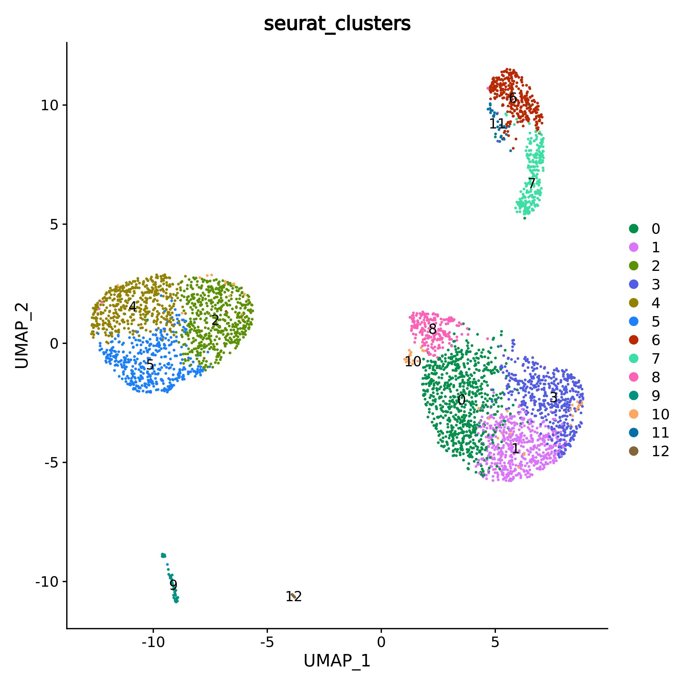
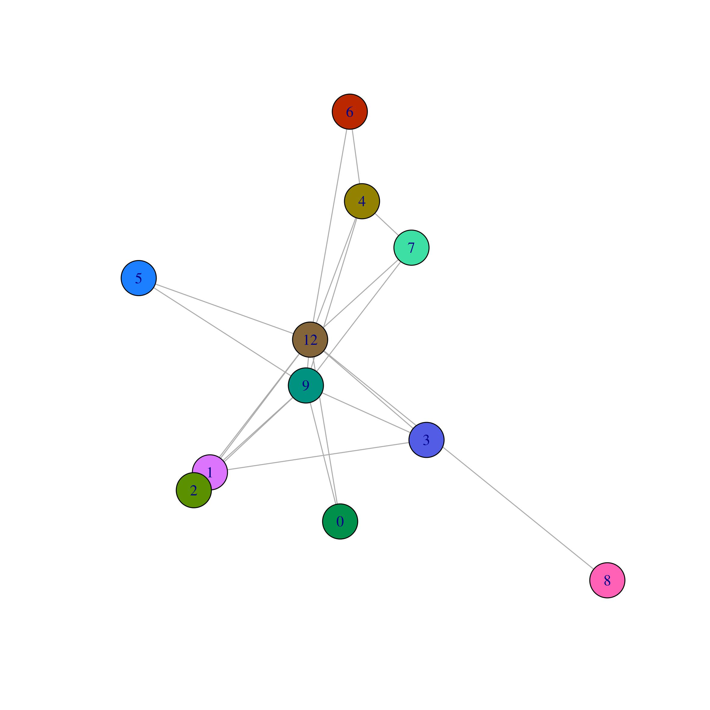
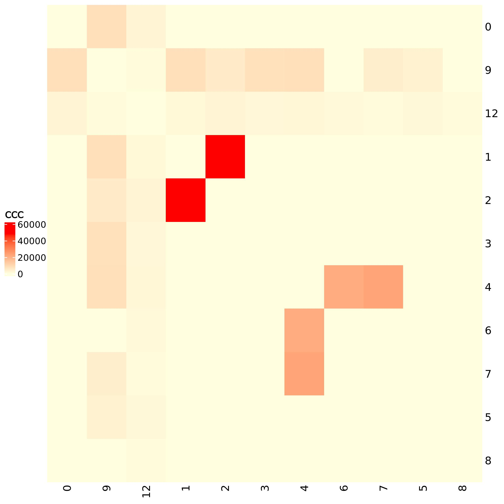

```{r setup, echo = FALSE, message = FALSE, warning=FALSE}
knitr::opts_chunk$set(
  collapse = TRUE,
  comment = "#>",
  error    = FALSE,
  warning  = FALSE,
  #eval     = FALSE,
  message  = FALSE,
  fig.width = 7,
  fig.height = 7
)
library(pander)
library(knitr)
library(rmarkdown)
#panderOptions("table.split.table", Inf)
#panderOptions('knitr.auto.asis', TRUE)
#options(width = 80)
```

In this vignette we will see how to use Ulisse to analyse cell-cell communication (CCC) data. We will need ranked gene lists and a biological network. We will use Omnipath to obtain the biological network with the Ligand-Receptor (LR) interactions. To obtain the gene lists, we need to pre analyse the data by using one of the available tools. In this tutorial we will use the data of the fourth sample of Nguyen et al. 2018, that can be downloaded from GEO database (accession code GSE113197), which is a single cell RNA seq of a healthy breast tissue. The pre-processing will be done by using the default Seurat pipeline.

```{r libraries, message=FALSE, warning=FALSE, eval=FALSE}
library(Seurat)
library(OmnipathR)
library(igraph)
library(Ulisse)
library(circlize)
library(ComplexHeatmap)
```

## Ligand-receptor network
Firstly, we need to obtain the ligand-receptor (LR) interaction data. To this purpose we will download the intercellular network from Omnipath and we will use ligand as `transmitter` param and receptor as `receiver`. In this case we will use only the Omnipath database, without considering `ligrecextra`.
In the code below we download the LR interaction data, to then obtain the gene names of `ligand` and `receptor` that will be used later, to then obtain the LR network and the associated adjacency matrix.

```{r OmnipathLR, eval=FALSE}
intercell_net <- import_intercell_network(interactions_param = list("datasets" = "omnipath"),
                                          transmitter_param = list(
                                            categories = c('ligand')),
                                          receiver_param = list(
                                            categories =c('receptor')), 
                                          entity_types = "protein")
ligand <- unique(intercell_net$source_genesymbol)
receptor <- unique(intercell_net$target_genesymbol)
g.intercell <- unique(intercell_net[,c("source_genesymbol", "target_genesymbol")])
g.intercell <- graph_from_edgelist(as.matrix(g.intercell), 
                                   directed = F)
adj.m <- as_adjacency_matrix(g.intercell, sparse = F)
```

## Pre-processing with Seurat pipeline
After downloading the N4 data, load the count table into R. The code below creates uses the standard Seurat pipeline to create the Seurat object to then normalize and scale the data, reduce the dimensionality by using the PCA and UMAP for graphical representation; clustering is done via graph-based approach. The obtained clusters can be observed into the plot below. We set the palette for the colour of the clusters as it will be useful below in the tutorial.

```{r preprocessing, eval=FALSE}
data <- read.table("GSM3099846_Ind4_Expression_Matrix.txt")
data <- CreateSeuratObject(counts = data, min.cells = 0, min.features = 0)
data <- NormalizeData(data)
data <- ScaleData(data)
data <- RunPCA(data)

data <- FindNeighbors(data, dims = 1:10)
data <- FindClusters(data, resolution = 0.5)
data <- RunUMAP(data, dims = 1:10)
pal <- c("#01904b", "#dc75fe", "#5b9100", "#535ce4", "#938100", "#1c7fff", "#ba2800", "#3ddfa4",
           "#ff61b7", "#009280", "#ffa661", "#0170aa", "#846439")
DimPlot(data, reduction = "umap", group.by = "seurat_clusters", label = T, cols = pal)

```

```{r loading_data, echo=FALSE, eval=TRUE, out.width=600}

```

The ranked gene lists needed for CCC analysis are derived from Differentially Expression Gene (DEG) analysis.
Seurat provides two function for DEG calculation, one that compare a cluster to the rest of the data (`FindAllMarkers()`), and the other that perform the analysis between two user-defined groups of cells (`FindMarkers()`). We focus on the study of the active communication between two clusters of cells by studying the DEGs between each pair as to identify the receptors that are highly expressed in a cluster and the corresponding ligands that are highly expressed in the other, and vice versa. To do so we will use `FindMarkers()` function. The code below will calculate DEGs between each cluster pairs. As Ulisse does not cosnsider directionality, we consider that the DEG analysis of a cluster A vs cluster B is equivalent to calcualte DEGs between cluster B vs cluster A. In the code, the for loop is used to calcualte DEGs between each unique cluster pairs and save the data.frame returned as output in a list. The elements of the list are named by pasting the names of the two clusters.
As this calculation may takes come times, we suggest saving the output list before going any further

```{r DEGsNOT, eval=FALSE}
DefaultAssay(data) <- "RNA"
Idents(data) <- data$seurat_clusters

genotypes <- as.vector(unique(data$seurat_clusters ))
DEG_list <- list() #may take a while
for (i in min(as.numeric(genotypes)):max(as.numeric(genotypes))) {
  print(paste("i =", i))
  for (j in min(as.numeric(genotypes)):max(as.numeric(genotypes))) {
    if(i<j) {
      tmp <- FindMarkers(data, ident.1 = i, ident.2 = j)
      DEG_list <- c(DEG_list, list(tmp))
      if(length(names(DEG_list))==0) {
        names(DEG_list)[1] <- paste(i,j, sep = "|")
      } else {
        names(DEG_list)[length(names(DEG_list))] <- paste(i,j, sep = "|")
      }

      print(paste("j =", j))
    }

  }

}


saveRDS(DEG_list, "DEG_list.Rds")
DEG_list[[1]][1:5,]
```

```{r DEGs, echo=FALSE, warning=FALSE, message=F, results='show', eval=TRUE}
DEG_list <- readRDS("sc_data/DEG_exp.Rds")
pander(DEG_list[1:5,], style = "simple")
```

## Single cluster pair communication analysis 
At this point we will use the Ulisse function to organize DEG data for communication analysis. Ulisse can analyse the communication between two clusters or between multiple cluster pairs. 
First, we will calculate CCC between cluster 0 and cluster 1, as an example, then we will calculate CCC between all clusters in the data.
In the code below we prepare the ranked gene list needed by using Ulisse's function `single_DEGlist()`. The function needs the names of the clusters ordered such that the first cluster name is the one used as numerator in fold change (FC) calculation, while the second is the denominator, plus the columns with log2FC, p-value and the threshold that have to be used to assign a gene as DEG of a cluster or the other. In detail, the function consider a gene as DEG of the first cluster if the log2FC is equal or higher than `threshold_l2FC` and the p-value is equal or lower than `threshold_pval`; on the other hand a gene is considered as a DEG of the second cluster if the log2FC is equal or lower than minus `threshold_l2FC` and again the p-value is equal or lower than `threshold_pval`. The `gene_universe` object is used to filter the DEGs of each cluster to return only the genes of interest, that are thus ligands or receptors. The function returns a list of two vectors, each one is composed by the -log10 of the p-value named after the genes that are DEGs and LR for that cluster

```{r singleCL, eval=FALSE}
gene_universe <- unique(c(ligand, receptor))
single_cl <- single_DEGlist(cl = c("0", "1"), 
                            gene = rownames(DEG_list[[1]]), 
                            l2FC = DEG_list[[1]]$avg_log2FC, 
                            pval = DEG_list[[1]]$p_val, 
                            gene_universe = gene_universe, 
                            threshold_l2FC = 0.25, threshold_pval = 0.1)
single_cl

```

```{r, eval=TRUE, echo=FALSE}
single_cl <- readRDS("sc_data/single_cl_list.Rds")
single_cl
```

At this point we have the ranked gene lists needed for CCC. The network needs firstly to be filtered to maintain only the genes present in `single_cl`. 
`cluster_communication()` needs as inputs the gene list and the adjacency matrix together with two vectors with the genes that are ligands ad receptors. This information will be used to remove any possible LL and RR interactions. It is possible that a gene codes for a protein that behaves as a ligand in some condition and as a receptor in others. Ulisse CCC calculation allows for a gene to be both ligand and receptor and flag it as `ligand/receptor`, without removing its link with both ligands or receptors.
`mc_cores_perm` value controls the parallelization of the function, which reduce the computational time needed for the calculation but improves the amount of memory needed. The CCC score is statistically evaluated by calculating an empirical p-value by using a permutation-based approach. This approach creates `k` permutated version of the adjacency matrix by changing randomly the order of the gene names on the rows (and equally in the columns), to maintain the structure of the network. Then CCC calculation is done using the real matrix and all the permutated ones. Thus, the number of permutated versions of the adjacency matrix that have to be used is controlled by the parameter `k` in the function. In this case we use 9 permutated matrices together with the real one, which correspond to a total of 10 matrix, and thus the minimal p-value that can be observed is 0.1.

```{r singleCL2, eval=FALSE}
DEG_gene <- unique(c(names(single_cl[[1]]), names(single_cl[[2]])))
adj.m_single <- adj.m[DEG_gene, DEG_gene]

single_clCC <- cluster_communication(DEG_list = single_cl, 
                                     gene_network_adj = adj.m_single, 
                                     ligand = ligand, 
                                     receptor = receptor, 
                                     k = 9, 
                                     mc_cores_perm = 1)
```

The function returns two outputs, the first is a table with the detailed description of the gene communication between the two clusters: the name of the first cluster, the gene of interest and its role; the name of the second cluster, the gene of interest and its role; the score of their communication.

```{r singleCLNot, eval=FALSE}
single_clCC[[1]]
```

```{r singleCL3, eval=TRUE, echo=FALSE}
single_clCC <- readRDS("sc_data/single_clCC.Rds")
pander(single_clCC[[1]], style = "simple")
```

The second output is a table with the names of the clusters, the cumulative CCC score between the two clusters, the number of genes and links involved and the empirical p-value.

```{r singleCLNot2, eval=FALSE}
single_clCC[[2]]

```

```{r singleCL4, eval=TRUE, echo=FALSE}
single_clCC$cc_communications$p_value <- as.vector(single_clCC$cc_communications$p_value)
pander(single_clCC[[2]], style = "simple")

```

## Multiple CCC analysis
`multi_DEGlist()` function takes as input the list obtained from DEG calculation between each cluster pairs. The users may decide to use anther tool to perform DEG calculation, thus `multi_DEGlist()` only need the names of the log2FC  (`log2FCname`) and p-value (`pval_name`) columns. The only requirement is that the tables in the list have the genes in the row names. As for the single cluster pair, `multi_DEGlist()` needs the thresholds on the log2FC (`threshold_l2FC`) and p-value (`threshold_pval`) and the names of the gene of interest (`gene_universe`). 
`multi_DEGlist()` for each cluster pairs calls `single_DEGlist()` and returns as an output a list, each element correspond to the DEG list of that cluster pair and is named correspondingly

```{r multiCL, eval=FALSE}
multi_cl <- multi_DEGlist(DEG_res = DEG_list, 
                          log2FCname = "avg_log2FC", 
                          pval_name = "p_val", 
                          threshold_l2FC = 0.25, 
                          threshold_pval = 0.1, 
                          gene_universe = gene_universe)
multi_cl[[1]]
```

```{r, echo = FALSE, eval=TRUE}
multi_cl <- readRDS("sc_data/multi_cl_list1.Rds")
multi_cl
```

`multicl_communication()` behaves exactly as `cluster_communication()` and thus requires the same inputs. The only difference is that `multicl_communication()` returns as a statistical evaluation the p-value and the false discovery rate (FDR)

```{r multi_cl, eval=FALSE}
DEG_gene <- unique(unlist(lapply(multi_cl, function(x) lapply(x, names))))
adj.m <- adj.m[DEG_gene, DEG_gene]

multi_clCC <- multicl_communication(DEG_list = multi_cl, 
                                    gene_network_adj = adj.m, 
                                    ligand = ligand, 
                                    receptor = receptor, 
                                    k = 9, 
                                    mc_cores_perm = 1)
```

`multicl_communication()` again returns two output. The fist is a table with the detailed description of the CCC

```{r, multi_clNot, eval=FALSE}
multi_clCC[[1]][1:5,]
```

```{r, multi_cl2, eval=TRUE, echo=FALSE}
multi_clCC <- readRDS("sc_data/multi_clCC.Rds")
pander(multi_clCC[[1]][1:5,], style = "simple")

```

The second is a table with the cumulative CCC scores, the number of genes and links involved, the p-value and the FDR

```{r multi_clNot2, eval=FALSE}
multi_clCC[[2]][1:5,]
```

```{r, multi_cl3, eval=TRUE, echo=FALSE}
pander(multi_clCC[[2]][1:5,], style = "simple")
```

## CCC network
The cumulative CCC score obtained as output of `multicl_communication()` can be used to build a Cell-Cell Communication network by considering only the significative ones. The resulting network can be visualized as a graph or as an heatmap.

```{r CCCnet, eval=FALSE}
CCC_net <- multi_clCC[[2]]
CCC_net <- CCC_net[which(CCC_net$p_value <= 0.1),]
CCC.g <- graph_from_edgelist(as.matrix(CCC_net[,1:2]), directed = FALSE)
CCC.g <- set.edge.attribute(CCC.g, name = "weight", value = CCC_net$ccc_score)
CCC.adj <- as_adjacency_matrix(CCC.g, sparse = F, attr = "weight")

plot(CCC.g, vertex.color = pal[(as.numeric(V(CCC.g)$name)+1)])
```

```{r, eval=TRUE, echo=FALSE, out.width=600}

```

```{r, eval=FALSE}
col_fun <- colorRamp2(c(0, max(CCC.adj)), c("lightyellow", "red"))
h <- Heatmap(CCC.adj, cluster_rows = F,  
             cluster_columns = F, 
             col = col_fun, 
             heatmap_legend_param = list(title="CCC"),
             )
draw(h, heatmap_legend_side = "left")


```

```{r, eval=TRUE, echo=F, out.width=600}

```


# Session Info {- .smaller}
```{r sessioninfo}
sessionInfo()
```
